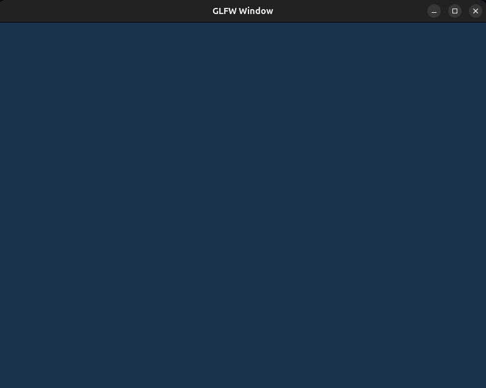

# Lesson 1 - GLFW Window 

Current file has most of the code using glfw functionality. OpenGL (specifically what glad offers with its function pointers) is used only for 3 operations:
* `gladLoadGL`
* `glClearColor(0.1f, 0.2f, 0.3f, 1.0f);`
* `glClear(GL_COLOR_BUFFER_BIT);`
I will talk more about these and other OpenGL specific functions in the later examples.

At the end of this lesson, we will be able to generate a simple GLFW window.

--- 
### Main GLFW Operations
Steps to have a primitive GLFW window:
1) `glfwInit()` Initializes GLFW library. IT DOES NOT INITIALIZE OPENGL.
2) `glfwCreateWindow(int width, int height,
                                     const char* title,
                                     GLFWmonitor* monitor,
                                     GLFWwindow* share))` Creates GLFW window. It also creates an OpenGL context (KEEP IN MIND THAT THIS CONTEXT IS NOT BOUND TO ANYTHING)
3) `glfwMakeContextCurrent(pWindow);` Binds the current OpenGL context to the current thread.
4) `gladLoadGL(glfwGetProcAddress)` Loads all the OpenGL function __pointers__ from the GPU driver. After calling this function (if it is successful) a user can finally call OpenGL specific functions. Calling OpenGL specific functions before glad (or any other loader) has loaded OpenGL functions would be like calling a person's name in a room when that person is not in the room. `glfwGetProcAddress` is a OS platform specific function loader.
5) `while (!glfwWindowShouldClose(pWindow))` Starts a while loop that on every iteration checks if the GLFW window is closed.
6) `glfwSwapBuffers(pWindow);` Displays the rendered image by swapping the back buffer with the front buffer. You can imagine that an old frame (the frame generated by the previous iteration) is currently not the newest image, since the current iteration on the while loop produced an even newer image.
7) `glfwPollEvents();` Asks for OS for pending events and process them. Events are processed only if they are relevant to the GLFW window, meaning that if glfw window is minimized, these events will not be processed. These are the most common events that can happen:
    * keyboard input
    * mouse movement
    * mouse clicks
    * window resize
    * window close button
    * scroll wheel
    * window focus changes
8) `glfwDestroyWindow(pWindow);` Destroys the denoted window with its associated OpenGL context.
9) `glfwTerminate();` Shuts down the GLFW library and releases all of its resources.

Notes:
* `glfwInit()` Does not initialize context. It sort of does not have any knowledge about what context is.
* `glfwCreateWindow(...)` Creates the context, while `glfwMakeContextCurrent(pWindow);` binds that created context to the current glfw window.

### Responsibilities

| Responsibility            | Does GLFW do it? |
|---------------------------|------------------|
| Initialize GLFW           | Yes              |
| Create OS window          | Yes              |
| Create OpenGL context     | Yes              |
| Activate context          | Yes              |
| Implement OpenGL          | No               |
| Talk directly to GPU      | No               |

### Conclusion

Why do we need a GLFW window if OpenGL is responsible for rendering?  
Isn't showing a window on the monitor also part of rendering?

Not exactly.

The main responsibility of OpenGL (or any graphics API) is to **compute pixel colors**. It takes geometries, shaders, textures, GPU states to produces pixel values (which I will show how to do in the next examples).

A window, on the other hand, is managed by the **operating system's windowing system**. It represents an area on the screen where images can be displayed and where the OS handles things like input, resizing, moving, and compositing with other windows.

Libraries like GLFW act as a bridge between these two worlds:

- The **windowing system** provides a window and a surface where images can appear.
- The **OpenGL context** provides the GPU state and execution environment needed to perform rendering.

When a window is created with GLFW, an OpenGL context is also created and associated with that window. OpenGL then renders into a framebuffer that is connected to the window's surface. The operating system later displays that image on the monitor.

In short:

- **OpenGL renders pixels.**
- **The windowing system decides where those pixels appear on the screen.**
