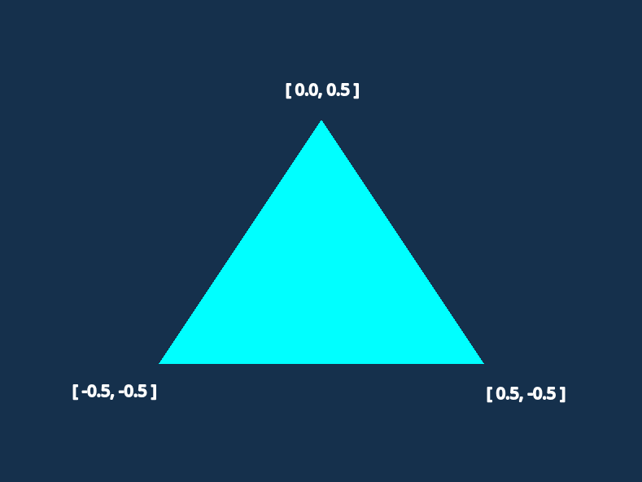

# Lesson 2 - Triangle 

This lesson is adding a few concepts into one. I did not want to separate these concepts into 2 or more lessons lessons due to a 1 major factor. Using the newest OpenGL version (ATM, the newest is 4.6), we cannot create a triangle without using the shaders (at least we cannot do it on Linux). For this, in this lesson we are going to discuss and learn about these topics:

1. Triangle
2. Rendering Steps
3. Vertex Buffer Object
4. Vertex Array Object
5. Vertex / Fragment shaders

Keep in mind that these are one of the most importatn building blocks of almost all the rendering in OpenGL. 

At the end of this lesson we will learn how to render a single triangle on the GLFW window.


---
### 1. Triangle

#### Triangle in Rendering

So (I would hope) that all of the people are familiar of what is a simple tringle. It is a fundamental 2D shape (polygon) that has 3 straight lines, 3 vertices and 3 interior angles that always sum up to 180 degrees (PI rad) (I definately did not copy this from google). In terms of math, it is probably it (again, I am not a math major or what, maybe some mathematicians would start throwing stuff at me for describing a triangle like that). BUT, in rendering, triangle has some more properties. In rendering a triangle can have:

* Vertices
* Each vertex can have a color
* Normals
* And other stuff (which currently I do not even know)

I hope that every one of of you knows what is a vertex, but what are the other 2?

Each vertex (for a single triangle) can have a color (defined in RGB or RGBA formats (A in RGBA is basically an alpha parameter telling how opaque the RGB should look like)).

Normal is a perpendicular vector that going from the triangle plane (the plane that the triangle lives in). This is a bit harder to understand but I hope this image helps you to understand the notion of it better.


This and some following examples are not going to touch the concepts of normals and why they are needed. But, since every person is curious I can tell, that one of the main reasons why normals are used in rendering is lights and shadows. Without this component, no realistic illumination would be possible.

#### Triangle Data

Since we know what is triangle in rendering world, a logical step frward would be to try to replicate that in the programming world. 

```C++

    float triangleVertices[] = { 0.0f,  0.5f,  0.0f, 1.0f, 1.0f, 1.0f, -0.5f, -0.5f,  0.0f, 1.0f, 1.0f, 1.0f, 0.5f, -0.5f,  0.0f, 1.0f, 1.0f, 1.0f };

```
This is what triangle (with colors) looks like in terms of data only. Interesting, isn't it? I mean without comments, specifically telling what these numbers mean and wthout some proper alignment, it would be like looking into some random array in C++. But how does it describe or tell anything about triangle vertices? To answer this question, we first can rewrite this line into something human souls could understand.

```C++
    float triangleVertices[] = {
        // positions    // colors
         0.0f,  0.5f,   0.0f, 1.0f, 1.0f, 1.0f, // top vertex 
        -0.5f, -0.5f,   0.0f, 1.0f, 1.0f, 1.0f, // bottom left
         0.5f, -0.5f,   0.0f, 1.0f, 1.0f, 1.0f  // bottom right
    };
```
Is it clearer now? Right now, it gives some instructions and rules on what these numbers mean. Before continuing any further, I want to say that postions and colors do not need to be defined in this order. OpenGL is great because it allows this flexibility to display data for triangles as you wish. For example, at first there could be colors, then normal and only then positions. As of this point it does not matter which way a user defines data of vertices, as long as the vertices array follows those rules throughout the program's lifetime. For this example, since a normal triangle is comprised of 3 vertices, the structure of this data is this: Row 1 - describes data for the first vertex, Row 2 - second vertex, Row 3 - third vertex. Each row (each vertex data point) has 6 components: irst 2 denote the position, the last 4 denote the color.

#### Positions 
Let's focus on the positions part. These coords show:

1. `[ 0.0, 0.5 ]` - top vertex
2. `[ 0.5, -0.5 ]` - right vertex
3. `[ -0.5, 0.5 ]` - left vertex



As you can see, it it jsut a simple representation of where each vertex should be located on the GLFW window. Now the last part is important. These coordinates have to be in the __[ -1.0f, 1.0f ]__ range. Why? Because this is the extention of coordinate system for the OpenGL's clip / NDC (normalized device coordinates) space. Right now we declare positions ONLY in terms that OpenGL can understand (later, once we are smarter and a little bit more advanced, stuff like local space, world space and etc. is understood, we will be able to create triangles on any positions we want). For now, keep in mind that [ 0.0, 0.0 ] is the center of the GLFW window and max values can be in this range [ -1.0, 1.0 ]

#### Colors

Colors for the vertices, are quite easier to understand. Each vertex color has 4 components - RGBA (what is RGBA can be easily found on the internet). Each of these 4 values has to be in the [ 0.0, 1.0 ] range. The last component value is A, meaning Alpha, which basically controls the opacity of the color.

---
### 2. Rendering steps

This is going to be a very simplified version of the steps needed to see a simple triangle on the screen using OpenGL (I will skip all the initializations of glfw, context and opengl):

1. Define triangle data
2. Generate VBO and VAO
3. Bind VAO and VBO
4. Buffer triangle data to VRAM
5. Tell OpenGL how to what the data inside the VRAM is and how to read it
6. Compile a shader program 
7. For every iteration inside a loop: \
    1. Use created shader program
    2. Bind VAO
    3. Draw triangles
    4. Swap buffers
    5. Poll events

Each of the elements described in these steps will be explained below. I just wanted to show the proto code on the steps what need to happen for a user to see a triangle from the `triangleVertices` data on the screen. Also, keep in mind, that these steps can be disected into smaller steps also, but it is for another day.

---
### 3. Vertex Buffer Object - VBO

What is this thing called VBO??? Remember the `float triangleVertices[] = ...` part? Well this buffer object basically stores the array containing info about a triangle's vertices inside the GPU, specifically inside the VRAM. Also, as a side note, as Cherno has said it best, to better understand what a VBO is, you should just imagine it as a simple buffer. Remove the words "vertex" and "object". VBO is essentially a buffer of data, a piece of bytes in some order.  What that data is, is currently a mystery to OpenGL. 

Another attribute of VBO is that it has an ID. Once you ask for OpenGL to generate a new VBO, it creates it and assignes a unique ID to it. This ID is needed so that Context could know how to map the buffered data to some specific Buffer IDs. This is one of those things on why I said (in lesson 1) that context is essentially a control panel. You have a data and an ID and it is the job of context to map them and check their states.

If the VBO is a buffered data, then what is the point in calling it __Vertex Buffer Data__? Well, it is because usually, and most often, VBO's are used to store data that describes what a vertex is. How to descibe it will be answered in the VAO part.

To create a VBO in C++, you have to call this OpenGL operation:

```C++
unsigned int vbo;
glGenBuffers(1, &vbo);
```

Why is it of type `unsigned int`? I do not know, ask someone who was responsible for making it that way, but now just pay attention that buffer (and, to be honest, many other OpenGL variables) are of this types. Unsigned int and OpenGL are like that couple that at first looks weird, but you see them everywhere together going hand in hand. I am sure, that when smart people designed OpenGL they had real concrete reasons on why a lot of stuff is unsigned int, but I have never deep dived into the reasons.

---
### Vertex Array Object - VAO

Since the data is stored inside the GPU, specifically, VRAM (Video Random Access Memory), we also need a way to tell OpenGL some info on what is this data. I mean right now, at this stage, that data means absolutely nothing to OpenGL. Why does it mean nothing? Remember how I said that `triangleVertices` can be rewritten as 

``` CPP
float triangleVertices[] = { 0.0f,  0.5f,  0.0f, 1.0f, 1.0f, 1.0f, -0.5f, -0.5f,  0.0f, 1.0f, 1.0f, 1.0f, 0.5f, -0.5f,  0.0f, 1.0f, 1.0f, 1.0f };
```

Tell me honestly, if any of you could look at this and say "That is easy, it describes the positions and colors of each of the 3 vertices insidet he vertex data". Please, do not lie to yourself. It is easy to a developer to just add comments and order array data so taht visually it could mean something to a developer, but to OpenGL, no comments, no ordering will answer a basic question - "What is this data that is buffered here?". To help OpenGL to understand it the same way we can, we need to tell it which numbers and which positions mean what. 

To do it, we have to use __Vertex Array Object - VAO__. Before answering some of your questions, I will paste the code from the main.cpp that will show you what is what and how does VAO come into this play.

```cpp
1   unsigned int vbo;
2   unsigned int vao;

3   glGenVertexArrays(1, &vao);
4   glGenBuffers(1, &vbo);

5   glBindVertexArray(vao);
6   glBindBuffer(GL_ARRAY_BUFFER, vbo);
7   glBufferData(GL_ARRAY_BUFFER, sizeof(triangleVertices), triangleVertices, GL_STATIC_DRAW);
8   glVertexAttribPointer(0, 2, GL_FLOAT, GL_FALSE, 6 * sizeof(float), (void*)0);
9   glEnableVertexAttribArray(0);
10  glVertexAttribPointer(1, 4, GL_FLOAT, GL_FALSE, 6 * sizeof(float), (void*)(2 * sizeof(float)));
11  glEnableVertexAttribArray(1);
```

1. First two lines, we just create vbo and vao variables (pay attention that they are unsigned int type)
2.  Lines 3, 4 - generate vao and vbo. How is ti different from the firs two lines? Well, at first we only created like some sort of variables that will be used for the OpenGL. Lines 3 and 4 is where the context comes into play. It assigned unique IDs to these 2 variables and, based on what operation (either `glGenVertexArrays` or `glGenBuffers`) knows that a variable `vbo` is a vertex buffer obj. and `vao` is a vertex array obj.
