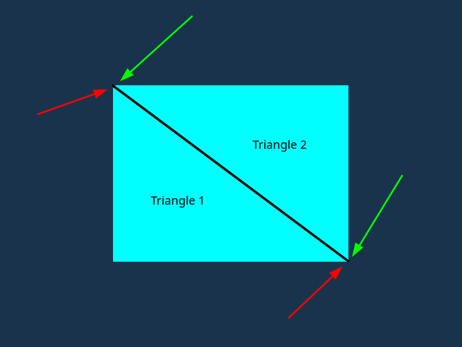

# Lesson 3 - Element Buffer Object

This lesson is going to be way smaller than the previous one. Mainly, because the code is 95% the same. The only thing I changed is that I added __Element Buffer Object__. Let's learn what this object is and why should we use it.

### What is it? Why do should we use it?

Well, this object is not making anything easier for, but rather it is helping the hardware, specifically, the VRAM, to deal with less data. How does it do it?

To answer this question, let's go back to the original data, we had in the lesson 2:

```C++
float triangle_vertices[] = {
     // positions   // colors
     0.0f,  0.5f,   0.0f, 1.0f, 1.0f, 1.0f, // top vertex 
    -0.5f, -0.5f,   0.0f, 1.0f, 1.0f, 1.0f, // bottom left
     0.5f, -0.5f,   0.0f, 1.0f, 1.0f, 1.0f  // bottom right
};
```

This is the data needed to render a single triangle with a color specified. How would we render 2 triangles? The first idea that come to mind is this "

```C++
float triangle_vertices[] = {
     // positions   // colors
     0.0f,  0.5f,   0.0f, 1.0f, 1.0f, 1.0f, // top vertex 
    -0.5f, -0.5f,   0.0f, 1.0f, 1.0f, 1.0f, // bottom left
     0.5f, -0.5f,   0.0f, 1.0f, 1.0f, 1.0f  // bottom right

     // positions   // colors
     0.0f,  0.5f,   0.0f, 1.0f, 1.0f, 1.0f, // top vertex 
    -0.5f, -0.5f,   0.0f, 1.0f, 1.0f, 1.0f, // bottom left
     0.5f, -0.5f,   0.0f, 1.0f, 1.0f, 1.0f  // bottom right
};
```

At first, it looks pretty standard: just add more data describing a new triangle to the `triangleVertices`. Following this rule (18 numbers, going sequentially, in the `triangleVertices` define a single triangle) 2 triangles have 36 numbers, 3 triangles have 54 numbers and etc. The rule for this is N * 18, where N is the number of triangles.

This rule is pretty simple, but now, let's imagine a scenario where 2 triangles form a single square. This would make `triangleVertices` look like this:

```C++
float square_vertices[] = {
    // positions   // colors
    -0.5f,  0.5f,  1.0f, 1.0f, 1.0f, // top left        triangle 1
    -0.5f, -0.5f,  1.0f, 1.0f, 1.0f, // bottom left     triangle 1
     0.5f, -0.5f,  1.0f, 1.0f, 1.0f, // bottom right    triangle 1

    -0.5f,  0.5f,  1.0f, 1.0f, 1.0f, // top left        triangle 2
     0.5f, -0.5f,  1.0f, 1.0f, 1.0f, // bottom right    triangle 2
     0.5f,  0.5f,  1.0f, 1.0f, 1.0f  // top right       triangle 2
};
```

Again, it looks pretty understandable, BUT, here lies 1 problem that scales up pretty fast if the triangle number is also increasing. 

What is this problem, I want you to understand? Take a look again at the `squareVertices`. Can you see that some vertices have literally the same data? Specifically, __top left__ and __bottom right__ vertices of both triangles have exactly the same values. Look at this image:



Red arrows point to the vertex for the triangle 1, green - triangle 2 (black line was added by me to visually help you to distinguish what is triangle 1 and triangle 2). What happens in 3 dimensions (what we certainly will cover in the future), the square becomes a cube. To form a cube, you need 2 x 6 = 12 triangles (cube has 6 faces, where each face is just a square, and we know that to render a square we need 2 triangles). For cubes the situation is even worse. Each cube vertex is the intersection of 3 cube faces, that means that 1 vertex is intersection of 6 triangles. With this configuation, there will be 6 defined vertex data points which are totaly the same. 

Keep in mind, that each data point (defined vertex data) takes up a real part on the GPU RAM (VRAM). Even though, 1 number takes a very tiny part on the VRAM, it still adds up to huge duplicated data if we render multiple objects every render iteration.

What I want you to understand is that you should ask yourself this "do I really need to use this simple, yet archaic method to define vertices data?". I mean since I am doing this lesson, the answer is definitely yes, there is. And this is where the __element buffer object__ comes in handy.

One of the reason why __Element Buffer Object (EBO)__ was created was to solve this particular issue that I have described earlier. Using EBO, you can basically just tell which vertex should be taken for which triangle. Let's go straight to the example. Instead of this:

```C++
float triangle_vertices[] = {
    // positions   // colors
    -0.5f,  0.5f,  1.0f, 1.0f, 1.0f, // top left        triangle 1
    -0.5f, -0.5f,  1.0f, 1.0f, 1.0f, // bottom left     triangle 1
     0.5f, -0.5f,  1.0f, 1.0f, 1.0f, // bottom right    triangle 1

    -0.5f,  0.5f,  1.0f, 1.0f, 1.0f, // top left        triangle 2
     0.5f, -0.5f,  1.0f, 1.0f, 1.0f, // bottom right    triangle 2
     0.5f,  0.5f,  1.0f, 1.0f, 1.0f  // top right       triangle 2
};
```

why can't we rewrite this as:

```C++
float triangle_vertices[] = {
    // positions    // colors
    -0.5f,  0.5f,   0.0f, 1.0f, 1.0f, 1.0f, // top left
    -0.5f, -0.5f,   0.0f, 1.0f, 1.0f, 1.0f, // bottom left
     0.5f, -0.5f,   0.0f, 1.0f, 1.0f, 1.0f, // bottom right
     0.5f,  0.5f,   0.0f, 1.0f, 1.0f, 1.0f  // top right
};

unsigned int indices[] = { 
    0, 1, 2, // triangle 1
    2, 3, 0  // triangle 2
};
```

Without going any further, one thing can be instantly visible. This configuration uses less amount of numbers for triangles description. Since some of you have at least some basic background in computer science, you should know that `float` and `int` are C++ datatypes that take some amount of space in memory. Both of these types take up 4 bytes in the RAM (or VRAM if we talk about GPUs).

Based on our first and second examples for the `triangleVertices` and `indices`, let's calculate how many bytes bytes in total we are going to need in order to store 2 triangles that combine into a single uniform square.

1. There are 2 triangles defined, where each triangle has 3 vertices where each vertex needs 6 numbers (2 for position, 4 for color), so in total there are 2 (triangles) x 3 (vertex per triangle) x 6 (elements er vertex) = 36 (numbers needed to describe 2 triangles). Each of these numbers is a `float`, so in total we are going to need 36 x 4 (bytes for `float`) = __144__ bytes of memory in the VRAM (do not forget, that we are uploading this data as a databuffer to the GPU using `glBufferData(GL_ARRAY_BUFFER, sizeof(triangleVertices), triangleVertices, GL_STATIC_DRAW);` operation)
2. There are 2 triangles defined. Instead of defining each vertex separately (sometimes dublicating them), we are just defining unique vertices. We also have an additional array called `indices[]`, which store indices of the vertices definitions in the `triangleVertices`. Let's calculate the total size of `triangleVertices` + `indices` in the VRAM. 
     1. First, let's calculate the space it takes to store `triangleVertices`. There are 4 unique vertices, where each is described by 6 numbers (2 for position, 4 for color), so in total it takes 4 (unique vertices) x 6 = 24 (numbers needed to describe 4 unique vertices). 24 * 4 (bytes for `float`) = 96 (bytes to describe 4 unique vertices).
     2. Second, let's calculate the space it takes to store `indices`. There are 2 triangles, each triangle needs 3 vertices, in total 2 (triangles) x 3 (vertices) = 6 (indices for 2 triangles). Each number in the `indices` is of type `int`, so we need 6 (indices for 2 triangles) x 4 (bytes for `int`) = 24 (bytes to describe 6 indices for 2 triangles)
     3. In total, when we add up `triangleVertices` + `indices`, we get 96 + 24 = __120__ (bytes to describe 2 triangles)

Do you see, even for 2 triangles, we already are saving 24 bytes of memory. It scales really fast, if we use more than 2 triangles. Looks at this table:

| Number of Triangles | Without EBO (bytes) | With EBO (bytes) |
|---------------------|---------------------|------------------|
| 3                   | 216                 | 156              |
| 10                  | 720                 | 408              |
| 1000                | 72,000              | 36,048           |

Trust me, for complex scenes, there are more than 1000 triangles per frame. Even better, look what happens, if we are describing triangles in 3D. That means, that each vertex is defined by 7 numbers instead of 6. Now, 3 numbers define the position (X, Y, Z) and 4 define color:

| Number of Triangles | Without EBO (bytes) | With EBO (bytes) |
|---------------------|---------------------|------------------|
| 3                   | 252                 | 180              |
| 10                  | 840                 | 460              |
| 1000                | 84,000              | 36,120           |

Do you see, how helpful is EBO for you VRAM? I hope, that these 2 tables helped you answer that the 2 questions I have given to you: __What is it? Why do should we use it?__.


### Code

Since we now now, what is EBO, let's see how to code it using OpenGL. Before scaring you, I just want to immediately address that it is really simple to implement EBO in the OpenGL. 

Ok, first, we have to define the data:

```C++
float triangle_vertices[] = {
     // positions    // colors
     -0.5f,  0.5f,   0.0f, 1.0f, 1.0f, 1.0f, // top left
     -0.5f, -0.5f,   0.0f, 1.0f, 1.0f, 1.0f, // bottom left
     0.5f, -0.5f,   0.0f, 1.0f, 1.0f, 1.0f, // bottom right
     0.5f,  0.5f,   0.0f, 1.0f, 1.0f, 1.0f  // top right
};

unsigned int indices[] = { 
     0, 1, 2, // triangle 1
     2, 3, 0  // triangle 2
};
```

Second, we have to define an EBO object:

```C++
unsigned int vbo;
unsigned int vao;
unsigned int ebo; // new

glGenVertexArrays(1, &vao);
glGenBuffers(1, &vbo);
glGenBuffers(1, &ebo); // new
```

As you can see, `ebo` is of the same type as the `vbo` and `vao` which we learned about in the lesson 2. It is the same procedure as with many other objects in OpenGL. This object is `unsigned int` because it has an ID attached to it, so that OpenGL could internally map this ID to the actual buffered indices data in the VRAM. We, also, have to generate a buffer for this `ebo`. Keep in mind that the same operation is called as for the `vbo`. It is because we are going to store `indices` as a data buffer inside the VRAM. Now, how to tell OpenGL how to use it? Let's look here:

```C++
glBindVertexArray(vao);

glBindBuffer(GL_ARRAY_BUFFER, vbo);
glBufferData(GL_ARRAY_BUFFER, sizeof(triangle_vertices), triangle_vertices, GL_STATIC_DRAW);

glBindBuffer(GL_ELEMENT_ARRAY_BUFFER, ebo);
glBufferData(GL_ELEMENT_ARRAY_BUFFER, sizeof(indices), indices, GL_STATIC_DRAW);

glVertexAttribPointer(0, 2, GL_FLOAT, GL_FALSE, 6 * sizeof(float), (void*)0);
glEnableVertexAttribArray(0);
glVertexAttribPointer(1, 4, GL_FLOAT, GL_FALSE, 6 * sizeof(float), (void*)(2 * sizeof(float)));
glEnableVertexAttribArray(1);
```

Pay attention that even though the operation is the same for binding both `indices` and `triangleVertices`, but the arguments are different. Why these need to change can be found in the [docs.gl](https://docs.gl/gl4/glBufferData). Just look at what is the difference between `GL_ARRAY_BUFFER` and `GL_ELEMENT_ARRAY_BUFFER`. Again, keep in mind, that OpenGL is a big state machine (you hear this term a lot when reading tutorials or learning something about OpenGL). In a sense, it means that everything in OpenGL is configured by pressing some buttons, or turning something on and off (by buttons and turning something on / off I mean that calling operations and setting something). 

Also, another major change is that now, we first have to bind `vao` before doing any operations using ebo. Why? Because binding `ebo` can be thought as "rules" on how the data buffer from the VRAM should be read. Keep in mind that.

The final thing we need to change in our example, is in the rendering `while` loop, it is how we issue a draw call. Previously, we did it, by calling this operation:

```C++
glDrawArrays(GL_TRIANGLES, 0, 3);
```

Now we have to change this a bit and do this instead:

```C++
glDrawElements(GL_TRIANGLES, 6, GL_UNSIGNED_INT, nullptr);
```

Why did we have to change it? Well, previously, we had just a single data buffer in the memory, so during the processing, OpenGL had to just look into the memory, where the data buffer is loaded, read all of it, apply reading rules from the VAO, and that's it. Even the function name `glDrawArrays` kinda indicates that arrays should be draw (keep in mind that `triangleVertices` is an array, so the data inside the VRAM is also array-like). Also, `glDrawArrays` expects data in the buffer to be sequential (exact order they appear in the memory), meaning that once 3 vertices are read, it needs to construct a triangle, then again, 3 new vertices are read --> construct a triangle. Now, for the `glDrawElements`, the story is a bit different. OpenGL still needs to look into VRAM, but it needs to do it twice, once for the `triangleVertices` and the second time for the `indices`. Another change is that `glDrawElements` does not read data from the buffer sequentially. The triangles are constructed based on what indices define them, that is why we need an index buffer inside the VRAM. 

To my knowledge, I do not know and I do not think, that this way (I mean using `glDrawElements` instead of `glDrawArrays` is any slower in terms of speed).


### Conclusion

I hope this really helped you to understand those 2 main questions I asked in the beginning about EBO:

* __What is it?__ It is a special OpenGL type of object that stores indices data for the vertices.
* __Why do should we use it?__ Because it allows our program not duplicate vertex data, thus preventing for overloading the VRAM with unnecessary data. This literaly saves memory space in VRAM.
