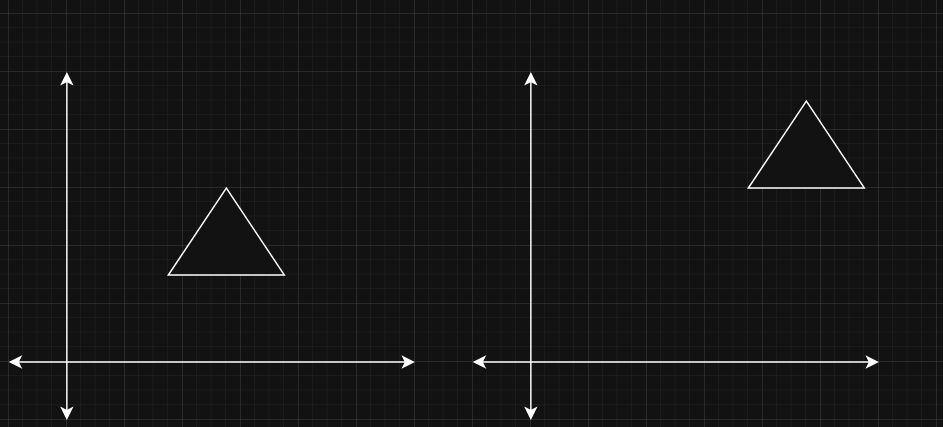

# Lesson 4 - Transformations

In this tesson we are going to learn tranformations and, as a side thing, shader uniforms. Transformations, as a whole is one of those building blocks, that someone, who is learning graphics, should definitely master it. But do not get too scared, unless you want to become a savant 3D graphics engineer, because transformations (at least to what I have used) is not a thing that a simple person, who does not understand math well, cannot understand.

Since I am not the best at explaining math topics and before continuing any further, I highly sugegst to you to:

* Read [this article](https://learnopengl.com/Getting-started/Transformations)
* If you are more of a visual learning, I advise you to look [this playlist](https://www.youtube.com/watch?v=fNk_zzaMoSs&list=PLZHQObOWTQDPD3MizzM2xVFitgF8hE_ab) by [3Blue1Brown](https://www.youtube.com/@3blue1brown/playlists). This, in my opinion, is the best way to visually understand the concepts of linear algebra.

Again, do not get discouraged by the fact than N years ago, during math classes you did not pay attention, but you need to know the gist of it.

As for the uniforms, it is also, one of the building blocks you have to understand, but it is as simple as learning what a shader or vertex buffer is.

---
### Transformation types

For the basic 3D rendering, in my opinion, you need to know 3 types of transformations:

1. __Scaling__ - resizing the object to make it bigger or smaller.

2. __Rotation__ - rotating the object around one of it's axis.

3. __Translation__ - moving an object in space from position A to position B.


This is probably 99% of transformations you will need if you want to understand how rendering works. Again, I just want to stress this that this topic of __transformations__ is also an integral part if you want to understand how rendering works. I know, that it may sound weird, I mean "how does knowing how objects can be transformed help me to understand how to render an image". But without tranformations, all of your scenes will be just a static image where nothing happens. 

Also, keep in mind, that I just showed you how transformations happen in 2D. But do not get too afraid, in 3D, these transformations happen the same way, just that there are more axis on which we can transform objects.


### Essence of Transformations in Rendering

I will try to give my own personal view, on why the tranformations are one of the building blovks in rendering. 

As I said before, rendering, in my opinion, without transformations is not rendering at all. Why? Because without transformations, it would be extremely hard to show something that is ___changing___. For example, imagine that you want to render a basketball going into a basket from a 3 pt line. Without transformations, the only way to smoothly render this animation, would be to create a new sphere for the basketball every render iteration with different values for coordinates. That is as ineficiant as it can get. Now imagine 100 basketballs going to the hoop at the same time, I thing you get the gist of it. Another example would be zooming the view (we are not going to cover this now, but to do it you also need to use transformations). Without transformations, every zoom you do, you have to create a new object, that has a bigger size. Imagine that you are zooming in on a circle. Every zoom a new larger sphere has to be created.

With transformations, instead of creating new objects, why can't we just change the way they appear on our screen. This is many times faster and "healthier" for computers to handle. Why? To answer this, just for a second, forget that there are transformations. Without them, if our rendered scene changes even the slightest, we would have to recreate all of our scene from scratch. That would mean that we have to:

1. Create data buffers
2. Reuse rules on how to read this data buffer
3. Delete previously used objects
4. Construct new objects
5. Etc.

This is extremely cost ineffective. Computers are fast, but that definitely hinders their speed by a lot.

With transformations, instead of doing all those steps, why can't we just manipulate the data we already have in our data buffer? Let's take our good old triangle data from previous lessons:

```C++
float triangleVertices[] = {
    // positions    // colors
    0.0f,  0.5f,   0.0f, 1.0f, 1.0f, 1.0f, // top vertex 
    -0.5f, -0.5f,   0.0f, 1.0f, 1.0f, 1.0f, // bottom left
    0.5f, -0.5f,   0.0f, 1.0f, 1.0f, 1.0f  // bottom right
};
```

If we want to change the vertex position (`0.0, 0.5`), without transformations, we would have to delete this buffer and create the new one. With transformations, we can directly access the data buffer and according to some translation rule, we update the XY coords of the first vertex.

To me, that is the essence of transofrmations in rendering. You just have some data in the buffer and you manipulate it according to your needs or rules that you have defined.


### Transformations

Since you read (I hope you did) [this article](https://learnopengl.com/Getting-started/Transformations), I can move directly to explaining how I understand what transformations is, what they are and how to use them. Our end goal is this window:


In this image you can see 4 different triangles placed on 4 different screen positions. First of a all, what do these triangles simbolize:

1. ___Top Left Corner___ - triangle that has 0 transformations applied.
2. ___Bottom Left Corner___ - triangle that has __rotation__ transformation applied.
3. ___Top Right Corner___ - triangle that has __scaling__ transformation applied.
4. ___Bottom Right Corner___ - triangle that has __rotation__ and __scaling__ transformations applied.

Before explaining how did I tranform these triangles, I want to say that there is another, "secret" transformation that has been applied to all of these 4 triangles. It is the __translation__ transformation that has been applied to all of these 4 triangles.

Also, from those tutorials you have read (that I hope you read), I hope you remember that there many coordinate systems for objects and other "stuff" like:

* Model space
* World space
* View space
* Projection space
* Clip space

In this lesson, we are only going to cover __local space__ and __model space__ (sometime in the future, I will for sure cover the remaining coordinates systems). We need to understand the first and the second coordinate systems to understand how transformations happen.


#### Model Space

__Model space__ is a type of coordinate system that is relative to object itself. That means that the object is centered around the origin (if it is 2D then it is [ 0, 0 ], if it is 3D - [ 0, 0, 0 ], etc.). Why do we need this type of coordinate system? Well, it is great for describing a single object. As alwasy, an example is worth more than a million words.

So imagine you want to create a triangle


### Code Part

Before I show you the code for this lesson, I want inform you that the code from the previous lesson is changed here. The things I have changed are:

1. I have moved the shaders code in separate files. I did that, because this is the convention on how to handle shaders (at least in our situations). For this and many more following lessons, we are not going to do shader generations throughout the lifetime of a program (that is what we maybe do far far into the future).
2. Added my own library from [my own grahics engine](https://github.com/ArturasDruteika/Andromeda). For the lessons, I will be naming it __Orion__. So everything, that you can find in the __Orion__ folder, is what I use when I am creating __Andromeda__ graphics engine.
3. Added __glm__ 3rd party. This is a great library for math. It has all the needed transformations and etc. when working with OpenGL.

Also, as a side note, from this point, moving in the future, we will be refactoring a lot of our code, to make it follow best practices. I am not saying, that all of our code will be the best it can, absolutely no, because then it will be hard to explain everything. But we will stop flooding our main.cpp file with all the code for a single lesson. Instead, we will separate what can be separated into classes, files and etc., so do not be scared.

Without any further pointless talks, let's dive deep into the code part, where I will show you how to code the transformation and how to use uniforms using OpenGL.


#### Uniforms

First, let's start here, since it will be over in a half a minute. Uniform is a way that let's developers to directly pass variables to shaders. What is the point of allowing developers directly pass values to the shaders? The first thing that comes to my mind is the paralellism of GPU. Remember what is the definition of a __shader__? (cough cough, a program that runs on GPU)... Also, remember that GPUs are great for program executions that are independent from one another (you can google what SIMD is). 

Ok, I will elaborate on this a little more. ___The following example is going to be run on the CPU, meaning a single core of CPU is going to be used___. Immagine a simple array of numbers, let's define it as `int arrayOfNumbers[] = {1, 2, 3, 4, 5, 6, 7, 8, 9};`. Imagine that there is a function that takes exactly 1s to complete, which does: 

```C++
int Some1SFunction(int originalValue):
    ...
    return processedOuput;
```

Also, imagine, that now, I want to apply this function to all of the numbers in the `arrayOfNumbers`. One way to do this is the following:

```C++
for (const number : arrayOfNumbers)
    int result = Some1SFunction(number);
```

On CPU, this function would take 9s to complete, since it would be called 9 times. To speed this up, we can use threads. So if our CPU had 9 or more cores, each core could take a single call of `Some1SFunction` and voila, the time was reduced from 9s to just 1s.

Ok, but what if our array has 10000 numbers? The CPU definitely does not have cores in terms of thousands. That's sad, but you know what has it? Yes, GPU. With some programming knowledge, you could run this operation on that 10000 number array, and since GPUs have thousands of minicores, this operation could be done seconds.

Where do uniforms come into play? Well, remember that most of the time, we have arrays of vertex data. This array can have thousands of vertices defined. Imagine, that we wanted to multiple each vertex position by some matrix (which we are going to talk in the transformations section). Each of those transformations on each vertex will definitely take a toll on the speed of the rendering. This is where __uniforms__ become handy. Let's take vertex shader for example. It can process many vertices at the same time because the VS is running on the GPU. Because of it, we can apply that matrix to each of the vertices many times faster than it could be done on the CPU. But, how to tell the GPU which matrix to apply? I mean GPU does not have in it's own memory no notion of that matrix you want to apply to each vertex. To bypass it, you can add a changable parameter to the shader program called __uniform__.

Take a look:

```C++
#version 460 core
layout (location = 0) in vec2 aPos;
layout (location = 1) in vec4 aColor;

uniform mat3 u_transform;

out vec4 ourColor;

void main()
{
    vec3 transformed = u_transform * vec3(aPos, 1.0);
    gl_Position = vec4(transformed.xy, 0.0, 1.0);
    ourColor = aColor;
}
```

`uniform mat3 u_transform;` is the newly added. Now the GPU knows, that there is an additional parameter, that is going to controlled by the user him/herself. We have a direct access from the program side to set a 3x3 size matrix to this shader. 

Just remember one thing, that uniforms allow developers to directly set values in the shader programs.


