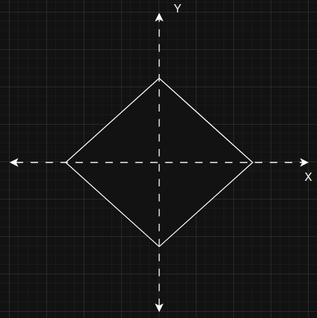
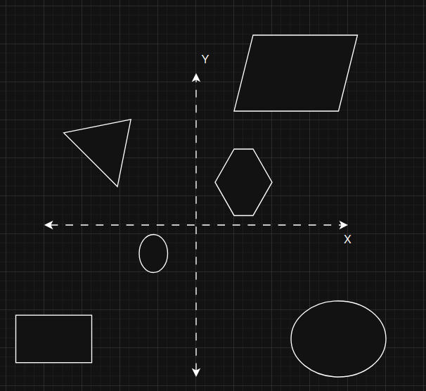

# Lesson 4 - Transformations

In this lesson we are going to learn tranformations and, as a side thing, shader uniforms. Transformations, as a whole is one of those building blocks, that someone, who is learning graphics, should definitely master it. But do not get too scared, unless you want to become a savant 3D graphics engineer, transformations (at least to what I have used) is not a thing that a simple person, who does not understand math well, cannot understand.

Since I am not the best at explaining math topics and before continuing any further, I highly suggest to you to:

* Read [this article](https://learnopengl.com/Getting-started/Transformations)
* If you are more of a visual learning, I advise you to look [this playlist](https://www.youtube.com/watch?v=fNk_zzaMoSs&list=PLZHQObOWTQDPD3MizzM2xVFitgF8hE_ab) by [3Blue1Brown](https://www.youtube.com/@3blue1brown/playlists). This, in my opinion, is the best way to visually understand the concepts of linear algebra.

Again, do not get discouraged by the fact than N years ago, during math classes you did not pay attention, because learning transformations is a process, where each person, given time, can understand.

As for the uniforms, it is also, one of the building blocks you have to understand, but it is as simple as learning what a shader or vertex buffer is.

---

### Essence of Transformations in Rendering

I will try to give my own personal view, on why the tranformations are one of the building blocks in rendering. 

One important thing you have to understand about building a graphics engine is that no everything inside the graphics engine revolves around rendering. For example, let's say you want to render a trinagle. From the previous lessons, we know that a triangle is comprised of 3 vertices. In order for the OpenGL to see how you have defined those 3 vertices, you need to upload that that vertex data array to GPU using `glBufferData`. Now stop right here, before the `glBufferData` operation is called. Let's focus purely on the `triangleVertices` (from the previous lesson) array.

If we isolated this `triangleVertices` array from all the OpenGL operations, could we say that `triangleVertices` is somehow related to rendering? Just look here:

```C++
int main()
{
    // Some code

    float triangleVertices[] = {
        // positions    // colors
         0.0f,  0.5f,   0.0f, 1.0f, 1.0f, 1.0f, // top vertex 
        -0.5f, -0.5f,   0.0f, 1.0f, 1.0f, 1.0f, // bottom left
         0.5f, -0.5f,   0.0f, 1.0f, 1.0f, 1.0f  // bottom right
    };

    // Some code

    return 0;
}

```

Looking at this piece of code, does it give any information that we are going to render a triangle on the screen defined by `triangleVertices`? No, it does not and this is the one of the major separation of concerns you have to understand. The whole graphics project you are building can (and matter of fact should be) be separated into 2 parts:

1. __Rendering__ - everything regarding graphics api for OpenGL, Vulkan or any other graphics backend.
2. __Real World__ - everything regarding the real world logic, like geometrical objects definitions, geometrical objects construction, physics, lighting, orientations, scenes, etc.

What rendering is, you probably know already, but what a real world it is this new concept that at first might be weird to understand as to why do we even need to separate it from the rendering. To understand easier what __real world__ I suggest changing the "real" with "virtual", thus __real world__ becomes __virtual world__. Does it make sense now? Every object we create, every logic we apply to it only lives inside computers, thus making it virtual. In order to render something, that something needs to be described and built from scratch. Going back to the triangle example, we have to provide OpenGL some data that it has to render. This "data" is what I (and I hope a lot of other people) call __real world__. This data for the triangle is quite simple, just 18 numbers in a sequential order. But in order to render something that would visually awe other people, a simple triangle is not enough. Just imagine, how many different geometrical shapes are required to render this frame:


Just look at this frame, this scene has so many object, like:

* 3 people + 1 laying dead
* Different clothing + different inventory (katanas, wakizashi, etc.)
* Environment, with trees, leaves, grass, rocks, mud, etc.
* Lighting and shadows (these 2 things are very big in terms of code lines)

What this can and cannot show in a single frame is the "flow" of the scene. I mean this is just a single scene, so no movement, either for characters, or for environmental things, cannot be seen, but you can almost feel, how this scene is playing out in you head. This movement is also a separate aspect in real world. 

Real world, most of the times, take up way more lines of code, than just calling some graphics backend API to render it. From my own personal experience, when creating my Andromeda graphics engine, I noticed that I spend 10x more time perfecting how the real world works (object creation, object movement, object transformations) than just simple implementation for how to render images. I, distinctly, remember, how I came to a realization that you need to separate what rendering and real world is. It kinda scared me at the beginning, but now I am really glad that I have created my own small virtual reality which I can show to other people.

I am telling you this, because real world does not work if we remove transformation logic. No matter how you want to bypass transformations, it is impossible. Without transformations, there is no way to smoothly show how movement works, it is impossible to implement illumination with realistic shadows. That is why I decided that lesson 4 is going to be about this topic.

Of course, this lesson is not going to be a full walkthrough on how to render scenes like the image I showed you before. I would have to write nonstop for like 2 weeks (no breaks just constant writing) to be able to tell you how to do stuff like that. I myself, at least at this point in my time, would not be able to creating games likes this, because it is really hard and takes enormous amount of time to make it happen. Just imagine, this game "ghost of tsushima" (the image I shared), was being created for 4 - 6 years and by ~150 people (I cannot prove the exact numbers, it was what I could find on the internet, so the numbers could be different). Imagine, the amount of total hours it takes to do this kinda stuff. And trust me when I say this, but it is impossible to create a game like this (or many other games) without transformations.

You have to realize that transformations are integral part of the real world, and you cannot render anything without some data. For example, imagine that you want to render a basketball going into a basket from a 3 pt line. You can create:

1. Sphere that represents a ball
2. Torus that represents a hoop
3. Mathematical equations that describes the motion of a ball, provided the force, trajectory and other necessary variables

Now, input all the time data points into those equations and now you have a trajectory of how the ball moves from the shooting spot to the hoop. What is missing, is the ability to visualize of movement of the sphere (ball) from the shooting spot up to the basket. For this we need translation transformation, which will help to constantly "transform" the position of a sphere from shooting spot up to the basket. 

Without transformations, the only way to smoothly render this animation, would be to create a new sphere for the basketball every render iteration with different values for coordinates. That is as inefficiant as it can get. Now imagine 100 basketballs going to the hoop at the same time, I think you get the gist of it. Another example would be zooming the view (we are not going to cover this now, but to do it you also need to use transformations).

You see? With transformations, instead of creating new objects, why not just change the way they appear on our screen. This is many times faster and "healthier" for computers to handle. Why? To answer this, just for a second, forget that there are transformations. Without them, if our rendered scene changes even the slightest, we would have to recreate all of our scene from scratch. That would mean that we have to:

1. Create data buffers
2. Reuse rules on how to read this data buffer
3. Delete previously used objects
4. Construct new objects
5. Etc.

This is extremely inefficient. Computers are fast, but that definitely hinders their speed by a lot.

With transformations, instead of doing all those steps, why can't we just manipulate how the data is interpreted during rendering? Let's take our good old triangle data from previous lessons:

```C++
float triangleVertices[] = {
    // positions    // colors
    0.0f,  0.5f,   0.0f, 1.0f, 1.0f, 1.0f, // top vertex 
    -0.5f, -0.5f,   0.0f, 1.0f, 1.0f, 1.0f, // bottom left
    0.5f, -0.5f,   0.0f, 1.0f, 1.0f, 1.0f  // bottom right
};
```

If we want to change the vertex position (`0.0, 0.5`), without transformations, we would have to delete this buffer and create the new one. With transformations, we can directly apply changes to the objects in the vertex shader, i.e. change all of the vertices coordinates accroding to a provided transformation.

To me, that is the essence of transofrmations in rendering. You just have some data in the buffer and you manipulate it according to your needs or rules that you have defined.

---
### Transformation types

For the basic 3D object transformation, in my opinion, you need to know 3 types of transformations:

1. __Scaling__ - resizing the object to make it bigger or smaller.

    

2. __Rotation__ - rotating the object around one of it's axis.

    

3. __Translation__ - moving an object in space from position A to position B.

    

This is probably 99% of transformations you will need if you want to understand how objects manipulation works. Again, I just want to stress this that this topic of __transformations__ is also an integral part if you want to understand how rendering works. I know, that it may sound weird, I mean "how does knowing how objects can be transformed help me to understand how to render an image". But without tranformations, all of your scenes will be just a static image where nothing happens. 

Keep in mind, that I just showed you how transformations happen in 2D. But do not get too afraid, in 3D, these transformations happen the same way, just that there are more axis on which we can transform objects.

Also, an important thing to say is that these 3 transformation are only for the objects manipulations. These transformations only change the objects in world space (we are going to talk about this in this lesson later). Without these 3 matrix transformations, there are others, like __view__, __projection__ transformations. But, these topics are going to be left for the following lessons, because those topics are a bit harder to explain.

---
### Transformations

Since you read (I hope you did) [this article](https://learnopengl.com/Getting-started/Transformations), I can move directly to explaining how I understand what transformations is, what they are and how to use them. Our end goal is this window:


In this image you can see 4 different triangles placed on 4 different screen positions. First of a all, what do these triangles symbolize:

1. ___Top Left Corner___ - triangle that has only __translation__ applied (no rotation, no scaling).
2. ___Bottom Left Corner___ - triangle that has __translation__ and __rotation__ transformation applied.
3. ___Top Right Corner___ - triangle that has __translation__ and __scaling__ transformation applied.
4. ___Bottom Right Corner___ - triangle that has __translation__ and __rotation__ and __scaling__ transformations applied.

I hope you remember that there many coordinate systems for objects (you can find these coordinate systems in the articles I have shared):

* Model space
* World space
* View space
* Projection space
* Clip space

In this lesson, we are only going to cover __local space__ and __model space__ (sometime in the future, I will for sure cover the remaining coordinates systems). We need to understand the first and the second coordinate systems to understand how transformations happen.

Model space and world space transformations are what happens in the __real world__ (please remember that real world = virtual world).

#### Model Space

__Model space__ is a type of coordinate system that is relative to object itself. That means that the object is defined relative to the origin (if it is 2D then it is `[ 0, 0 ]`, if it is 3D - `[ 0, 0, 0 ]`, etc.). Why do we need this type of coordinate system? Well, it is great for describing a single object. As always, an example is worth more than a million words.

So imagine you want to create a triangle that, which center is shifted 4 units to the left. There are 2 options how you can achieve that:

1. Populate `triangleVertices` like this:

    ```C++
    float triangleVertices[] = {
        // positions    // colors
         0.0f - 4,  0.5f,   0.0f, 1.0f, 1.0f, 1.0f, // top vertex 
        -0.5f - 4, -0.5f,   0.0f, 1.0f, 1.0f, 1.0f, // bottom left
         0.5f - 4, -0.5f,   0.0f, 1.0f, 1.0f, 1.0f  // bottom right
    };
    ```
    Now every coordinate will be shifted 4 units to the left.
2. Imagine that you place the center of a triangle at the origin of a coordinate system, and generate positions of vertices relative to the origin. And after it's generation, apply translation transformation.

In a normal world, most of the developers go the second route. This is where the model space comes into play. Before creating an object, do not think where it is placed in a real world, instead, think about how the object, you want to create, is going to look like (i.e. where it's vertices are going to be relative to that object's center). Then, after the creation, just translate that object to the desired place. Model space is really great for this and allows user to think about vertices in a local space, where the origin is the center of the object and that vertices are placed relative to the origin.


#### World Space

__World Space__ is the coordinate system shared by all objects in the real world. Imagine a simple coordinate system, where the origin is some arbitrary point that you picked, from which you place all other objects. Simple as that. Imagine that a triangle (I mean the center of the object) is placed at the coordinates [4, 5], then, there might be a square at coordinates [-6, 7], a torus at [11, 22] and etc..

To illustrate you the difference between model space and world space, I created these 2 images:

* Model space

    

* World space

    

Do you see the difference? In the first image, you define only a single object, i.e. you create vertices relative to the origin. In the second image, you place the created objects in the shared world. 

To sum it up, model space is for object creation, world space is where all the created objects are placed.

---
### Matrices

We pack transformations into matrices because they allow for transformation of the whole space simultaneously. What do I mean by this? Let's take 2 scenarios, the goal of this transformatation is to scale a triangle to twice it's size and to rotate by 90 degrees:

1. Applying transforamtion without matrix
2. Applying transformation with matrix

In the first case, what we could do is take every triangle vertex and apply a scaling and and then rotation operations. It would look like this:

```C++

struct Vec2
{
    float x;
    float y;
};

int main()
{
    std::array<Vec2, 3> triangle =
    {
        Vec2{ 0.0f,  0.5f },
        Vec2{ -0.5f, -0.5f },
        Vec2{ 0.5f, -0.5f }
    };

    float scaleFactor = 2.0f;

    for (Vec2& vertex : triangle)
    {
        // --- Scaling ---
        vertex.x = vertex.x * scaleFactor;
        vertex.y = vertex.y * scaleFactor;

        // --- Rotation (90 degrees) ---
        float oldX = vertex.x;
        float oldY = vertex.y;

        vertex.x = -oldY;
        vertex.y = oldX;
    }
}
```

At the first glance, it looks harmless, just 2 operations applied one after another. But the real issue here is the number of triangles. If we want to render a single triangle, than this is perfectly fine, a speed of our application is not going to be slow. What if there are millions of triangles per frame? You see the issue? Every iteration `for (Vec2& vertex : triangle)` is going to slow you application. It slows the program due to the fact that evety iteration 2 operations have to be applied one by one. Imagine, if there was a way, whre we could somehow combine these 2 transformations into a single entity and reuse it every time. This is where the magic of matrices lie.

Now take a look at what the second option would look like:

```C++
struct Vec2
{
    float x;
    float y;
};

struct Mat2
{
    float data[2][2];
};

Vec2 Multiply(const Mat2& matrix, const Vec2& vector)
{
    Vec2 result;
    result.x = matrix.data[0][0] * vector.x + matrix.data[0][1] * vector.y;
    result.y = matrix.data[1][0] * vector.x + matrix.data[1][1] * vector.y;
    return result;
}

Mat2 Multiply(const Mat2& a, const Mat2& b)
{
    Mat2 result = { 0.0f };

    for (int row = 0; row < 2; ++row)
    {
        for (int col = 0; col < 2; ++col)
        {
            result.data[row][col] = 0.0f;

            for (int k = 0; k < 2; ++k)
            {
                result.data[row][col] += a.data[row][k] * b.data[k][col];
            }
        }
    }

    return result;
}

int main()
{
    std::array<Vec2, 3> triangle =
    {
        Vec2{ 0.0f,  0.5f },
        Vec2{ -0.5f, -0.5f },
        Vec2{ 0.5f, -0.5f }
    };

    float scaleFactor = 2.0f;

    Mat2 scaleMatrix =
    {{
        { scaleFactor, 0.0f },
        { 0.0f, scaleFactor }
    }};

    Mat2 rotationMatrix =
    {{
        { 0.0f, -1.0f },
        { 1.0f,  0.0f }
    }};

    Mat2 transformationMatrix = Multiply(rotationMatrix, scaleMatrix);

    for (Vec2& vertex : triangle)
    {
        vertex = Multiply(transformationMatrix, vertex);
    }

    return 0;
}
```

Can you guess why this is better? The main advantage here is that instead of applying scaling and then rotation operations one by one for every vertex, we first combine ("encode") the 2 transformatons into a single entity - matrix, and then apply it to each vertex separately. This does not remove the need to process each vertex, but it allows us to define the transformation once and reuse it for all vertices. This becomes especially useful when many vertices share the same transformation, and it matches how transformations are applied in modern graphics pipelines.

The main advantages of trasnformations represented as matrix are:

* Combines multiple transformations into a single entity.
* Makes transformations reusable (combine transfomations into a single matrix and reuse it for every vertex).
* Scales conceptually. Going from 2D to 3D is simple.
* Matrix transformations is what all of rendering uses, so it matches how graphics pipelines work.


#### Homogeneous Coordinate Space

Notice in the previous example, I only showed how to contruct transformation matrix for scaling and rotation. In 2D environment 2D transformation matrix works perfectly fine for scaling and rotation transformations, but issue arises when we want to also combine a translation transformation. 

Why does 2x2 matrix work for scaling and rotations but not for transformations? Both scaling and rotation is a linear operation, meaning that after applying these 2 operations:

* Origin stays at the origin
* Parallel lines stay parallel
* Straight lines stay straight

Just think about it, when you rotate something, the origin still stays at the origin, the parallel lines stay parallel and straight lines stay straight. Scaling works the same. But translation breaks one linear transformation rule, which is that even though, parallel lines stay parallel, straight lines stay straight, but the origin is moved. Try to visualize these 3 operations in your head. When you apply rotation, all the space around the origin is rotated, when you apply scaling, everything is scaled, but when you translate something, origin moves to that translation point or in that translation direction. This is a huge problem if we want to combine all the transformations (rotation, scale, translation) into a single entity.

To combine multiple transformations into a single matrix, we have to use this trick, where we introduce an additional dimension to a transformation matrix. This added additional dimension is what makes the transformation matrix lay in the homogeneous coordinate system. The homogeneous matrix will have a size of (N + 1) x (N + 1) where N is the dimension count of your real world. Right now we work with 2D shapes, so our homogeneous matrix is 3 x 3. "But wait, what is the point of that additional dimension? What purpose does it serve?" The additional dimension allows us to express translation matrix as a linear transformation, which then allows us to combine rotation, scaling and translation into a single transformation matrix. 

To have a deeper understanding on why specifically the additional dimension helps with translation operation, I suggest you to google or chatgpt it. I can understand it, but I do not want to try to explain it here since I may do some mistakes in doing so. The provided links at the start of this lesson elaborate on homogenous coordinate system pretty well also. For the basic beginers, you only need to know that the additional dimensions allows to combine translation transformation with scaling and rotation transformations.

--- 
### Uniforms

First, let's start here, since it will be over in a "half" a minute. Uniform is a way that let's developers to directly pass variables to shaders. What is the point of allowing developers directly pass values to the shaders? The first thing that comes to my mind is the parallelism of GPU. Remember what is the definition of a __shader__? (cough cough, a program that runs on GPU)... Also, remember that GPUs are great for program executions that are independent from one another (you can google what SIMD is). 

Ok, I will elaborate on this a little more. ___The following example is going to be run on the CPU, meaning a single core of CPU is going to be used___. Imagine a simple array of numbers, let's define it as `int arrayOfNumbers[] = {1, 2, 3, 4, 5, 6, 7, 8, 9};`. Imagine that there is a function that takes exactly 1s to complete, which does: 

```C++
int Some1SFunction(int originalValue):
    ...
    return processedOuput;
```

Also, imagine, that now, I want to apply this function to all of the numbers in the `arrayOfNumbers`. One way to do this is the following:

```C++
for (const number : arrayOfNumbers)
    int result = Some1SFunction(number);
```

On CPU, this function would take 9s to complete, since it would be called 9 times. To speed this up, we can use threads. So if our CPU had 9 or more cores, each core could take a single call of `Some1SFunction` and voila, the time was reduced from 9s to just 1s.

Ok, but what if our array has 10000 numbers? The CPU definitely does not have cores in terms of thousands. That's sad, but you know what has it? Yes, GPU. With some programming knowledge, you could run this operation on that 10000 number array, and since GPUs have thousands of minicores, this operation could be done seconds.

Where do uniforms come into play? Well, remember that most of the time, we have arrays of vertex data. This array can have thousands of vertices defined. Imagine, that we wanted to multiple each vertex position by some matrix (which we talked in the transformations section). Each of those transformations on each vertex will definitely take a toll on the speed of the rendering. This is where __uniforms__ become handy. Let's take vertex shader for example. It can process many vertices at the same time because the VS is running on the GPU. Because of it, we can apply that matrix to each of the vertices many times faster than it could be done on the CPU. But, how to tell the GPU which matrix to apply? I mean GPU does not magically know about the matrix we want to use to transform vertices. To bypass it, you can add a changable parameter to the shader program called __uniform__.

Take a look:

```C++
#version 460 core
layout (location = 0) in vec2 aPos;
layout (location = 1) in vec4 aColor;

uniform mat3 u_transform;

out vec4 ourColor;

void main()
{
    vec3 transformed = u_transform * vec3(aPos, 1.0);
    gl_Position = vec4(transformed.xy, 0.0, 1.0);
    ourColor = aColor;
}
```

`uniform mat3 u_transform;` is the newly added. Now the GPU knows, that there is an additional parameter, that is going to controlled by the user him/herself. We have a direct access from the program side to set a 3x3 size matrix to this shader. 

Just remember one thing, that uniforms allow developers to directly set values in the shader programs.

---
### Code Part

Before I show you the code for this lesson, I want inform you that the code from the previous lesson is changed here. The things I have changed are:

1. I have moved the shaders code in separate files. I did that, because this is the convention on how to handle shaders (at least in our situations). For this and many more following lessons, we are not going to do shader generations throughout the lifetime of a program (that is what we maybe do far far into the future).
2. Added my own library from [my own grahics engine](https://github.com/ArturasDruteika/Andromeda). For the lessons, I will be naming it __Orion__. So everything, that you can find in the __Orion__ folder, is what I use when I am creating __Andromeda__ graphics engine.
3. Added __glm__ 3rd party. This is a great library for math. It has all the needed transformations and etc. when working with OpenGL.

Also, as a side note, from this point, moving in the future, we will be refactoring a lot of our code, to make it follow best practices. I am not saying, that all of our code will be the best it can, absolutely no, because then it will be hard to explain everything. But we will stop flooding our main.cpp file with all the code for a single lesson. Instead, we will separate what can be separated into classes, files and etc., so do not be scared.

Without any further pointless talks, let's dive deep into the code part, where I will show you how to code the transformation and how to use uniforms using OpenGL.

#### Transformations

To easily use transfomations, we are going to use [glm](https://github.com/g-truc/glm) library. It is a great tool to apply and use all sorts of transformations. 

Take a look at the transformations we are going to use:

```C++
glm::mat3 CreateTranslation2D(const glm::vec2& translation)
{
    glm::mat3 result(1.0f);
    result[2] = glm::vec3(translation, 1.0f);
    return result;
}

glm::mat3 CreateRotation2D(float angleInRadians)
{
    const float cosine = std::cos(angleInRadians);
    const float sine = std::sin(angleInRadians);

    glm::mat3 result(1.0f);
    result[0] = glm::vec3(cosine, sine, 0.0f);
    result[1] = glm::vec3(-sine, cosine, 0.0f);
    return result;
}

glm::mat3 CreateScale2D(const glm::vec2& scale)
{
    glm::mat3 result(1.0f);
    result[0] = glm::vec3(scale.x, 0.0f, 0.0f);
    result[1] = glm::vec3(0.0f, scale.y, 0.0f);
    return result;
}

...


    const float rotationAngle = glm::radians(90.0f);
    const glm::vec2 nonUniformScale{ 0.5f, 1.5f };
    const glm::vec2 topLeftPosition{ -0.5f, 0.5f };
    const glm::vec2 bottomLeftPosition{ -0.5f, -0.5f };
    const glm::vec2 topRightPosition{ 0.5f, 0.5f };
    const glm::vec2 bottomRightPosition{ 0.5f, -0.5f };

    const glm::mat3 translateTopLeft = CreateTranslation2D(topLeftPosition);
    const glm::mat3 translateBottomLeft = CreateTranslation2D(bottomLeftPosition);
    const glm::mat3 translateTopRight = CreateTranslation2D(topRightPosition);
    const glm::mat3 translateBottomRight = CreateTranslation2D(bottomRightPosition);

    const glm::mat3 rotate2D = CreateRotation2D(rotationAngle);
    const glm::mat3 scale2D = CreateScale2D(nonUniformScale);

    const glm::mat3 topLeft = translateTopLeft;
    const glm::mat3 bottomLeft = translateBottomLeft * rotate2D;
    const glm::mat3 topRight = translateTopRight * scale2D;
    const glm::mat3 bottomRight = translateBottomRight * rotate2D * scale2D;
```

Let's go line by line and I will try to explain what is going on in here:

```C++
const float rotationAngle = glm::radians(90.0f);
const glm::vec2 nonUniformScale{ 0.5f, 1.5f };
const glm::vec2 topLeftPosition{ -0.5f, 0.5f };
const glm::vec2 bottomLeftPosition{ -0.5f, -0.5f };
const glm::vec2 topRightPosition{ 0.5f, 0.5f };
const glm::vec2 bottomRightPosition{ 0.5f, -0.5f };
```
We, basically, what we want to trasform in simplest terms. You can say that these lines only define what transformations are going to be used later. At this point, these are just simple values, which we are going to use later. Also, we have not defined to which objects we are going to apply these transformations. 

`const float rotationAngle = glm::radians(90.0f);` this is pretty self explanatory, a single value (in radians) that tells how much to rotate something. But the next 5 lines are vectors, which have 2 numbers in them. Since we are rendering triangles in 2D world (in the future we are going to transition to 3D), scaling and translation need to be 2D vectors. Why? Because each of those 2 numbers define transformation on a single axis. Let's take this `const glm::vec2 nonUniformScale{ 0.5f, 1.5f };`. this is a scaling vector which tells how much to scale X and Y axes separately, i.e. `0.5` scales the X axis, `1.5` scales the Y axis. Keep in mind that X and Y axes are set arbitratrely, meaning that you can use `1.5` for X and `0.5` for Y axis. But, the convention is this, first number in a transformation vector is for X, second - Y, third - Z. Translation works the same, in the `const glm::vec2 topLeftPosition{ -0.5f, 0.5f };` the -0.5 tells where to move in the X axis, `1.5` tells where to move in the Y axis.

Now let's discuss these lines:

```C++
glm::mat3 CreateTranslation2D(const glm::vec2& translation)
{
    glm::mat3 result(1.0f);
    result[2] = glm::vec3(translation, 1.0f);
    return result;
}

glm::mat3 CreateRotation2D(float angleInRadians)
{
    const float cosine = std::cos(angleInRadians);
    const float sine = std::sin(angleInRadians);

    glm::mat3 result(1.0f);
    result[0] = glm::vec3(cosine, sine, 0.0f);
    result[1] = glm::vec3(-sine, cosine, 0.0f);
    return result;
}

glm::mat3 CreateScale2D(const glm::vec2& scale)
{
    glm::mat3 result(1.0f);
    result[0] = glm::vec3(scale.x, 0.0f, 0.0f);
    result[1] = glm::vec3(0.0f, scale.y, 0.0f);
    return result;
}

...

    const glm::mat3 translateTopLeft = CreateTranslation2D(topLeftPosition);
    const glm::mat3 translateBottomLeft = CreateTranslation2D(bottomLeftPosition);
    const glm::mat3 translateTopRight = CreateTranslation2D(topRightPosition);
    const glm::mat3 translateBottomRight = CreateTranslation2D(bottomRightPosition);

    const glm::mat3 rotate2D = CreateRotation2D(rotationAngle);
    const glm::mat3 scale2D = CreateScale2D(nonUniformScale);
```

This is where the matrices come into play. As I said before, matrices are great for reusability, adding transformations into a single entity and, also, matrices are a standart in how transformations should be used. Let's discuss this part:

```C++
glm::mat3 CreateTranslation2D(const glm::vec2& translation)
{
    glm::mat3 result(1.0f);
    result[2] = glm::vec3(translation, 1.0f);
    return result;
}

...

const glm::mat3 translateTopLeft = CreateTranslation2D(topLeftPosition);
const glm::mat3 translateBottomLeft = CreateTranslation2D(bottomLeftPosition);
const glm::mat3 translateTopRight = CreateTranslation2D(topRightPosition);
const glm::mat3 translateBottomRight = CreateTranslation2D(bottomRightPosition);
```

These lines help us create a translation transformation matrix. Since we know how matrices work (again, I hope you read the articles I provided) I will tell you how the translation matrix looks like it is. `CreateTranslation2D(const glm::vec2& translation)` constructs a matrix that looks like this:

```
[  1  0  tx  ]
[  0  1  ty  ]
[  0  0  1   ]
​
```

"What are tx and ty? Wait, before answering this, can you tell me why the translation matrix is 3x3 when we are still working in a 2D world?" To answer this, first get really familiar with "Homogeneous Coordinate Space" paragraph in the "Transformations" section. As I said, transformation matrix always has 1 more dimension than real world you are working in, so because we have a 2D world, our transformtion matrix is 3x3.

The `tx` and `ty` variables is the offset, or the position you wnat to translate the object. Please know that offset and position are 2 different approaches on how we can translate our object, do not confuse them as one. These are not the same because there are 2 main possibilieties on how a object can be translated (moved):

1. Give only a position of where you want to see you object moved to. An example is when you have an object at the initial position of (4, 7) and you want that object to be moved to a position of (10, -6). With this approach you supply your function the final position where you want to see your object moved.
2. Give an offset, meaning how much in which directions the object should be moved. An example is when you have an object at the initial position of (4, 7) and you want that object to be shifted by 10 units on the X axis and -6 units on the Y axis. That would put our object at the final position of (4 + 10, 7 + (-6)) = (14, -2).

Do you see the difference now? These are just 2 options on how you can move your object, both are equally valid. It is up to the programmer on how he / she programs the translation operation. For this lesson, our translation is gooing to be the first case, meaning we pass the final value where we want to see our object placed. In the future, we are definitely going to implement the offset translation.

Going back to the code part, notice, that there are 4 different translation matrices. For this lesson, we need 4 translations, because our goal is to render 4 triangles placed at different positions on the screen (as seen in the Transformations section (first image)). This means that each of those triangles has a translation transformation applied to them so that their position could be changed on the screen. Remember how in model and world space I talked about the differences between these 2 coordinate systems? This is where the understanding of these concepts help us realize the need of transformations better.

If you look at the `triangleVertices`, you can see that the positions are defined in the model space, meaning that all vertex position are relative to the origin. If you rendered the triangle with the positions of `triangleVertices`, without the translation transformation applied, you would see exactly the same triangle as in lesson 2.

Before showing how to apply transformtions to objects, let's first look at these lines, just so that we could finish with transformation definitions:

```C++
glm::mat3 CreateRotation2D(float angleInRadians)
{
    const float cosine = std::cos(angleInRadians);
    const float sine = std::sin(angleInRadians);

    glm::mat3 result(1.0f);
    result[0] = glm::vec3(cosine, sine, 0.0f);
    result[1] = glm::vec3(-sine, cosine, 0.0f);
    return result;
}

glm::mat3 CreateScale2D(const glm::vec2& scale)
{
    glm::mat3 result(1.0f);
    result[0] = glm::vec3(scale.x, 0.0f, 0.0f);
    result[1] = glm::vec3(0.0f, scale.y, 0.0f);
    return result;
}

...

    const glm::mat3 rotate2D = CreateRotation2D(rotationAngle);
    const glm::mat3 scale2D = CreateScale2D(nonUniformScale);
```

Analogous to the translation matrices, right here, we are constructing matrices for rotation and scaling. The created matrices are exactly the same shape as translation matrix. 

To better understand why the rotation matrix is the way it looks like, I highly suggest you to watch these videos:

* [Rotation Matrices by Dr. Trefor Bazett](https://www.youtube.com/watch?v=rUKsjo1nReE)
* [Rotation Matrix by Dr Peyam](https://www.youtube.com/watch?v=Ta8cKqltPfU&t=380s)

These videos, at least to me, allowed to understand how rotation transformations work using matrices.

Scaling is probably the easiest of all the transformation in terms of matrices. The only thing you need to change are the diagonal values for each axis in the matrix. This way that dimension of the object is going to be scaled according to the value.

Keep in mind 2 things about all of the 3 transformations:

1. To construct a transformation, first create an identity (sometimes called eye) matrix of shape (N + 1, N + 1) (identity matrix is the type of matrix where each element is 0 except for diagonal values, which are set to 1). To create an eye matrix, use `glm::mat3 result(1.0f)`. Identity matrix is unique, because it does not transform the the term you are multiplying. If you multiply A x y, where A is an identity matrix and y is a vector, the result is going to be y (A x y = y). Same rule applies to matrix x matrix multiplication. If you multiply A x B, where A is an identity transformation and B some other matrix, the answer is going to be B (A x B = B). With matrix multiplication remember that it is not commutative, meaning that `M x N != N x M`, but with identity matrices, `A x B == B x A`.
2. Pay attention which matrix values are changed in each of the transformation matrix. For translation, only the 3rd axis's x and y values are changed. For rotation, 1-st and 2-nd axes's x and y values are changed. For scaling, only the diagonal values are changed excpt the last dimension's.

#### Model Matrix

I think that this is the last topic we are going to understand about the matrix transformations in this lesson. This is the finale. 

__Model Matrix__ is the transformation matrix that combines all other transformations into a single entity. 

Imagine that you have an object that you want to scale by some amount, then rotate by some degrees and then translate to some position. Instead of doing this:

``` Python
# T - translation matrix
# R - rotation matrix
# S - scaling matrix

for vertex_position_local_space in vertex_positions_local_space:
    vertex_position_world_space = T x R x S x vertex_position_local_space
```

why can't we do this:

``` Python
# T - translation matrix
# R - rotation matrix
# S - scaling matrix
# M - model matrix

M = T x R x S

for vertex_position_local_space in vertex_positions_local_space:
    vertex_position_world_space = M x vertex_position_local_space
```

Can you see the benefits? Instead of recalculating the same value every time a new vertex position comes, why can't we just calculate it a single time and reuse it. It becomes even more efficient if the same transformations are going to be applied to multiple objets.

In graphics, __model matrix__ can be defines as a transformation that moves an object from model space to world space. It is because if you remove rotation and scale transformations, model matrix is consttuced as a translation matrix, thus using model model an object is being translated to a specified point in space.

One, very important thing to mention, is the order of multiplication for construction of model matrix. Did you notice why in here `M = T x R x S` I use this sequence? This is the convention (at least in graphics world) for how to construct a model matrix. If you want to know where in the real world your vertex position is going to land, follow these steps:

```
p_m - vertex position in model (local) space
p_w
S - scaling matrix
R - rotation matrix
T - translation matrix
M - model matrix, where M is initialized as an identity matrix

1.  M = S
2.  M = R x M
3.  M = T x M
4.  p_w = M x p_m
```

Also, please rememeber, that every object that you want to place in the real world, has it's own unique model matrix. If 2 or more objects share the same model matrix, that means that these 2 objects are exactly the same, in terms of all of their vertices positions. 

Why every object has it's own model matrix? Well, just think about it. I mean you might want to create one object that is rotated 40 degrees on the X axis and scaled to look twice as big. The other object, might be moved to the opposite direction from the first object and rotate 90 degrees on the Y axis. The third object might lay directly in between these 2 objects, but be twice as small as the second object. If either a single scaling component, or rotation degrees, or postion differs, that means that a new model matrix is constructed.

So with this knowledge, we can go to this part:

```C++
const glm::mat3 topLeft = translateTopLeft;
const glm::mat3 bottomLeft = translateBottomLeft * rotate2D;
const glm::mat3 topRight = translateTopRight * scale2D;
const glm::mat3 bottomRight = translateBottomRight * rotate2D * scale2D;
```

Since we have 4 triangles, we have 4 unique model matrices. Take a look again at this image:


1. `topLeft` - model matrix for the triangle at the top left corner
2. `bottomLeft` - model matrix for the triangle at the bottom left corner
3. `topRight` - model matrix for the triangle at the top right corner
4. `bottomRight` - model matrix for the triangle at the bottom right corner

Each of these model matrices transforms an original triangle in a unique way. Again, notice, that we retain the multiplication order for model matrices, that follows this rule `M = T x R x S`. 

You might ask "why some of the model matrices do not have all the transformations in them, like where `topLeft` is only a translation matrix?". There are 2 ways how you can think about them:

1. Think that model matrix does not need to have all transformations embedded in it.
2. Always think that model matrix needs to have all the transformations embedded, but if it is missing one or the other, implicitly substitute that transformation matrix with identity matrix. It works, because identity matrix does not change the outer product.

Both of these ideas work fine, it is just the way you want to think about model matrix.


#### Main Loop

Finally, we have arrived at the end of this lesson. The long awaited main rendering loop. There are basically 2 new lines that need discussion, since all other have been talked about in the previous lessons. Let's go line by line:

1. `int transformLocation = glGetUniformLocation(shaderProgram, "u_transform");` this lines allows us to get the ID of a location in the shader program . Using this ID, we will be able to directly set the `u_transform`, which is a variable representing a model matrix. notice that the ID is of type `int` and not `unsigned int`. It is like this because `glGetUniformLocation` can return a -1 if the specified uniform does not exist in the shader program. Right now, you opened the VS shader for this lesson, you would notice that it has `u_transform` defined as a uniform. Names have to match, so if you tried to do this `int transformLocation = glGetUniformLocation(shaderProgram, "u_transformmm");`, the `transformLocation` would have a value of -1. Arguments are also pretty self explanatory, `shaderProgram` tells for which shader program the location is needed. `"u_transform"` specifies which uniform is needed from the shader program.
2. `glUniformMatrix3fv(transformLocation, 1, GL_FALSE, glm::value_ptr(topLeft));` - in short, this line is where we actually set our transformation matrix's values to the shader. It's arguments are as follows:

    1. `GLint location` - specifies the location in the shader. Notice that you do not need to specify the shader program itself, only an ID of a location. This is one of those "OpenGL is a state machine where every little tiny thing has it's own ID".
    2. `GLsizei count` - count for how many matrices we are sending to the shader. Shaders can have uniforms as arrays also. We will talk about this in the future.
    3. `GLboolean transpose` - almost always it is going to be false, since we do not need to transpose our matrix. 
    4. `const GLfloat * value` - pointer to the value you want to set in the shader.

One important thing I want to say about `glUniformMatrix3fv` is that there are many variations for this function. It changes based on what uniform variable type you want to set. For example:

* `glUniform1i` - sets variable type `int`
* `glUniform1f` - sets variable type `float`
* `glUniformMatrix4iv` - sets variable matrix of size 4 x 4 where each entry is of type `int`


---
### Conclusion

That is it, we did it. We have the basic knowledge about transformations and how to use them to change the way objects appear on our screen. As I said, transformations is the building block in rendering, so knowing them allows you to build all kinds of shapes and manipulate them. And did you notice another thing, once you realize what transformations are, math, especially linear algebra does not seem so distant and unknown. 