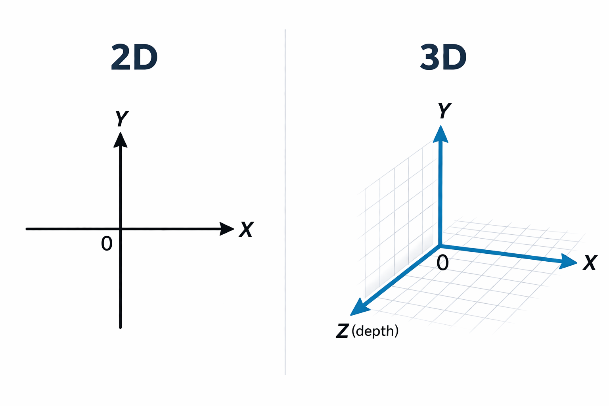
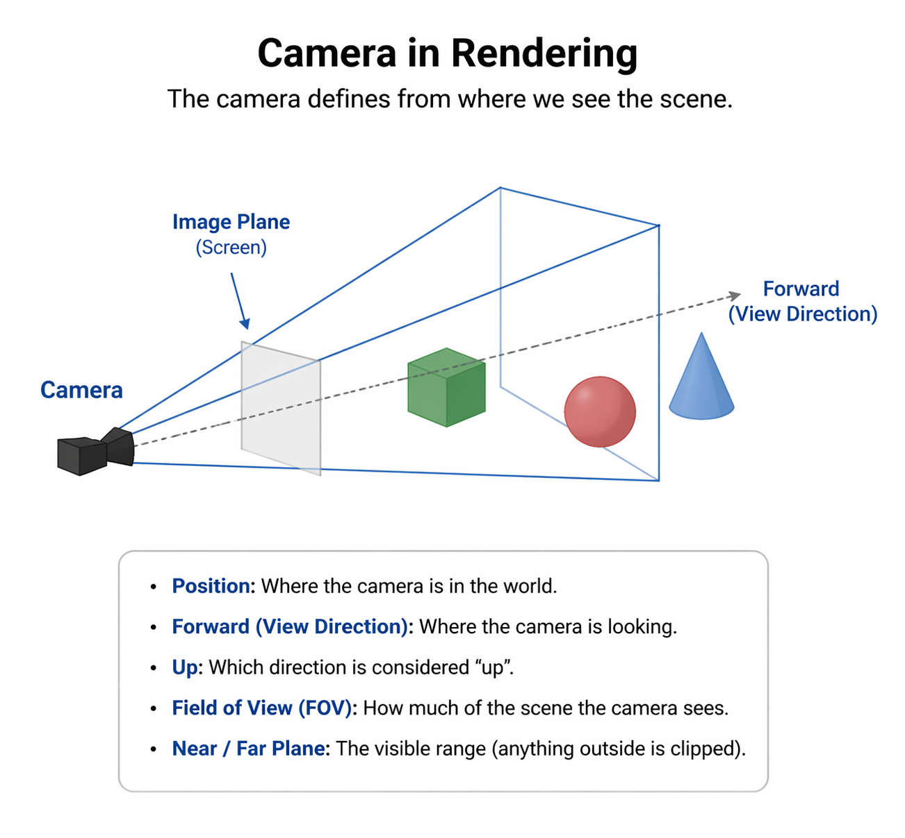
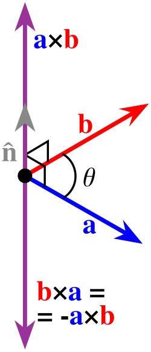
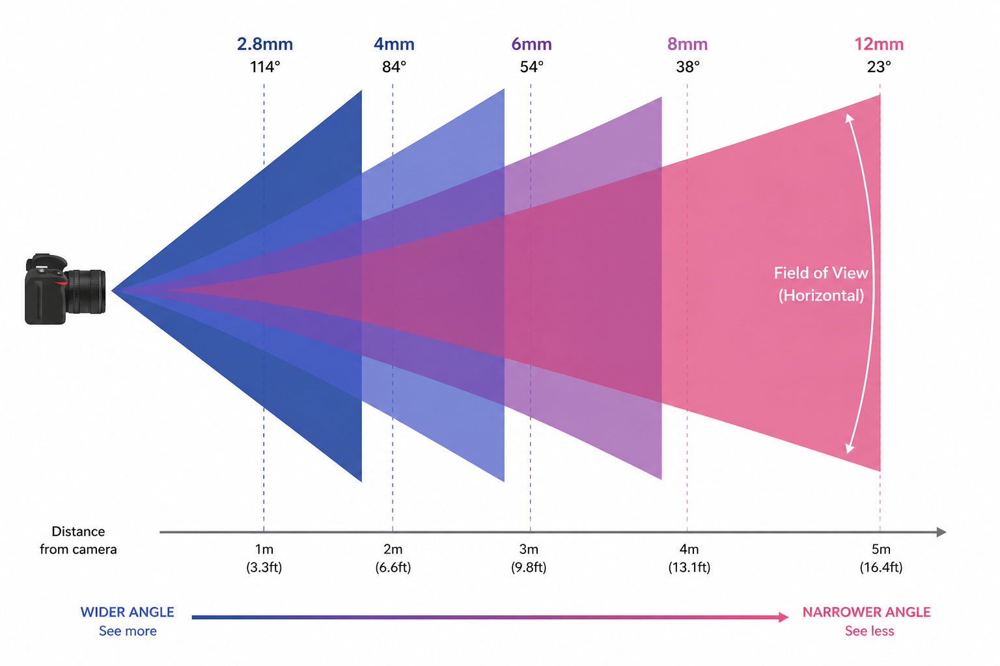
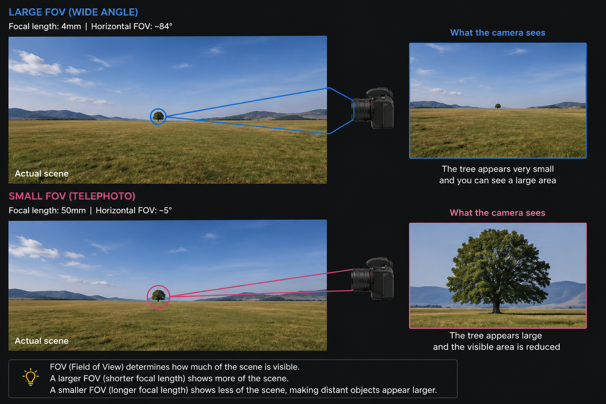
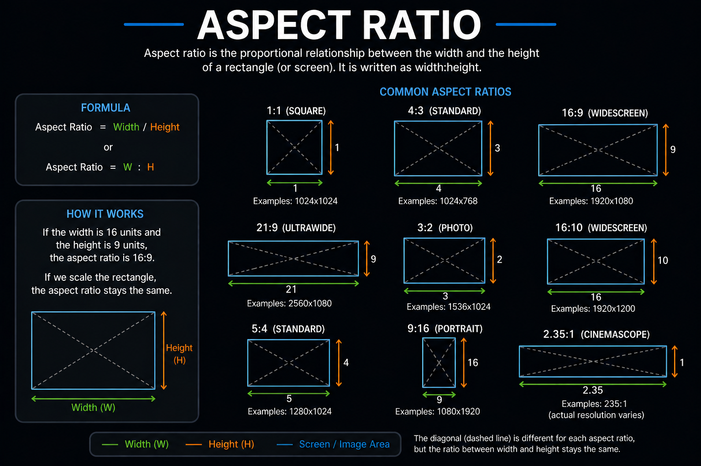
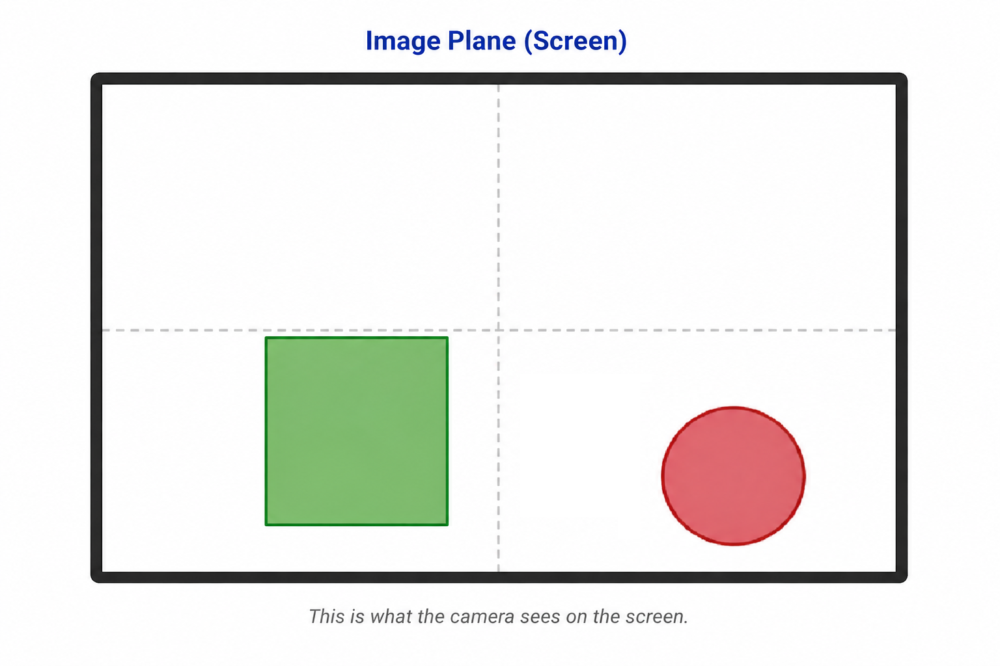

# Lesson 5 - Going to 3D

This lesson is going to be an intro to a 3D renderer. But please, do not get too excited, as we are only going to discuss the basics of 3D world and we will do a simple transition from rendering 2D shapes to 3D. 

At the end of the lesson, we will be able to render a pyramid as seen below:

To be honest, after this lesson, you will be able to render any 3D shape, given that you correctly construct it's data.

In this lesson, we are going to cover:

* Transition from 2D to 3D world
* Intro into camera 
* Aspect ratio

What we are not going to cover in this lesson are:

* Interactive camera
* Live transformations (like orbiting bodies or etc.)
* Light

These topics (especially anything that has to do with lights) will be left for the following lessons. This lesson is not going to be long as the previous one. Transformations were the thing that takes time to understand and that's totally fine. Transformations, especially for those that do not like math, is a bit tricky to grasp the intuition. But this lesson is way simpler.

So, without further ado, let's continue with the lesson.

## Transition from 2D to 3D world

To be fair, going from 2D to 3D is kind of simple. I am not joking. The only thing that changes in the data that is being loaded to a GPU VRAM is the coordinates component (position). In 2D we had 2 numbers describing where in space the vertex should be placed (X and Y coords). In 3D world, another dimension is needed, which is called the Z dimension. Because of it, instead of 2 numbers, we need 3 numbers to describe the vertex position (X, Y and Z coords). Look at this image bellow:

Is it clearer now? 

One thing to rememeber (or you can think about it as guidlines) is the axis directions. By convention:

* X axis: left <--> right
* Y axis: up <--> down
* Z axis: depth

#### Z axis

X and Y axes are pretty simple to understand, but Z is a bit trickier. You can think of this depth dimension the same way depth is measured in water. Imagine, that you put your face paraller to the water surface, so that your eyes would look directly into the water. This way the depth of the water acts as a Z dimension.

Also, another important thing is the Z axis convention. There are 2 way how you can measure an axis:

1) Right hand rule: the Z axis is poisitve going towards you (in rendering it would be towards the screen) (this is the convention)
2) Left hand rule: the Z axis is negative going away from you (in rendering it would be away from the screen)

This graph below clearly demonstrates this:

To be honest, I do not know what else to talk about 3D real world. The main thing is that coordinates expand to another dimension (Z axis).

## Camera

For me, the best way to think about camera is like an actual operator that is filming the scene. Imagine, that you have a scene which has some objects placed in it (like tables, chairs and etc.). Now the operator can film the scene from many positions, maybe from the left side, maybe from the right. The operator can film the scene from the bottom or the top side. In other words, the operator can film it from any direction and any distance. The camera produces the visual information (what it captured), thus allowing viewers to see what is happening in that scene. The different position of the camera, produces the different view of the scene.

The exact same principles apply for the camera term in rendering. Instead of a human carying that camera from place to place, the position is controlled by the user him/herself. 

The image below illustrates everything you need to know about the camera for this lesson:

Let's go 1 by 1 and explain all of these:

* __Position__ - the coordinates of the camera.
* __Forward (View Direction)__ - it is a vector, a direction the camera is looking to. Imagine that from a camera a straight vector is point. This vector points to the direction the is focused.
* __Up__ - a vector that is pointing to the up direction from the camera and that is perpendicular to the forward vector.
* __Right__ - a vector that is pointing to the right direction from the camera  and that is perpendicular to the forward vector.
* __Near Plane (Image Plane)__ - the closest distance the object can be seen. Anything closer than that, and the object is not going to be rendered.
* __Far Plane__ the farthest distance the object can be seen. Anything farther than that, and the object is not going to be rendered.
* __View Frustum__ - a truncated pyramid (a pyramid with its top sliced off), where the two parallel faces are the near plane and the far plane.
* __Field of View (FOV)__ - How much of the scene the camera sees. Usually, the camera ___only___ everything that is inside the view frustum. Anything outside the view frustum is clipped.

Looking at the image, only 2 out of the 3 objects would be seen, the green cube and the red sphere, the blue cone would not be visible to the camera because it is outside the view frustum. 

Also, take a look at the __image plane__ in the image. In the parenthesis it is named as "screen". If it is easier for you, you can totally think of it like that, but please do not make a mistake thinking that the the view starts at the camera position. Now, why is that a problem? Well, mathematically, if a near plane is the coords of the camera, then the view frustum is not a frustum at all, but a pyramid, since no plane can be constructed in 1 point. That is why it is very important to have a near plane a little farther from the actual camera position, thus making a frustum possible.

#### Up and Right Vectors

Let's dive a little deeper for the __up__ and the __right__ vectors. First of all, why do we need these 2 vectors?

* __Up__ (camera up, not the world up) is used for the generation of the __view__ matrix (we are going to cover this later in this lesson).
* __Right__ is used to calculate the up vector.

So in a sense, we need A to construct C, but we need B to construct A, where A is up, B is right, C is view. 

How to calculate these vectors? Below are the equations for vectors caclulation:

$
    \mathbf{Right} = \mathrm{normalize}(\mathbf{Forward} \times \mathbf{WorldUp})
$

$
    \mathbf{Up} = \mathbf{Right} \times \mathbf{Forward}
$

Keep in mind 2 things:

1. `WorldUp` is a global up direction for the world, for example in 3D world, `up` vector would be [0, 1, 0] 
2. `x` is not a dot product but a cross section multiplication which is done this way:

    $
        \mathbf{a} =
        \begin{bmatrix} 
            a_x \\ a_y \\ a_z
        \end{bmatrix}, \quad
        \mathbf{b} =
        \begin{bmatrix} 
            b_x \\ b_y \\ b_z
        \end{bmatrix}
        \rightarrow
        \mathbf{a} \times \mathbf{b}
            =
        \begin{bmatrix} 
            a_y b_z - a_z b_y \\ 
            a_z b_x - a_x b_z \\ 
            a_x b_y - a_y b_x
        \end{bmatrix}
    $

Cross multiplication of 2 vectors is great because it spits out a 3-rd vector which is perpendicular to `a` and `b` vectors. To better understand why a 3-rd vector is perpendicular, just take a look at this image:

It clearly shows that a produced `n` vector is perpendicular to both `a` and `b`, or in other words, it is perpendicular to a plane that is defines by a total span of vectors `a` and `b`. Also, another important thing to see in this image is the order of multiplication. The cross product is not __commutatve__. `a × b` and `b × a` produce vectors that point in opposite directions. The exact direction is determined by the right-hand rule. Right hand rule works by pointing your index finger to the direction the first vector is pointing and middle finger - to the direction the second vector points, then the direction of the 3-rd vector is determined by your thumb. Just take a look at the image below:

The important thing to remember from this sections is that we need `up` (camera up) in order to get the `view` matrix.

#### Near / Far Planes and View Frustum

Once these 3 concepts are understood, you will understand half of what you see on your screen and why do you see it as you do ( a couple smiling faces). Why only a half? Well, because there are still concepts like __view__ and __projection__ matrices (which, as I said, I will cover on this lesson). But those, in my opinion, should be discussed after near, far planes and view frustum sits wells in your head. So, let's start digesting it. 

I hope this image elaborates a little more as to what I mean by near, far planes and view frustum. You can think of a near plane as to where the monitor screen starts. Far plane is where the visibility ends, and what you see on your screen is inside the view frustum (the blue volume in the image). I explained on why the near plane cannot start at the coordinates of a camera, but I never told why does the far plane have to have a defined end. 

The far plane has to have a defined ending because otherwise an infinite view frustum would happen. This would be a huge problem for your GPU, because looking infinitely far back there might be objects that are in the frustum's volume, so in a sense, calculations on those objects would be done. Also, for the same GPU problem, it is advised not to make a far plane super far away. Do not forget, that the more objects are visible, the more computation is needed to process and render them. But, it is up to the programmer to find an optimal solution for the distance of the far plane. Some scenes do not need the far plane to be very far away, but others, like a scenery of trees or a huge field require it to be farther away.

Again, to sum this little section, just know that based on the near and the far planes, the view frustum is constructed, and everything that is seen through the monitor screen is inside the view frustum.

#### Field of View (FOV)

__FOV__ is the angle that determines how much of the world the camera can see at one. This parameter is needed once we start calculating the projection matrix (which we will cover in this lesson).

To illustrate what the FOV is, here is the first explanatory image:

As you can see in this image, field of view angles fo from wide to narrow. Each colored triangle (in 3D it would be a pyramid) shows what area is visible through the camera lense. Wide angle is great in capturing near objects, but each captured objects has less detail in a single frame, while narrow angle is great for having a great detail in far away objects, but instead of seeing many objects, a few or a single object is visible. It is essentially a tradeoff, and each case or each combination might require to look at the scene with a different angle. The image below captures this idea:

There is a single tree in an empty field. The top right image shows how this scene is captured using a wide angle. Almost the entire scene is captured, all the mountains and hills, all of the sky and grass, captured in a single image. We can say that we see about 90% of the actual scene. But, using this picture, if we wanted to see the individual details of the tree or a mountain or even a grass, we would see that it lacks pixels. There is not enough detail for each individual object. Here comes the the bottom right image. A single tree is captured. A lot of detail for an individual tree, you can easiluy see it's branches and almost individual leafs. But, not a lot of background. Instead of the full view of the actual scene, we see about 5% of it, only a single tree with a little background that surrounds it. But then again, it is up to the person that uses the camera to determine what he / she wants to capture.

Also, looking at the top right and top bottom images, one important thing to say is that both images have the same amount of total pixels.

The exact same FOV principles hold in the rendering world. If you have a camera that has a wide FOV angle, you will be able to see a lot of scene at once throuh your monitor screen, but each separate object might not have the most detail and vice versa with a narrow FOV angle.

The equation for FOV is the following:

$
    FOV = 2 \cdot \arctan\left(\frac{sensor\_size}{2 \cdot focal\_length}\right)
$

But keep in mind that FOV is a single angle, meaning it describes the angle only for a single dimension.
You can specialize for horizontal and vertical FOV:

$
    FOV_h = 2 \cdot \arctan\left(\frac{sensor\_width}{2 \cdot focal\_length}\right)
$

$
    FOV_v = 2 \cdot \arctan\left(\frac{sensor\_height}{2 \cdot focal\_length}\right)
$

But, these are the equations that help as determine the FOV in the real world. In redering, we usually directly set the FOV. Also, one important thing to note here is that FOV is usually set for the vertcal component. Why? Well, as you will see later, the horizontal component can be extracted knowing what is the aspect ratio.

#### Aspect Ratio

__Aspect Ratio__ tells the ration between the pixels in width and pixels in height. No magic, just easy to understand topic. This parameter, same as FOV, is needed to calculate the projection matrix. The equation for the aspect ratio is this:

$
aspect\_ratio = \frac{width}{height}
$

I hope this image explains everything to you about the aspect ratio.

Now, that we have went through all the "small" building blocks of the camera, let's go to the "big bolder" topics.

## Camera Transformations: View and Projection Matrices

These 2 remaining topics about the camera are, at least for me, kind of hard to understand. I mean, I remember when I first stumbled on these 2 words and was like "what is that?". Trust me when I say this, but it took me some time to get a good grip on what these things are. This is, probobly, the first time where the notion of "why do I see objects like I do in pure form?" comes to light. First of all, in this section stop thinking anything outside the real world. I mean when I will be explaining these 2 matrices, do not think about no OpenGL or shaders or any other thing related to pixel coloration. Instead, all the time think about the real world (virtual world).

Remember how to get the model matrix of each object, you have to follow these steps:

$
    \text{Local} \;\rightarrow\; \text{Scaling} \;\rightarrow\; \text{Rotation} \;\rightarrow\; \text{Translation} \;\rightarrow\; \text{Model}
$

Well, somewhat the same logic can be applie here (the following represent different coordinat systems):

$
    \text{Model} \rightarrow \text{View} \rightarrow \text{Clip (Projection)} \rightarrow \text{NDC} \rightarrow \text{Screen}
$

Before moving any further, here you can see __NDC__ and __Screen__. I am going to cover these 2 in this or the following lessons. For now, just know that NDC (normalized device coordinate) is resolution or pixel invariant 2D coordinate system. It's range is $(-1, 1)$ (both, for X and for Y axes). Screen is the actual pixel coordinates (also 2D, because screen is flat), meaning that when X and Y coordinates are given, they represent the actual pixel position on your monitor screen. 

We know what a model matrix is, but following it, we can also see our 2 main protagonists of this section. Since __view__ goes right after the model matrix, let's start with it.

---
### View Transformation

__View Matrix__ is a matrix that transforms world space into camera (view) space. It transforms all objects in the scene in such a way that the camera becomes the origin of the coordinate system and looks along a fixed direction. In a sense, you can think about this transformation as changing the world space to local space, where the local space is relative to the camera. To help you visualize this, imagine a cube placed at position [x, y, z] in world space, and a camera located at $(x_c, y_c, z_c)$. After applying the view matrix, the coordinate system is transformed so that the camera is effectively at $(0, 0, 0)$, and the cube is moved and rotated to a new position $(x_t, y_t, z_t)$ relative to the camera. In other words, instead of moving the camera, the entire world is transformed relative 
to the camera's position and orientation.

What might help you to better understand how a camera view coordinate are how the axis look like. Remember what are camera's forward direction, right and up vectors? Well, these become axes in the camera view coordinate system:

* Forward vector --> -Z axis (since Z axis goes towards the screen)
* Right vector --> +X axis
* Up vector --> +Y axis

The idea of view matrix is kinda simple. You need a view transform in order to move all the world in such a way that the camera would be the origin of it. You need the camera to be the origin because you see the real world through your monitor, and he monitor is eesentialy the camera lense through which you see the real world. 

There are also deeper and much more important reasons on why the view transform is necessary. For example, it mathematically simplifies a lot of the stuff for the GPU. Imagine for a second that you did not use the view transform. In this case, now the GPU has to somehow figure out what is visible and what is not. And how would the GPU do it? Well, in this case, for every object the GPU would have to calculate the camera orientation (because we want to see if the object is visible or not), compute projections differently. We would need all this stuff because, at the end, the clip space essentially tells what objects are in the camera view are and which not. View transformation simplifies a lot of steps, and also, because matrices are amazing, you can combine the view matrix with the projection matrix (which we are going to discuss now).

### Mathematical Core and Intuition Behind View Transformation

The core problem we are trying to solve with view transformation is that we want to transform the world space in such a way that the camera is the origin of this new coordinate system. Remember, that up now, the origin of the real world is defined as $(0, 0, 0)$ while camera has it's own position $(x, y, z)$. 

In order to transform the real world coordinate system into a camera space, you need 3 things:

* Camera position

    $
        \vec{c}
    $

* Target (what the caera is looking towards)

    $
        \vec{t}
    $

* Up vector (for the real world, which is usually $(0, 1, 0)$)

    $
        \vec{u}_{\text{world}} = (0, 1, 0)
    $

Next, we need to build 3 axes vectors that will define camera space's coordinate system's base axes. As mentioned earlier we need:

* Forward vector (camera direction) <--> $-z$

    $
        \vec{f} = \frac{\vec{t} - \vec{c}}{\|\vec{t} - \vec{c}\|}
    $

* Right vector <--> $+x$

    $
        \vec{r} = \frac{\vec{f} \times \vec{u}_{\text{world}}}{\|\vec{f} \times \vec{u}_{\text{world}}\|}
    $

* Camera up vector <--> $+y$

    $
        \vec{u}_{\text{camera}} = \vec{r} \times \vec{f}
    $

Now, before continuing any further, let's just take a small step back and try to think what will the view transformation do. I mean what type of transformations. Remember, that there are 3 basic types of physical transformations: scaling, rotation and translation. Now let's see which of these 3 are needed for the view transformation:

* Scaling - no We do not in any shape or form scale anything. Not a single object in the camera space is going to have a different size than what it used to have.
* Rotation - yes. Imagine if the camera is rotate 90 degrees on the Z axis. This way the camera up vector is the -X axis of the world space. But, in camera space, the up vector of the camera becomes the Y axis for the camera space. Because of it rotation is needed in view transformation.
* Translation - yes. Remember, that we want to make the camera position as the origin for the camera space, meaning that cameera position in world space $(x, y, z)$ becomes $(0, 0, 0)$ in camera space:

    $
        \overset{\text{world space}}{(x, y, z)} \;\rightarrow\; \overset{\text{camera space}}{(0, 0, 0)}
    $

Now we know that view transformation is basically comprised of 2 types physical transformations: rotation and translation. Because view transformation has translation ad the fact that we want to express this transformation as a linear operation, we have to visit our good old friend homogeneous coordinate system. This means that the view matrix is going to be 4D instead of 3D.

Here is how the view matrix looks like:

$
    V =
    \begin{bmatrix}
        r_x & r_y & r_z & -\vec{r} \cdot \vec{c} \\
        u_x & u_y & u_z & -\vec{u} \cdot \vec{c} \\
        - f_x & - f_y & - f_z & \vec{f} \cdot \vec{c} \\
        0 & 0 & 0 & 1
    \end{bmatrix}
$

For me, when I first saw this matrix was "what is that? Why is it layed the way as it is?". To better understand why the view matrix looks the way it does, it is advised to look at the translation and rotation transformations separately. Because, remember that the view matrix is comprised of of these 2 transformations. Also, remember this one fact, that when the view matrix is being created, first you apply the translation and then the rotation matrices. Do not mistaken it with the model matrix, where vice versa happens (first rotation and only then translation).

Let's take a look at how the translation matrix for the view transformation is going to look like:

$
    T =
    \begin{bmatrix}
        1 & 0 & 0 & -c_x \\
        0 & 1 & 0 & -c_y \\
        0 & 0 & 1 & -c_z \\
        0 & 0 & 0 & 1
    \end{bmatrix}
$

One thing to note from the beginning is that we are again in the homogeneous coordinate system (we are in 3D world, but the transformation matrix is 4D). Do not forget translation is not a linear operation, but we want to make it one. Homogeneous coordinate system allows us to achieve this. 

Again, you might go "why is the `-` sign before the camera position?". Well, our goal is to make camera position in world space, the origin of camera space (as I mentioned before). So if the camera is at:

$
    c \rightarrow (c_x, c_y, c_z)
$

we want:

$
    c \rightarrow (0, 0, 0)
$

In order to achieve this, we need to solve a simple algebra equation. We know the origin coordinates, we know the camera coordinates. The only unknown is what values we need to subtract from camera position in order to get the origin? Let's solve it:

$
    \begin{aligned}
        \vec{c} - \vec{x} &= (0, 0, 0) \\
        \vec{x} &= (0, 0, 0) - \vec{c} \\
        \vec{x} &= (0, 0, 0) - (c_x, c_y, c_z) \\
        \vec{x} &= (0 - c_x, 0 - c_y, 0 - c_z) \\
        \vec{x} &= (-c_x, -c_y, -c_z) \\
        \vec{x} &= -(c_x, c_y, c_z) \\
        \vec{x} &= -\vec{c}
    \end{aligned}
$

So now we know why the delta components in the translation matrix have a `-` sign.

Let's now study the rotation part. The rotation trasnformation matrix looks like this:

$
    R =
    \begin{bmatrix}
        r_x & r_y & r_z & 0 \\
        u_x & u_y & u_z & 0 \\
        - f_x & - f_y & - f_z & 0 \\
        0 & 0 & 0 & 1
    \end{bmatrix}
$

This looks a bit harder to understand than the translation matrix (of the view matrix). Since this matrix is also in the homogeneous coordinate system and in order to better understand how the rotation part works in the view transformation, let's first drop the last dimension of the rotation matrix. Now, this matrix looks like this:

$
    R =
    \begin{bmatrix}
        r_x & r_y & r_z \\
        u_x & u_y & u_z \\
        - f_x & - f_y & - f_z \\
    \end{bmatrix}
$

One thing to notice from the beginning is that values are logically placed. I mean first row has right vector values, second row has up vector values and the third row has negative forward vector values (remember, positive values go toward the screen). But, at the moment, it still looks a bit confusing. One of the weird things I noticed while learning the rotation matrix (which is the transformation component in the view matrix) was that for some reason, the rows of this matrix have basis axis of camera space. My question was, why the basis vectors are now the rows and not columns, I mean in the last lesson I remember that I told you that in math, it is a convention to have columns in the matrix representing the basis vectors of that coordinate system. So why is it that this rotation matrix is [transposed](https://en.wikipedia.org/wiki/Transpose)?

The main idea why the rows instead of columns are the basis vectors in this rotation matrix is because we are trying to transform the world space to local space. Remember, how we had a an object constructed and then we wanted to move it to the world space (in a sense, putting a contstructed object into the scene). What we essentially are doing is moving the object from local space to world space. When an operation like this is done, usually the transformation matrix has basis vectors defined in columns. One critical thing to understand is that camera space is essentially a local space for the camear object. Now, logically thinking, in order to go back from the world space to local space, we can just take the original transformation matrix and apply the inverse of it. In a sense it would look like this:

$
    M - \text{transformation matrix, local space} \rightarrow \text{world space}\\
    \vec{v}_{\text{world}} = M \, \vec{v}_{\text{local}} \\
    \vec{v}_{\text{local}} = M^{-1} \, \vec{v}_{\text{world}}
$

That looks pretty reasonable, but our rotation does not look like an inverse, it looks transposed. Yes, but here lies one of the math's hidden beauties. If a transformation is orthogonal, it's inverse is a transposed version of it (the original trasnformation). In order for a trasnformation to be an orthogonal, it needs to preserve angles and lengths, also, it needs to be a linear transformation. Rotation preserves all of these. There is also a reflection trasnformation, but will not be covering that on this lesson. Translation is not linear and scaling literally lengthens or shortens the lines.

Let's look again into the mathematical world to understand why the trasnpose of the rotation matrix is actually an inverse of it:

For orthogonal matrix __Q__ the defining property is:

$
    I - \text{indentity matrix}
$

$
    Q^{T}Q = I
$

Now let's compare this to the definition of inverse:

$
    A^{-1}A = I
$

So if:

$
    Q^{T}Q = I 
$

then $Q^T$ is an inverse of $Q$.

Because the view trasnformation essentially transforms world space into a camera space, which is a local space for the camera object, that means that the rotation part of the view matrix is transposed. That is rows in rotation matrix of the view transformation has rows as basis vectors.

Now we have 2 necessary components that comprise a single view matrix. We have translation and rotation matrices. The only thing that is left is we need to multiply them together and we will have a proper view matrix.

$
    V - \text{view matrix} \\
    R - \text{rotation matrix} \\
    T - \text{translation matrix} \\
    \vec{r} - \text{right vector} \\
    \vec{f} - \text{forward vector} \\
    \vec{c} - \text{camera position} \\
$

$
    RT = V \\
$

$
    \begin{bmatrix}
        r_x & r_y & r_z & 0 \\
        u_x & u_y & u_z & 0 \\
        - f_x & - f_y & - f_z & 0 \\
        0 & 0 & 0 & 1
    \end{bmatrix}
    \begin{bmatrix}
        1 & 0 & 0 & -c_x \\
        0 & 1 & 0 & -c_y \\
        0 & 0 & 1 & -c_z \\
        0 & 0 & 0 & 1
    \end{bmatrix}
    =
    \begin{bmatrix}
        r_x & r_y & r_z & -\vec{r} \cdot \vec{c} \\
        u_x & u_y & u_z & -\vec{u} \cdot \vec{c} \\
        - f_x & - f_y & - f_z & \vec{f} \cdot \vec{c} \\
        0 & 0 & 0 & 1
    \end{bmatrix}
$

If you do not believe that multiplying $R_{V}T_{V}$ produces these values, you can try multiplying it on paper. Hightly suggest that in order so that you could arrive to these results yourselves.

One question you might have is why first translation is applied and only then rotation. I mean in the last lesson I told you that the order of multiplication is $TRS$. But remember, this is only the order if we move from local space to world space. Since view trasnformation transforms world space to local space all the operations also have to be reverted in order. Because of it, we have to first translate the space and only then rotate it.

Finally, now we understand what is a view transformation and how to construct it. We know $\frac{1}{2}$ of the transformations needed for this lesson. Next, we have a projection transformation.  

---
### Projection Transformation

Dilemma is simple - we have 3D objects which are represented by triangles where each vertex is defined in 3D space $(x, y, z)$ coordinates. The problem is that our screen is 2D, and pixels are usually specified by 2 coordinates $(x, y)$. Now, how can we transform 3D points in a way that we could see them on a 2D screen? Lucky for us, we have one special transformation, suited exactly for these kinda situations. Here comes the __projection transformation__.

__Projection Transformation__ - transforms 3D points in camera (view) space into a form that can be mapped onto a 2D screen. 

Remember this image:

Well in this situation the view on your monitor should be something like this:

Now, since we know the reason for which we need the projection transformation, let's see how we can actually implement it. Before we start, I have to inform you that we will see some math, but please do not leave this lesson here.

This graph shows the flow of how 3D becomes 2D on the screen:

$
    \text{3D} \rightarrow \text{Projection Transformation} \rightarrow \text{2D}
$

This is where the projection transformation is responsible for in real world. In rendering, it is a bit different. In rendering the 3D to 2D transformation happens in these steps:

$
    \text{View Space} \rightarrow \text{Projection Transformation} \rightarrow \text{Clip Space} \rightarrow \text{Perspective Divide} \rightarrow \text{NDC} \rightarrow \text{Viewport Transform} \rightarrow \text{Screen Space}
$

As you can see, here projection transformation only is one of many steps in transforming 3D coordinates to 2D, which could mean pixels on our monitor screen. In rendering, projection transformation trasnforms view space to clip space (aka. projection space).

Before we continue any further, I want to say that to understand projection transformation properly I recommend understanding what is NDC (normalized device coordinates) and what is clip space. Why I suggest it? Because I think that there are 2 reasons why it will help you overall:

1. Understanding NDC space let's you understand the purpose of projection trasnformation way simpler than before
2. NDC space overall is far easier to understand and wrap your head around it than projection
3. Even though clip space is a bit harder than NDC, it is still way easier than projection matrix

### NDC

**NDC (normalized device coordinates)** is a coordinate system where each axis has a range of $[-1; 1]$. It exists because there must be some GLFW window size independant coordinate system, so that GLFW window with different sizes could correctly display vertex positions. 

A clear example is imagine 2 different size monitors:

1. GLFW window A: size 400 x 800
2. GLFW window B: size 800 x 400

Following a common ground, if there is a sphere that is in the center of the GLFW window, that would mean that on window A it would be at coordinates [200; 400], but on window B it would be at [400; 200]. How to define what is center for GLFW window space which is different in size? Look at the 2 images below:

1. Image size: 400 x 800
    
    

2. Image size:  800 x 400

    

Do you see the problem? NDC exists exactly to solve this issue. 

What it serves for is if we have a coordinate system that is GLFW window size independant, then we can say that the same sphere in the NDC space is [0; 0]. Then internally a graphics API handles GLFW window size positions, so that any size GLFW window could display the sphere on exactly the same place.

### Clip Space

**Clip Space** is a coordinate system which essentially tells which vertices are visible and which not. To be more technical, clip space where the GPU decides what is inside camera's view and what should be clipple away. Remember the car and the window example in lesson 2.

To know which vertices will be visible and which not, remember this rule:

$
    -w_\text{clip} \leq x_\text{clip} \leq w_\text{clip} \\
    -w_\text{clip} \leq y_\text{clip} \leq w_\text{clip} \\
    -w_\text{clip} \leq z_\text{clip} \leq w_\text{clip}
$

A vertex is visible only and only if these 3 conditions are true. If at least one of these fail, the vertex is clipped and will not be visible in the final image.

Also, remember that the clip space still has a shape of $[D + 1; D + 1]$ where $D$ is the number of dimensions in real world. That means that clip space is homogeneous coordinate system.

Another fact worth mentioning is do not mistake clip space with NDC range. I have done this myself where for some time I was thinking that clip space has also a range of $[-1; 1]$. That is wrong. This is NDC's range, clip space do not have bounds.

### Perspective Divide

We understand what is clip space and what is NDC space, now we need to understand what is the operation that turns one to the other.

**Perspective divide** is a special operation which goal is to transform clip space to NDC space. 

### Mathematical Core and Intuition Behind Projection Transformation

The core problem we are trying to solve is that we want 3D points in camera space to be transformed to 2D coordinates. Again, we need 2D coordinates because we are slowly moving towards a final image that will be see on your screen. 

The problem can be generalized by this:

$
    \pi : \mathbb{R}^3 \rightarrow \mathbb{R}^2, \quad \text{where } \pi \text{ is the projection function}
$

which maps a 3D point to a 2D point:

$
    \vec{p} = (x, y, z) \;\rightarrow\; \vec{p'} = (x', y')
$

The simplest way to transform 3D points to 2D is to divide `x` and `y` coordinates by the $z$ (depth) value. 

$
    x' = \frac{d \cdot x}{z}, \quad y' = \frac{d \cdot y}{z}
$

The $d$ is for the camera zoom (we will cover it in this section). For simplicity, we can set:

$
    d = 1
$

This makes :

$
    x' = \frac{x}{z}, \quad y' = \frac{y}{z}
$

This way we would retain the distance, where once the $z$ value is large, the division by $z$ would produce a small value. This is all great, but here lies a small problem. The way we divide coordinates by $z$ is not considered a linear operation. As you remember from our previous lesson, I stressed the fact that transformations (if possible) should be linear, because this way we can combine multiple operations into a single matrix. You may ask me "why isn't this operation linear?". Remember, a linear transformation is a transformation that satisfies these 2 rules:

1. Additivity:

    $
        T(\vec{u} + \vec{v}) = T(\vec{u}) + T(\vec{v})
    $

2. Homogeneity:

    $
        T(a\,\vec{u}) = a\,T(\vec{u})
    $

Let's check the additivy first for the division by $z$:

$
    \vec{u} = (1, 0, 1) \ ; \vec{v} = (0, 1, 1)
$

Project $\vec{u}$ and $\vec{v}$ vectors (divide $x$ and $y$ by $z$):

$
    \begin{aligned}
        T(\vec{u}) &= T(1,0,1) = \left(\frac{x}{z}, \frac{y}{z}\right) = \left(\frac{1}{1}, \frac{0}{1}\right) = (1,0) \\
        T(\vec{v}) &= T(0,1,1) = \left(\frac{x}{z}, \frac{y}{z}\right) = \left(\frac{0}{1}, \frac{1}{1}\right) = (0,1)
    \end{aligned}
$

Now let's add:

$
    T(\vec{u})+T(\vec{v})=(1,0)+(0,1)=(1,1)
$

So, we have the first result for the $T(\vec{u}) + T(\vec{v}) = (1, 1)$. Now wee need to check what the $T(\vec{u} + \vec{v})$ will give. 

First, let's add the 2 vectors together:

$
    \vec{w} = \vec{u} + \vec{v} = (1, 0, 1) + (0, 1, 1) = (1, 1, 2)
$

Project the result:

$
    \begin{aligned}
        T(\vec{w}) &= T(1,1,2) = \left(\frac{x}{z}, \frac{y}{z}\right) = \left(\frac{1}{2}, \frac{1}{2}\right) 
    \end{aligned}
$

Do you see the problem? I mean why the simple division by $z$ is not linear?

$
    T(\vec{u}) + T(\vec{v}) \neq T(\vec{u} + \vec{v}) \rightarrow (1, 1) \neq \left(\frac{1}{2}, \frac{1}{2}\right)
$

"Hmmm, what can be done to solve this linearity issue? I wonder if a similar problem apeared in the previous lesson, where we wanted to make a translation also linear.". For some of those that remembered the last lesson, we have learned about the homogeneous coordinate system. This coordinate system was great because it allowed us to express translation as a linear operation by introducing another dimension. Remember that our goal is to combine transformations into a single matrix (entity) which could be reused for all objects. 

We can follow the same logic to make the projection transformation linear also. In the previous lesson, we were still dealing with 2D world, so our transformation matrix in homogeneous coordinate system was 3D. Now, since we are transitioning to 3D, the transformation matrix has to be 4D.

The projection matrix in homogeneous space looks like this:

$
    P =
    \begin{bmatrix}
        \frac{1}{\tan\left(\frac{fov}{2}\right)\cdot aspect} & 0 & 0 & 0 \\
        0 & \frac{1}{\tan\left(\frac{fov}{2}\right)} & 0 & 0 \\
        0 & 0 & \frac{f + n}{n - f} & \frac{2fn}{n - f} \\
        0 & 0 & -1 & 0
    \end{bmatrix}
$

Ok, if view matrix made 0 sense at the beginning, this one looks even worse. Remember, that the projection transformation transforms a vector from view space to clip space:

$
    \vec{v_\text{view}} = [x_\text{view}, y_\text{view}, z_\text{view}, w_\text{view}] \text{ - vector in view space} \\
    \vec{v_\text{clip}} = [x_\text{clip}, y_\text{clip}, z_\text{clip}, w_\text{clip}] \text{ - vector in clip space} \\
    P \text{ - projection transformation matrix}
$

$
    \vec{v_\text{clip}} = P \cdot \vec{v_\text{view}}
$

I think that the best way to understand this matrix is to look at it by each row individually, since each row trasnforms a single component in the input vector. Let's see how it works:

* 1-st row

    $
        \begin{bmatrix}
            \frac{1}{\tan\left(\frac{fov}{2}\right)\cdot aspect} & 0 & 0 & 0 \\
        \end{bmatrix}
        \xrightarrow{\text{transforms}} x_\text{view} \rightarrow x_\text{clip}
    $

* 2-nd row

    $
        \begin{bmatrix}
            0 & \frac{1}{\tan\left(\frac{fov}{2}\right)} & 0 & 0 \\
        \end{bmatrix}
        \xrightarrow{\text{transforms}} y_\text{view} \rightarrow y_\text{clip}
    $

* 3-rd row

    $
        \begin{bmatrix}
            0 & 0 & \frac{f + n}{n - f} & \frac{2fn}{n - f} \\
        \end{bmatrix}
        \xrightarrow{\text{transforms}} z_\text{view} \rightarrow z_\text{clip}
    $

* 4-th row

    $
        \begin{bmatrix}
            0 & 0 & -1 & 0 \\
        \end{bmatrix}
        \xrightarrow{\text{transforms}} w_\text{view} \rightarrow w_\text{clip}
    $

Let's go one by one and understand why and how they transform their respective components.

### 1-st row

The 1-st row of the projection matrix has only a single non 0 element. That means that for the $x_\text{clip}$ the result will be:

$
    x_\text{clip} = \frac{1}{\tan\left(\frac{fov}{2}\right)\cdot aspect} \cdot x_\text{view}
$

Since we understand how $x_\text{clip}$ is computed, let's dive deeper into the meaning of the:

$
    \frac{1}{\tan\left(\frac{fov}{2}\right)\cdot aspect}
$

To understand it better, we have disect this expression into even smaller parts. Let's start from:

$
    \tan\left(\frac{fov}{2}\right)
$

What is the meaning of this and why is it the way it is? Why is it the denominator?

The image above shows that (remember the [$tan$](https://en.wikipedia.org/wiki/Trigonometric_functions) rule):

$
    t = \text{top} \\
    n = near
$

$
    \tan\left(\frac{\theta}{2}\right) = \frac{t}{n}
$

we can rearrange this equation to be:

$
    \frac{t}{n} = \tan\left(\frac{\theta}{2}\right) \\
    t = n \cdot \tan\left(\frac{\theta}{2}\right)
$

Now we can express the height (top) in terms of distance from the eyer and the $\tan\left(\frac{\theta}{2}\right)$ value.

If we choose $near$ to be 1, then this equation simplifies to:

$
    t = \tan\left(\frac{\theta}{2}\right)
$

This is an extremely important result. It tells us how large the visible half-height of the camera frustum is at distance 1. From this, we can see that increasing the field of view increases the size of the visible region. A larger visible region means more world space fits inside the camera frustum, causing objects to appear smaller in projected space. A smaller field of view produces the opposite effect and behaves similarly to a zoomed-in camera. Also, from the definition of __fov__, we can say that the the larger the angle, the smaller the object's projection on the screen is. You can see this clearly on the tree picture (at the top of the lesson). The tree, in both pictures, has the same height, but the different fov makes tree to have the different size on the screen. That is directly affected by this equation.

Now, the above equation basically tells us ___how large the visible region at a distance of 1 is___. This is great, but this number can vary from 0 to infinity. I mean look at this:

$
    t = \tan\left(\frac{0^\circ}{2}\right) = \tan\left(0^\circ\right) = 0 \\
    t = \tan\left(\frac{180^\circ}{2}\right) = \tan\left(90^\circ\right) = \infty
$

Usually to prevent the infinities, we hardcode that choosing an angle of 180&deg; is prohibited.

I will give you an actual example showing how $fov$ affects the height proportion of the object on the screen. Let's take 2 examples: 

1. Small fov: 15&deg;  $\; \; \; \; \; \tan(15^\circ) \approx 0.27$
2. Large fov: 120&deg; $\; \; \; \tan(120^\circ) \approx 1.73$

Let's plug in these values to this equation $top = \tan\left(\frac{\theta}{2}\right)$:

$
    f - \text{scaling factor} \\
$ 

$
    \text{1. fov = } 15^\circ \\
    t_1 = \tan\left(\frac{\theta}{2}\right) = \tan\left(\frac{15^\circ}{2}\right) = \tan(7.5^\circ) \approx 0.132 \\
    f_1 = \frac{1}{t_1} = \frac{1}{0.132} \approx 7.576 \\
$

$
    \text{2. fov = } 120^\circ \\
    t_2 = \tan\left(\frac{\theta}{2}\right) = \tan\left(\frac{120^\circ}{2}\right) = \tan(60^\circ) \approx 1.732 \\
    f_2 = \frac{1}{t_2} = \frac{1}{1.732} \approx 0.577
$

The $f_1$ and $f_2$ values are the **projection scaling factors**. These factors determine how strongly projected coordinates are magnified or shrunk for a given $fov$.

At this stage, we still have no notion of screens or pixels. Because of that, it would be incorrect to think that this factor directly tells us how many pixels an object will occupy on the screen. The scaling factor only affects how coordinates are scaled in projected space.

Another important thing to understand is why the scaling factor is the inverse:

$
    \frac{1}{top}
$

The intuition is actually very simple. The larger the visible region is, the more we must shrink coordinates in order to fit that region into normalized device coordinates (NDC). Likewise, the smaller the visible region is, the more we must magnify coordinates.

Remember that many rendering parameters can change dynamically:
- object positions,
- camera position,
- field of view,
- near and far planes.

However, one thing always remains constant: normalized device coordinates. After projection and perspective division, visible coordinates must fit into the fixed range:

$
    [-1,1]
$

This means:

- a small $fov$ produces a small visible region, so coordinates must be magnified more strongly,
- a large $fov$ produces a large visible region, so coordinates must be shrunk.

That is exactly why the projection matrix uses:

$
    \frac{1}{\tan\left(\frac{\theta}{2}\right)}
$

You should not think:

$
    \text{"object size} = x
    \Rightarrow
    \text{screen pixels} = f \cdot x"
$

At this point, there is still no final screen-space conversion. The scaling factor simply controls how zoomed-in or zoomed-out the projection is in projected space.

Why Does the Matrix Use Aspect Ratio? The top-left part of the projection matrix contains the following term:

$
    \frac{1}{\tan\left(\frac{fov}{2}\right)\cdot aspect}
$

A natural question arises: Why is the `aspect` ratio included only in the horizontal scaling term?
The answer is simple: monitors are usually rectangular, not square.

The aspect ratio is defined as:

$
    aspect = \frac{width}{height}
$

For example, a monitor with resolution:

$
    1920 \times 1200
$

has an aspect ratio of:

$
    aspect = \frac{1920}{1200} = 1.6
$

meaning that the screen is 1.6 times wider than it is tall. The `fov` value in the projection matrix usually represents the **vertical field of view**. From earlier, we already know that:

$
    \frac{1}{\tan\left(\frac{\theta}{2}\right)}
$

gives the vertical projection scaling factor. However, once the vertical scaling factor is known, we can compute the horizontal scaling factor using the aspect ratio. The horizontal scaling becomes:

$
    f_x = \frac{f_y}{aspect}
$

or equivalently:

$
    f_x = f_y \cdot \frac{height}{width}\\
    f_x = \frac{1} {\tan\left(\frac{\theta}{2}\right)\cdot aspect}
$

#### Why Divide by Aspect?

The intuition is very important.

A wider screen means that:
- more world space should be visible horizontally,
- therefore horizontal coordinates must be scaled less aggressively.

If the aspect ratio were not included:
- circles would appear stretched,
- squares would become rectangles,
- the image would look distorted.

The aspect ratio correction ensures that projection remains geometrically correct for non-square screens.

#### Intuition

You can think about it like this:

- the vertical `fov` determines how tall the visible camera region is,
- the aspect ratio determines how wide that visible region should become.

A larger aspect ratio:
- increases horizontal visible space,
- therefore decreases horizontal scaling.

That is exactly why the aspect ratio appears in the denominator.

To sum it up, we now understand what type of transformation does the top left matrix do. The goal of this transformation is to apply scale X and Y coordinates of the input vector by scaling factors respectively.

### 2-nd row

Second row of the projection transformation is:

$
    \begin{bmatrix}
        0 & \frac{1}{\tan\left(\frac{fov}{2}\right)} & 0 & 0 \\
    \end{bmatrix}
$

This is probobly the easiest to explain, since it is almost identical to the 1-st row, just without the $aspect$ term. We do not need the $aspect$ to get the $y_\text{clip}$ because remember, that $fov$ is defined as the vertical angle (not the horizontal). So our vertical scaling factor does not require to be further adjusted according to the aspect.

### 4-th row

I suggest to understand this row first, because it is easier and more intuitive from the remaining 2 rows.

The 4-th row is:

$
    \begin{bmatrix}
        0 & 0 & -1 & 0 
    \end{bmatrix}
$

Each element transforms a unique component:

$
    \begin{bmatrix}
        0^x & 0^y & -1^z & 0^w 
    \end{bmatrix}
$

Keep in mind that this row is transforming not the original vector, but that vector which is in view space. Because of it, components $[x, y, z, w]$ are components in view space.

Let's take this example: there is a vector in view space, and a projection matrix 4th row (imagine that this row is just another vector):

$
    \vec{v_{\text{view}}} \text{ - vector in view space} \\
    w_{\text{clip}} \text{ - clip value in clip space} \\
    \vec{p} \text{ - projection matrix's 4th row }
$

$
    \vec{v_{\text{view}}} = [x, y, z, w] \\
    \vec{p} = [0, 0, -1, 0]
$

Let's see how will $\vec{v}$ change in the cslip space:

$
    w_{\text{clip}} = \vec{p} \cdot \vec{v_{\text{view}}} = -z
$

Now we have a proof that a clip value is equal to $-z$. Now let's go a bit forward with it:

$
    \vec{v_{\text{view}}} \text{ - vector in view space} \\
    \vec{v_{\text{clip}}} \text{ - vector in clip space} \\
    P \text{ - projection matrix} \\
$

$    
    \vec{v_{\text{view}}} = [x, y, z, w]\\
    P =
    \begin{bmatrix}
        \frac{1}{\tan\left(\frac{fov}{2}\right)\cdot aspect} & 0 & 0 & 0 \\
        0 & \frac{1}{\tan\left(\frac{fov}{2}\right)} & 0 & 0 \\
        0 & 0 & \frac{f + n}{n - f} & \frac{2fn}{n - f} \\
        0 & 0 & -1 & 0
    \end{bmatrix}
$

$
    \vec{v_{\text{clip}}} = P \cdot \vec{v_{\text{view}}} = [x', y', z', w']
$

Since $w'$ is a value in clip space --> $w' = -z$ thus:

$
    \vec{v_{\text{clip}}} = [x', y', z', -z]
$

What comes next? Well, to understand it better, let's look back at all the trasnformations that happen in the rendering saga:

$
    \text{Model Space}
    \rightarrow
    \text{World Space}
    \rightarrow
    \text{View Space}
    \rightarrow
    \text{Clip Space}
    \xrightarrow{\text{Perspective Divide}}
    \text{NDC}
    \rightarrow
    \text{Viewport Transform}
    \rightarrow
    \text{Screen Space}
$

The next step after clip space is the **perspective divide**. The essence and goal of the perspective divide is pretty intuitive and clear. 

**Perpsective divide** transforms the vector in clip space to a vector in NDC space. An example of how it works:

$
    \vec{v_{\text{clip}}} = [x_\text{clip}, y_\text{clip}, z_\text{clip}, w_\text{clip}] \\
    \vec{v_{\text{ndc}}} = [x_\text{ndc}, y_\text{ndc}, z_\text{ndc}]
$

$
    x_\text{ndc} = \frac{x_\text{clip}}{w_\text{clip}} \\
    y_\text{ndc} = \frac{y_\text{clip}}{w_\text{clip}} \\
    y_\text{ndc} = \frac{z_\text{clip}}{w_\text{clip}} \\
$

If we replace the $w_\text{clip}$ with $-z_\text{view}$, we get:

$
    x_\text{ndc} = \frac{x_\text{clip}}{-z_\text{view}} \\
    y_\text{ndc} = \frac{y_\text{clip}}{-z_\text{view}} \\
    y_\text{ndc} = \frac{z_\text{clip}}{-z_\text{view}} \\
$

Does this equation remind you of something? Remember the:

$
    x' = \frac{x}{z}, \quad y' = \frac{y}{z}
$

This is the simplest way to project something onto a 2D screen from 3D world. Doesn't the 3 above equation look similar to this one? That is the essence of the 3-rd row in the projection transformation. You get the divisor for that is projecting x and y coords onto 2D screen.

Also, one key thing to remember is that up to now, many transformations we did were linear, but perspective divide is not a linear operation, since (as shown before) division by a value is does not satisfy the additivity rule.

This was a kind of long explanation on meaning and intuition on what is the 4-th row in the projection transform. The goal of the $[0, 0, -1, 0]$ row is to create a clip space $w_\text{clip}$ value that is actually $-z_\text{view}$, and this value is used as a denominator for the transformation from clip space to NDC. The transformation that transforms the vector from clip space to NDC space is called perspective divide.

Now we can go to the last group of elements in the projection matrix, which will complete our journey through the projection transformation intricacies and reasons on why is it the way it is.

### 3rd row

$    
    \begin{bmatrix}
        0 & 0 & \frac{f + n}{n - f} & \frac{2fn}{n - f}
    \end{bmatrix}
$

Before we continue with the explanation on why this row is the way it is, let's first get the intuition and what problem is the 3-rd row solving.

As we remember:

* 1-st row scales $x$ according to a scaling factor and an aspect
* 2-nd row scales $y$ according to a scaling factor
* 4-th row calculates $w_\text{clip}$, which, as we remember is $-z_\text{view}$

The question that remains is: what should we do with the z component after the projection transformation?

To understand the essence of this transformation, let's look back at the NDC space. NDC range (for all components or axes) is $[-1; 1]$. Also, there is a new concept we have to learn that is part of the clip space. Remember, that the clip space is the place where we can see which vertices in the view frustum are kept and which are clipped? I have told this before, but I think that I never have given a proper explanation on how to know which vertices are visible and which not.

The important rule to understand is this one:

$
    -w_\text{clip} \leq x_\text{clip} \leq w_\text{clip} \\
    -w_\text{clip} \leq y_\text{clip} \leq w_\text{clip} \\
    -w_\text{clip} \leq z_\text{clip} \leq w_\text{clip}
$

These 3 equations essentially tell which vertices are visible. If all 3 components of a vertex satisfy each of the equation, then this vertex is visible. If only a single one is not in this range, i.e. $[-w_\text{clip}; w_\text{clip}]$, then the vertexz is going to be clipped (we are not going to see that vertex on our screen).

How does this come into play with the 3-rd row of the transformation matrix? Well, these 3 equations have 4 unique terms: $x_\text{clip}, y_\text{clip}, z_\text{clip}, w_\text{clip}$. We know what 3 of them actually are (i.e.: $x_\text{clip}, y_\text{clip}, w_\text{clip}$). To remind you what these are:

* $x_\text{clip} = \frac{1}{\tan\left(\frac{fov}{2}\right) \cdot aspect} \cdot x_\text{view} = \frac{x_\text{view}}{\tan\left(\frac{fov}{2}\right) \cdot aspect}$
* $y_\text{clip} = \frac{1}{\tan\left(\frac{fov}{2}\right)} \cdot y_\text{view} = \frac{y_\text{view}}{\tan\left(\frac{fov}{2}\right)}$
* $w_{\text{clip}} = -1 \cdot z_{\text{view}} = -z_\text{view}$

The last remaining unknown term is $z_\text{clip}$.

The purpose of the 3-rd row is to help construct a $z_\text{clip}$ value which, after the perspective divide, maps the view-space depth range $[−near;−far]$ into the NDC depth range $[−1;1]$.

The space that we are moving towards is the NDC, but we still are in the view space and in between view and NDC there is a clip space. We still have one major problem that we need to solve which is that in view space the z axis is still not scaled. Remember that in NDC the range is [-1; 1], but in view the $near$ and the $far$ planes can have whatever values you have set. For example:

$
    near = 1.5 \\
    far = 25
$

Now, if we have a vertex at position $[x, y, 10.7]$ we can know that this vertex is in the range of $[1.5; 25]$, but how to express the same stuff in NDC?

What we want is this:

$
    near \rightarrow -1 \\
    far \rightarrow +1
$

To be even more precise the above equation is kind of wrong, because, the z axis for the view space is actualy a -z axis since the camera forward direction points forward, but due to the rendering convention, the positive values go outside the camera forward. So the above equations should be replaced like this:

$
    -near \rightarrow -1 \\
    -far \rightarrow +1
$

The 3-rd row itself does not transform $z_\text{view}$ into a space where $near$ is -1 and $far$ is 1. It constructs a $z_\text{clip}$ value which will be used in the perspective divide step which produces $z_\text{ndc}$. Only $z_\text{ndc}$ is where the $near$ is -1 and $far$ is 1. Do not forget or mix these concepts (I am telling you this because I was the one who for a long time thought that $z_\text{clip}$ is the value where $near$ is -1 and $far$ is 1). 

Let's look how 3-rd row transforms the $z_\text{view}$ into $z_\text{clip}$. On paper it seems pretty understandable:

$
    \begin{aligned}
        &z_\text{clip} = 0 \cdot x_\text{view} + 0 \cdot y_\text{view} + \frac{f + n}{n - f} \cdot z_\text{view} + \frac{2fn}{n - f} \cdot w_\text{view} \\ 
        &z_\text{clip} = \frac{f + n}{n - f} \cdot z_\text{view} + \frac{2fn}{n - f} \cdot w_\text{view}
    \end{aligned}
$

But, as with other rows, we need to have an intuition, we need to understand why this row is the way it is (why it has these values).

First thing we need to know is that the projection transformation is responsible for 3 things:

1. Scale $x$ and $y$ coordinates according to scaling factor
2. Calculate the clip value
3. Calculating the $z_\text{clip}$ value.

Because of these 3 rules, the mapping process (2-nd point) must be a linear operation. In mathematics, the simples linear scaling operation is:

$
    x' = a \cdot x + b
$

At first I did not understand why is this a way to scale things, but let's analyze how it works.

Let's use the rendering example, where we want to make $near \rightarrow -1$ and $far \rightarrow +1$:

Let's say that:

$
    n - near \\
    f - far
$

$
    n = -2 \\
    f = -50
$

Now we have 2 equations we need to solve:

$
    n' = a \cdot n + b \rightarrow -1 = a \cdot -2 + b \rightarrow -1 = -2a + b\\
    f' = a \cdot f + b \rightarrow +1 = a \cdot -50 + b \rightarrow -1 = -50a + b
$

This is a simple linear equation with 2 unknowns. Since we have 2 equations, we can solve it:

1) Subtract the first equation from the second:

    $
        \begin{aligned}
            & 1 - (-1) = (-50a + b) - (-2a + b) \\
            & 2 = -50a + b + 2a - b \\
            & 2 = -48a \\
            & a = \frac{2}{-48} \\
            & a = -\frac{1}{24}
        \end{aligned}
    $

2) Subtract the first equation from the second:

    $
        \begin{aligned}
            -1 &= -2a + b \\
            -1 &= -2\left(-\frac{1}{24}\right) + b \\
            -1 &= \frac{2}{24} + b \\
            -1 &= \frac{1}{12} + b \\
            b &= -1 - \frac{1}{12} \\
            b &= -\frac{12}{12} - \frac{1}{12} \\
            b &= -\frac{13}{12}
        \end{aligned}
    $

Nice, we have 2 unknowns solved:

$
    \begin{aligned}
        a = -\frac{1}{24} \\
        b = -\frac{13}{12}
    \end{aligned}
$

Nice, now if we want to see where any other number on this new scaled version would fall to, we can just apply this linear operation:

$
    \begin{aligned}
        x' = -\frac{1}{24} \cdot x + \left(-\frac{13}{12}\right)
    \end{aligned}
$

Let's test it with a number that is in between -2 and -50. -26 seems to be 24 units from -2 and 24 units from -50. This means that if we apply this linear trasnformation it should have a value of 0, since it is in between. Let's look:

$
    \begin{aligned}
        x' &= -\frac{1}{24} \cdot (-26) + \left(-\frac{13}{12}\right) \\
        x' &= \frac{26}{24} - \frac{13}{12} \\
        x' &= \frac{13}{12} - \frac{13}{12} \\
        x' &= 0
    \end{aligned}
$

Now we know how to scale space. This is what we were looking for, but how does 3-rd row helps us to achieve that? Well, what if I told you that you can look into this row like this:

$
    \begin{bmatrix}
        0 & 0 & A & B
    \end{bmatrix}
$

P.s. you see capital letters because it is the convention in math to use capital letter for coefficiants in matrices. Since 3-r row is part of a matrix, I will be using capital letters for A and B.

Look at that, we have this:

$
    z_\text{clip} = A \cdot z_\text{view} + B 
$

We can expand $A$ and $B$ with their respective values from the 3rd row:

$
    \begin{aligned}
        &A = \frac{f + n}{n - f} \\
        &B = \frac{2fn}{n - f} \cdot w_\text{view} \\
        &z_\text{clip} = \frac{f + n}{n - f} \cdot z_\text{view} + \frac{2fn}{n - f} \cdot w_\text{view}
    \end{aligned}
$

At this point, although we do not understand what do the $A$ and $B$ values mean, we can understand the big picture. We know that the 3-rd row is just a plain and simple linear equation which allows us to scale any $z_\text{view}$ coordinate.

But, as with everything in these lessons, we cannot stop with just $A$ and $B$, we have to understand why they are the way they are. I will try to explain all the reasons and give you the intuition on why:

$
    \begin{aligned}
        &A = \frac{f + n}{n - f} \\
        &B = \frac{2fn}{n - f} \cdot w_\text{view} \\
    \end{aligned}
$

First of all, we have to remember that we want to move from view space to NDC. During this "transition" we will have to go through the perspective divide operation which is:

$
    \begin{aligned}
        &z_\text{ndc} = \frac{z_\text{clip}}{-z_\text{view}}
    \end{aligned}
$

Now let's substitute all As and Bs into it:

$
    \begin{aligned}
        &z_\text{ndc} = (A \cdot z_\text{view} + B)  \cdot \frac{1}{-z_\text{view}} \\
        &z_\text{ndc} = \frac{A \cdot z_\text{view}}{-z_\text{view}} + \frac{B}{z_\text{view}} \\
        &z_\text{ndc} = -A + \frac{B}{z_\text{view}}
    \end{aligned}
$

Right now this equation does not make any sense, but please keep it inside your heads, because it will be very import soon.

Right now, we still have 0 intuition on A and B, let's focus on them. From a simple linear eqution form:

$
    z_\text{clip} = a \cdot z_\text{view} + b
$

we know that $a$ is a scaler for $x$ and $b$ is just a bias, meaning how much shift should be applied to a transformed value. Because of it, we can look at this:

$
    \begin{aligned}
        &A = \frac{f + n}{n - f} \text{ --- scaler for } x \\
        &B = \frac{2fn}{n - f} \cdot w_\text{view} \text { --- bias for } x'
    \end{aligned}
$

Now here comes the fun part. In order to understand $A$ and $B$ we have to derrive them from the conditions we already know and want to acheive. First of all we have:

$
    z_\text{view} = n = near \\
    z_\text{clip} = -1
$

and:

$
    z_\text{view} = f = far \\
    z_\text{clip} = -1
$

Therefore:

$
    \begin{aligned}
        & \frac{A(-n) + B}{n} = -1 : \text{multiply by } n\\
        & -An + B = -n : \text{add }An\\
        & B = n(A - 1)
    \end{aligned}
$

and:

$
    \begin{aligned}
        & \frac{A(-f) + B}{f} = 1 : \text{multiply by } f\\
        & -Af + B = f : \text{add }Af\\
        & B = f(A + 1)
    \end{aligned}
$

Solve for $A$:

$
    \begin{aligned}
        & n(A - 1) = f(A + 1) \\
        & nA - n = fA + f \\
        & nA - fA = n + f \\
        & A(n - f) = n + f \\
        & A = \frac{n + f}{n - f}
    \end{aligned}
$

Solve for B:

$
    \begin{aligned}
        & B = n(A - 1) \\
        & B = n \left(\frac{n + f}{n - f} - 1\right) \\
        & B = n \left(\frac{f + n - (n - f)}{n - f} \right) \\
        & B = n \left(\frac{2f}{n - f} \right) \\
        & B = \frac{2fn}{n - f}
    \end{aligned}
$

There we have it. We mathematically derrived why:

$
    \begin{aligned}
        & A = \frac{n + f}{n - f} \\
        & B = \frac{2fn}{n - f}
    \end{aligned}
$

Let's get back to this equation:

$
    \begin{aligned}
        z_\text{ndc} = -A + \frac{B}{z_\text{view}}
    \end{aligned}
$

This equation is doing 2 things:

1. Scales the z value according to $[-1; 1]$ with respective $A$ and $B$ coefficients
2. Does the perspective divide

After this operation, now our z value is transformed in such way that far away objects look smaller. Also, the value is scaled, which is what the NDC space requires.

What I want you to understand about the 3-rd row is that it only calculates the $z_\text{clip}$ value which is an intermediate. In clip space you still would not be able to see if farther objects look smaller. For this effect to work we need divide the $z_\text{clip}$ by $w_\text{clip}$:

$
    \begin{aligned}
        & z_\text{ndc} = \frac{z_\text{clip}}{w_\text{clip}} \\
        & z_\text{ndc} = \frac{z_\text{clip}}{-z_\text{view}}
    \end{aligned}
$

### Resume on Projection Transformation

Finally, we have reached the ending on the mathematical meaning of projection transformation. 

Understand that projection transformation in itself is just an intermediate step for the perspective divide.