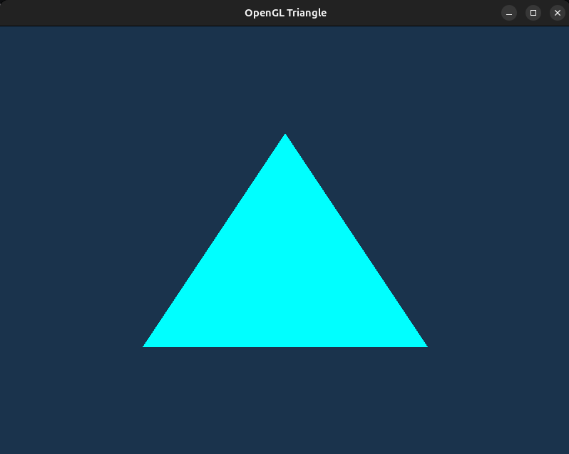
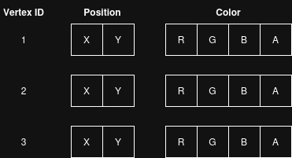
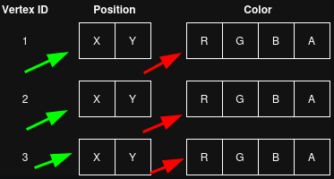

# Lesson 2 - Triangle 

Before starting, I wanna share [learnopengl.com](https://learnopengl.com/Getting-started/Hello-Triangle) link which (in my mind) explains everything way better than what I am documenting here.

This lesson combines a few concepts into one. I did not want to separate these concepts into 2 or more lessons due to a 1 major factor. Using the newest OpenGL version (at the moment), the newest is 4.6), we cannot create a triangle without using the shaders (at least we cannot do it on Linux). For this, in this lesson we are going to discuss and learn about these topics:

1. Triangle
2. Rendering Steps
3. Vertex Buffer Object
4. Vertex Array Object
5. Vertex / Fragment shaders

Keep in mind that these are one of the most important building blocks of almost all the rendering in OpenGL. 

At the end of this lesson we will learn how to render a single triangle on the GLFW window.



---
### 1. Triangle

#### Triangle in Rendering

So (I would hope) that all of the people are familiar of what is a simple triangle. It is a fundamental 2D shape (polygon) that has 3 straight lines, 3 vertices and 3 interior angles that always sum up to 180 degrees (PI rad) (I definitely did not copy this from google). In terms of math, it is probably it (again, I am not a math major or what, maybe some mathematicians would start throwing stuff at me for describing a triangle like that). BUT, in rendering, a triangle has some additional properties. In rendering, a triangle can have:

* Vertices
* Each vertex can have a color
* Normals
* And other stuff (which currently I do not even know)

I hope that every one of you knows what is a vertex, but what are the other 2?

Each vertex (for a single triangle) can have a color (defined in RGB or RGBA formats (A in RGBA is basically an alpha parameter telling how opaque the RGB should look like)).

A normal is a perpendicular vector that going from the triangle plane (the plane that the triangle lives in). This is a bit harder to understand but I hope this image helps you to understand the notion of it better.


This and some following examples are not going to touch the concepts of normals and why they are needed. But, since every person is curious I can tell, that one of the main reasons why normals are used in rendering is lights and shadows. Without this component, no realistic illumination would be possible.

#### Triangle Data

Since we know what a triangle is in the rendering world, a logical step forward would be to try to replicate that in the programming world. 

```C++

    float triangle_vertices[] = { 0.0f,  0.5f,  0.0f, 1.0f, 1.0f, 1.0f, -0.5f, -0.5f,  0.0f, 1.0f, 1.0f, 1.0f, 0.5f, -0.5f,  0.0f, 1.0f, 1.0f, 1.0f };

```
This is what triangle (with colors) looks like in terms of data only. Interesting, isn't it? I mean without comments, specifically telling what these numbers mean and without some proper alignment, it would be like looking into some random array in C++. But how does it describe or tell anything about triangle vertices? To answer this question, we first can rewrite this line into something human souls could understand.

```C++
    float triangle_vertices[] = {
        // positions    // colors
         0.0f,  0.5f,   0.0f, 1.0f, 1.0f, 1.0f, // top vertex 
        -0.5f, -0.5f,   0.0f, 1.0f, 1.0f, 1.0f, // bottom left
         0.5f, -0.5f,   0.0f, 1.0f, 1.0f, 1.0f  // bottom right
    };
```
Is it clearer now? Right now, it gives some instructions and rules on what these numbers mean. Before continuing any further, I want to say that positions and colors do not need to be defined in this order. OpenGL is great because it allows this flexibility to display data for triangles as you wish. For example, at first there could be colors, then normal and only then positions. As of this point it does not matter which way a user defines data of vertices, as long as the vertices array follows those rules throughout the program's lifetime. For this example, since a normal triangle is comprised of 3 vertices, the structure of this data is this: Row 1 - describes data for the first vertex, Row 2 - second vertex, Row 3 - third vertex. Each row (each vertex data point) has 6 components: irst 2 denote the position, the last 4 denote the color.

#### Positions 
Let's focus on the positions part. These coordinates show:

1. `[ 0.0, 0.5 ]` - top vertex
2. `[ 0.5, -0.5 ]` - right vertex
3. `[ -0.5, 0.5 ]` - left vertex


As you can see, it it just a simple representation of where each vertex should be located on the GLFW window. Now the last part is important. These coordinates have to be in the __[ -1.0f, 1.0f ]__ range. Why? Because this is the extent of coordinate system for the OpenGL's clip / NDC (normalized device coordinates) space. Right now we declare positions ONLY in terms that OpenGL can understand (later, once we are smarter and a little bit more advanced, stuff like local space, world space and etc. is understood, we will be able to create triangles on any positions we want). For now, keep in mind that [ 0.0, 0.0 ] is the center of the GLFW window and max values can be in this range [ -1.0, 1.0 ]

#### Colors

Colors for the vertices, are quite easier to understand. Each vertex color has 4 components - RGBA (what is RGBA can be easily found on the internet). Each of these 4 values has to be in the [ 0.0, 1.0 ] range. The last component value is A, meaning Alpha, which basically controls the opacity of the color.

---
### 2. Rendering steps

This is a very simplified version of the steps needed to render a simple triangle on the screen using OpenGL. (I will skip all the initializations of glfw, context and opengl):

1. Define triangle data
2. Generate VBO and VAO
3. Bind VAO and VBO
4. Buffer triangle data to VRAM
5. Tell OpenGL how to what the data inside the VRAM is and how to read it
6. Compile a shader program 
7. For every iteration inside a loop: \
    1. Use created shader program
    2. Bind VAO
    3. Draw triangles
    4. Swap buffers
    5. Poll events

Each of the elements described in these steps will be explained below. I just wanted to show the proto code on the steps what need to happen for a user to see a triangle from the `triangle_vertices` data on the screen. Also, keep in mind, that these steps can be dissected into smaller steps also, but it is for another day.

---
### 3. Vertex Buffer Object - VBO

What is this thing called VBO??? Remember the `float triangle_vertices[] = ...` part? Well this buffer object basically stores the array containing info about a triangle's vertices inside the GPU, specifically inside the VRAM. Also, as a side note, as Cherno has said it best, to better understand what a VBO is, you should just imagine it as a simple buffer. Remove the words "vertex" and "object". VBO is essentially a buffer of data, a piece of bytes in some order.  What that data is, is currently a mystery to OpenGL. 

Another attribute of VBO is that it has an ID. Once you ask for OpenGL to generate a new VBO, it creates it and assigns a unique ID to it. This ID is needed so that Context could know how to map the buffered data to some specific Buffer IDs. This is one of those things on why I said (in lesson 1) that context is essentially a control panel. You have a data and an ID and it is the job of context to map them and check their states.

If the VBO is a buffered data, then what is the point in calling it __Vertex Buffer Data__? Well, it is because usually, and most often, VBO's are used to store data that describes what a vertex is. How to describe it will be answered in the VAO part.

To create a VBO in C++ and buffer vertices data, you have to call these OpenGL operations:

```C++
unsigned int vbo;
glGenBuffers(1, &vbo);
glBindBuffer(GL_ARRAY_BUFFER, vbo);
glBufferData(GL_ARRAY_BUFFER, sizeof(triangle_vertices), triangle_vertices, GL_STATIC_DRAW);
```

What happens here is pretty simple:

1. `unsigned int vbo;` creates a vbo variable. Currently this variable does not mean anything.
2. `glGenBuffers(1, &vbo);` generates a buffer __ID__. Currently, it does not generate a buffer inside the VRAM (even though the operation is called `glGenBuffers`) . This line basically makes the context aware of vbo. The context is notified that a new buffer "handle" is created. This handle is a key to understand what is going to happen later. `vbo` is not a part inside the VRAM that has vertices data buffered. It is not a pointer or anything else that says "hey, I point to this memory data inside the VRAM. No, at the moment, it is only a simple handle with some ID assigned to it by the OpenGL Context.
3. `glBindBuffer(GL_ARRAY_BUFFER, vbo);` Notifies context that all of the operations on the array buffers are going to be bound to this vbo (which as I said is just a simple handle with an ID). Youca n have this model in your head `GL_ARRAY_BUFFER binding = vbo`. With this operation called, once we actually going to buffer the data to VRAM, we (context) will be able to map it to this handle. You can think of it as a bank account. You can put your money to the bank, but you also need some info given to the bank that would say "this amount of money is associated for this person". The same way vertex buffer objects and actual data in the VRAM work.
4. `glBufferData(GL_ARRAY_BUFFER, sizeof(triangle_vertices), triangle_vertices, GL_STATIC_DRAW);` this is the operation in which OpenGL loads `triangle_vertices` data to VRAM (actaully, OpenGL decides where this data is going to live, it does not necesseraly need to be on VRAm, it can be stored in RAM or anywhere else). If we did not bind buffer before calling this operation, it would be like putting money to the bank without any connection to which this money belong, so later in the future there would be no optiont to withdraw that money. 

Going further with the bank example, you can have this mental model:

```
glGenBuffers -> create bank account number
glBindBuffer -> select the account you want to operate on
glBufferData -> deposit money into that account
```

Why is it of type `unsigned int`? I do not know, ask someone who was responsible for making it that way, but now just pay attention that buffer (and, to be honest, many other OpenGL variables) are of this types. Unsigned int and OpenGL are like that couple that at first looks weird, but you see them everywhere together going hand in hand. I am sure, that when smart people designed OpenGL they had real concrete reasons on why a lot of stuff is unsigned int, but I have never deep dived into the reasons.

---
### Vertex Array Object - VAO

Since the data is stored inside the GPU, specifically, VRAM (Video Random Access Memory), we also need a way to tell OpenGL some info on what is this data. I mean right now, at this stage, that data means absolutely nothing to OpenGL. Why does it mean nothing? Remember how I said that `triangle_vertices` can be rewritten as 

``` CPP
float triangle_vertices[] = { 0.0f,  0.5f,  0.0f, 1.0f, 1.0f, 1.0f, -0.5f, -0.5f,  0.0f, 1.0f, 1.0f, 1.0f, 0.5f, -0.5f,  0.0f, 1.0f, 1.0f, 1.0f };
```

Tell me honestly, if any of you could look at this and say "That is easy, it describes the positions and colors of each of the 3 vertices insidet he vertex data". Please, do not lie to yourself. It is easy to a developer to just add comments and order array data so taht visually it could mean something to a developer, but to OpenGL, no comments, no ordering will answer a basic question - "What is this data that is buffered here?". To help OpenGL to understand it the same way we can, we need to tell it which numbers and which positions mean what. 

To do it, we have to use __Vertex Array Object - VAO__. To generate VAO and tell how to read the data from the memory, we call these operations

```cpp
1   unsigned int vao;
2.  glGenVertexArrays(1, &vao);
3.  glBindVertexArray(vao);

4.  glVertexAttribPointer(0, 2, GL_FLOAT, GL_FALSE, 6 * sizeof(float), (void*)0);
5.  glEnableVertexAttribArray(0);
6.  glVertexAttribPointer(1, 4, GL_FLOAT, GL_FALSE, 6 * sizeof(float), (void*)(2 * sizeof(float)));
7.  glEnableVertexAttribArray(1);
```

1. `unsigned int vao;` Same as for vbo, it just creates a C++ variable thta is going to be used later on. Currently, it does not mean anything to OpenGL.
2. `glGenVertexArrays(1, &vao);` Generates vertex array ID and assigns it to the `vao` variable. You can also call it a "handle".
3. `glBindVertexArray(vao);` binds this handle. That means that every rules on how to read data from the memory will be associated with this handle.

Now the last 4 lines is where a slightly deeper understanding is needed. But please do not panic, to be honest, it is way easier than what it looks like. To help you understand it, I will share this image:

 

As you can see, it shows how the data inside the `triangle_vertices` is ordered. It has 3 vertices, where each vertex has 2 components for coordinates (X and Y), and 4 components for the color (RGBA).

4. `glVertexAttribPointer(0, 2, GL_FLOAT, GL_FALSE, 6 * sizeof(float), (void*)0);` This is how we describe to OpenGL a single attribute about a vertex. It looks kinda tricky and weird, but let's go argument by argument:
    
    1. `0` means the location of this vertex attribute. Each vertex might be comprised of many attributes. It can have positions, colors, normals, texture coords and etc. `0` tells "this will be the first attributein the buffered data.
    2. `2` means that this attribute is comprised of 2 components / elements. You can kinda imagine it as a rule that we place on this attribute "this attribute is comprised of 2 components".
    3. `GL_FLOAT` answers what type of data this attribute is. Is it float, is it int, is it double? `GL_FLOAT` means that the first 2 numbers in the buffered data should be treated as floats.
    4. `GL_FALSE` answers "once read, should normalization be aplied to these 2 numbers". It is simple, either false or true.
    5. `6 * sizeof(float)` answers "how big of a stride OpenGL has to do, when reading a buffered data, before the next 2 numbers (components, that comprise this attribute) are seen again. Why is it sizeof(float)? Because OpenGL does not know the size of float in terms of bytes. In C++, `float` is usually 4 bytes. `6 * sizeof(float)` essentially says "the next pair of numbers is after 24 bytes".
    6. `(void*)0` tells that this attribute starts at the position __0__.

    Going back to this `float triangle_vertices[] = { 0.0f,  0.5f,  0.0f, 1.0f, 1.0f, 1.0f, -0.5f, -0.5f,  0.0f, 1.0f, 1.0f, 1.0f, 0.5f, -0.5f,  0.0f, 1.0f, 1.0f, 1.0f };` and taking into consideration of the `glVertexAttribPointer(0, 2, GL_FLOAT, GL_FALSE, 6 * sizeof(float), (void*)0);`' we essentially say that "starting from position 0, take these 2 numbers, keep in mind that these 2 numbers are floats, do not normalize them and voila, you have a single attribute of a single vertex. Now jump again for 6 (size of float) bytes and you will cross another 2 numbers that will comprise another attribute for another vertex. Then jump again, again, again and keep doing it as long as `sizeof(triangle_vertices)` allows it to do.

5. `glEnableVertexAttribArray(0);` enables the vertex attribute `0` so the GPU could be able to read the data from the data buffer during rendering and assign the specified chunk of it to attribute `0`.
6. `glVertexAttribPointer(1, 4, GL_FLOAT, GL_FALSE, 6 * sizeof(float), (void*)(2 * sizeof(float)));` does exatcly the same thing as line __4__. It tells "The location of this vertex attribute is `1`. It is comprised of 4 numbers (components). These numbers are of type float. Do not normalize them. Another set of this attribute will be after `6 * size(float)` = 24 bytes. The start of this attribute is at `2 * sizeof(float)` = 8 bytes.
7. `glEnableVertexAttribArray(1);` enables the vertex attribute `1` so the GPU could be able to read the data from the data buffer during rendering and assign the specified chunk of it to attribute `1`.

That is basically it. Looking back at the last image, you can clearly see what these operations. 



Green arrows point to the positions in the buffered data that is attribute `0`, while the red ones point to the attribute `1`. BUT, keep in mind, that OpenGL does not understand what these attributes mean. Up to now, it __ONLY__ knows that there are 2 attributes that comprise a single vertex.

---
### 5. Vertex / Fragment shaders

This is the last stage in rendering the triangle. This is also the place, where we tell OpenGL how to interpret what the 2 vertex attributes mean. After this stage, we finally see what `float triangle_vertices[] = { 0.0f,  0.5f,  0.0f, 1.0f, 1.0f, 1.0f, -0.5f, -0.5f,  0.0f, 1.0f, 1.0f, 1.0f, 0.5f, -0.5f,  0.0f, 1.0f, 1.0f, 1.0f };` looks like on the screen.

Right now, let's focus purely on what a __shader__ is. As far as I know, shader is nothing more than a program that can be run on the GPU. Yeah, that's it. At first, while learning OpenGL I was one of those people that thought "Shader must have something to do with shadows". To be honest, shaders are powerful tools that help squeezing top level shadows, but they themselves aren't what defines shadows and etc.. 

Let's differentiate between what a vertex and a fragment is. As I said earlier, vertex is nothing more than where the lines intersect to form an internal angle. Triangle, in the normal world, has 3 vertices. If you have 5 triangles, in total you will have __5 * 3 = 15__ vertices. That's easy.

With fragments, it is a bit trickier. As you might know, rendering isn't comprised of "I give you info about vertices, generate buffers, bind what I need, tell how to read data from the buffer and that's it". No, there are many many steps, that for today, is not the best thing to explain. For today, I can describe fragment as this: ___a fragment is a candidate pixel produced when a triangle is projected onto the screen___. 

Imagine, that you have a wall, and in the middle of that wall there is a window. Also, on the outside, there is some object, let's say that there is a red car. A car is a 3D object, but looking through a window, that car appears to be a 2D, because you only see that car from 1 side. Also, imagine, that on a window, there is a very dense flat net placed that is see through. Now pixels, in this analogy, are the holes on the net. You might ask me "why aren't fragments called pixels, I mean in your example, every hole in the net is a pixel, so each hole might have a different color.". Well, yes, but fragments are a bit more. Imagine, that behind that car, there is aslo a black cat, but that cat is not visible through the window. If fragments were pixels, there would not be fragments created for the cat, since we cannot see it, but this is the difference. At this stage (before fragment shader does it's job) there are fragments created for that cat. 

Actually, to be more precise, that car and that car would be "changed" to small triangles. A good example of this "imagine" is when you have a low resolution image. You practically can see pixels, detail is very low, but if the resolution is very big, no pixels are visible and the detail is high. In my example, change pixels to triangles, the more pixels comprise the car, the more detail of that car there is.

Going back to my example, there might be cases where a triangle of cat occupies the same area on the window as the a triangle of the car. So there would be 2 fragments created for the same hole on the net, 1 for the cat's triangle and 1 fr the car's triangle.

Why? Why do we need to have fragments of objects, that are clearly not visible? There are many reasons, but one of the reasons is that you want to see the depth of each fragment. __Depth__ is a new term , which basically is just a "distance" from the screen to that fragment. Also, another reason, why you want to keep those fragments is when you have some games, where there might be some abilities given that lets you see through the walls. After the fragment shader, OpenGL calls a special operation called __depth testing__. It's goal is to leave only those fragments that are closes to the screen, in other words, those fragments that have the lowest depth values. Finally, we are left with fragments that that __could__ be visible on the screen. Again, that still does not mean that they will be seen.

To sum it up:

* __Vertex Shader__ is a small program that is being run on the GPU per vertex. If you have 12 vertices, that means that every iteration on the main while loop, there will be 12 vertex shader program executions.
* __Fragment Shader__ is a program that is being run on the GPU per fragment. So if your program rendering logic produces, let's say 1 000 000 fragments, that means that on that (because fragments number can differ every iteration if the objects move in the window) iteration on the main while loop, there will be 1 000 000 fragment shader program executions.

Now you might ask me "1 000 000? surely it cannot be that much". Let's take my monitor's resolution which is 2560 x 1440 = 3 686 400. This means, that if the triangle or many triangles occupy all the space on the screen, there will be a minimum of 3 686 400 fragments created. Now, what if 2 triangles exist, first occupies the whole screen size, and the other is behind the first one, but it also occupies the full screen? Now there are 2560 x 1440 * 2 = 7 372 800 operations. 

Do not get scared, there are ways that OpenGL internally deals with situations like these. What I want you to understand is that FS is executed 1000s of times more in a single iteration than VS, so be smart on what you calculate on the CPU (happens 1 time per iteration), what you place in the VS (what happens as many times as there are vertices) and what you place in the FS (what happens as many times as there are fragments). We will, for sure, talk way more about this when we touch the MVP and shadows topics.

#### Code vertex and fragment shaders

Since these programs run many times on the GPU during each render loo, we should stress the fact that these programs should not be computationally heavy. The more heavy the shader is (especially the fragment shader, due to it's number of times being executed) the lower FPS (frames per second) you can expect.

Here is the code for the vertex shader:

```GLSL
#version 460 core
layout (location = 0) in vec2 a_pos;
layout (location = 1) in vec4 a_color;

out vec4 our_color;

void main()
{
    gl_Position = vec4(a_pos, 0.0, 1.0);
    our_color = a_color;
}
```

Here is fragment shader:

```GLSL
#version 460 core
in vec4 our_color;
out vec4 FragColor;

void main()
{
    FragColor = our_color;
}
```

As you see, these programs are very lightweight, only a few lines of code (P.S. keep in mind that this is lightweight for this example. Professional AAA games or some other heavy rendering applications might have shaders with hundreds or sometimes thousands of lines of code, but we are not going to discuss it now).

What do these shaders do? Let's first discuss the vertex shader. As you remember, VS (vertex shader) is run once for shader, so if we have a single triangle (as in this lesson we have), this VS code will be run 3 times every iteration.

#### Let's go line by line and explain all of it (vertex shader):

1. `#version 460 core` it tells the GLSL compiler to use version 4.60 of the GLSL language in the core profile.
2. `layout (location = 0) in vec2 a_pos;` and `layout (location = 1) in vec4 a_color;` this is an input for the fragment shader (simbolized by the keyword `in`). This is the place where the VAO becomes handy. Remember how I said that VAO basically tells OpenGL how to read the data from the buffer on the GPU. It is important for these 2 lines. `layout (location = X)` layout and location tell OpenGL pipeline, that in `location 0` should go attribute 0, and in `location 1` should go attribute 1. These 2 lines basically get fed those 2 attributes (their values) that we created earlier. Keep in mind, that even though the variables are named a_pos (for position) and a_color, it does not mean that these attributes are positions and colors. We just chose to name these variables this way. They key part is their types, specifically, `vec2` and `vec4`. They MUST correlate with the values from the VAO.
3. `out vec4 our_color;` this is the ouput variable (the one that is the output of this shader). It is output of the shader because it has a keyword `out`. It also has a type, which means that this VS will output a `vec4` type of data.
4. `void main()` same as in C++, it says that this the main function that needs to be executed for this shader program. Kinda like an entry point to this program.
5. `gl_Position = vec4(a_pos, 0.0, 1.0);` this creates a new coordinate space, called __Clip Space__. This is kinda tricky to explain, but still, I will try. We have to go back to the window and a car example. I said that a car is visible through the window, but what if it is partially seen, I mean, let's say that wheels are not visible, because they are below the window. Also, I mentioned triangles and resolution. Now what if one of those triangles happens to be outside of the vision through the window? Well, option 1, is that it is not visible at all. That is easy, you just remove that triangle from further calculations. But how to know if it is visible or not? How to tell a machine, that wheel of the car are not visible? Easy for us to just see through the window and say "I cannot see the wheel.", but computers do not have this basic notion. Computers see everything in terms of numbers. __Clip Space__ is essentially the method that tells what is and what is not visible through the window. This is the place, where it is important that the first attribute of the VAO (for our concrete example) should be describing position. Clip space is dealing with coordinates and positions, so if you pass as vec2 some other numbers from data buffer (which stores info about our vertices), clip space will be calculated for those numbers, which might do some weird stuff on your vertices. Not to go very deep into why it works like that, but the main thing is this (Google it if you want to see what this means):
    ```
    -w ≤ x ≤ w
    -w ≤ y ≤ w
    -w ≤ z ≤ w
    ```
6. `our_color = a_color;` pretty self explanatory. You just assign an output variable with the color, a vertex has.


#### Let's go line by line and explain all of it (fragment shader):

1. `#version 460 core` it tells the GLSL compiler to use version 4.60 of the GLSL language in the core profile.
2. `in vec4 our_color;` this is an input for the fragment shader (symbolized by the keyword `in`). This input, for FS (fragment shader) is the output of the VS. If you look again the the VS, you can see `out vec4 our_color;`. The same values finally comes to the `in vec4 our_color;` for the FS.
3. `void main()` entrypoint for the fragment shader program (same as VS).
4. `out vec4 FragColor;` this is an output for of the FS. Again, you might ask me "Why VS and FS both output color? If FS outputs the color again, then what does it do?". This is the key to understanding FS. FS outputs color for each fragment left, that are ready to be placed on the screen. After FS, there are couple more steps, but those we will discuss later. After FS (right now), you can just take the values (color values, because this is what FS outputs) of those fragments and easily display them on the screen and you would see an actual image of what your triangle looks like.

#### Creating shader program

Before using the shaders, we first need to create a shader program. __Shader Program__ is a set of shaders that GPU uses during rendering.

To create a proper shader program using OpenGL, there are 2 steps that need to be completed:

1. Compile shaders
2. Create a shader program

Let's go 1 by 1 (order matters) and explain why each stage is needed and what happens in those stages. To make it easier, I suggest going from the step 2 (Create a shader program) and then dive deeper into how the actual shader code gets compiled.

#### Create a shader program

This stage creates an actual shader program from 2 pieces, vertex and fragment shaders. We need this program for reasons like:

* How to process vertices?
* How to transform positions?
* How to generate fragment color which includes colors?

When we have a data buffer, that good old `float triangle_vertices[] = { 0.0f,  0.5f,  0.0f, 1.0f, 1.0f, 1.0f, -0.5f, -0.5f,  0.0f, 1.0f, 1.0f, 1.0f, 0.5f, -0.5f,  0.0f, 1.0f, 1.0f, 1.0f };` we need a program that can read this, read the instructions on what these numbers mean and then produce pixel colors on the screen.

You can sort of think about this program in the following way "Give this program a data and output me shapes and colors on the screen." ath the moment, it is totally enough to think of this program as this.

```CPP

unsigned int create_shader_program(const std::string& vertex_source, const std::string& fragment_source)
{
    unsigned int vertex_shader = glCreateShader(GL_VERTEX_SHADER);
    if (!compile_shader(vertex_source, vertex_shader))
    {
        glDeleteShader(vertex_shader);
        return 0;
    }

    unsigned int fragment_shader = glCreateShader(GL_FRAGMENT_SHADER);
    if (!compile_shader(fragment_source, fragment_shader))
    {
        glDeleteShader(vertex_shader);
        glDeleteShader(fragment_shader);
        return 0;
    }

    unsigned int shader_program = glCreateProgram();
    glAttachShader(shader_program, vertex_shader);
    glAttachShader(shader_program, fragment_shader);
    glLinkProgram(shader_program);

    int success;
    char info_log[512];
    glGetProgramiv(shader_program, GL_LINK_STATUS, &success);
    if (!success)
    {
        glGetProgramInfoLog(shader_program, 512, nullptr, info_log);
        spdlog::error("Shader program linking failed: {}", info_log);
        shader_program = 0;
    }

    glDeleteShader(vertex_shader);
    glDeleteShader(fragment_shader);

    return shader_program;
}

```

Lets go line by line and explain everything that happens here:

1. `unsigned int vertex_shader = glCreateShader(GL_VERTEX_SHADER);` tells OpenGL to create an __empty__ shader object with ID of type __vertex__. This line right here, does not create an actual shader, but it sort of prepares OpenGL for vertex shader creation.
2. `if (!compile_shader(vertex_source, vertex_shader))` compiles vertex shader code into a vertex shader "object". Right here the vertex shader is compiled (if success happens), but we still could not use this shader now.
3. `unsigned int fragment_shader = glCreateShader(GL_FRAGMENT_SHADER);` does exactly the same thing as the previous line, but does it for the fragment shader.
4. `if (!compile_shader(fragment_source, fragment_shader))` exactly the same thing as the previous line, but only for a fragment shader.
5. `unsigned int shader_program = glCreateProgram();` creates an __empty__ shader program object with ID. I just want to stress this fact again that every OpenGL object must have it's own ID, because OpenGL, internally, tracks everything using IDs. __Shader object__ and __shader program object__ are 2 different things. Do not think these are the same.
6. `glAttachShader(shader_program, vertex_shader);` and `glAttachShader(shader_program, fragment_shader);` attaches both shader objects to an empty shader program object. You need to attach these 2 (or any other number of defined shaders) shaders to this program, because otherwise the program will not know what to do with buffer data and rules how to read them. Attaching them, means that the final shader program will use these 2 shader programs for rendering pipeline.
7. `glLinkProgram(shader_program);` links a shader program object. This right here (if successful), finally, creates an executable on the GPU side of our shader program which is defined by vertex and fragment codes.
8. `int success;` and `char info_log[512];` allocates necessary variables which are needed to handle errors, if they have occured during shader program creation.
9. `glGetProgramiv(shader_program, GL_LINK_STATUS, &success);` returns the requested parameter from a shader program. You can sort of think of this operation as a __getter__ type of operation for objects in C++ (or other programming languages). You have to specify which program to extract info from, what type of info you want to extract and where to store the extracted result.
10. `glGetProgramInfoLog(shader_program, 512, nullptr, info_log);` extracts the info log from the shader program. This info log is mostly about the compiler / linker diagnostic information. `glGetProgramInfoLog` operation, basically lets you extract all those logged messages. We want to extract a log information, because we want to see why the program did not successfully compile. We again, specify which program we want to extract the logs, specify the number of characters to retrieve, `nullptr` if specified, tells the length of the string in the info log, and specify where to store all those logs.
11. `shader_program = 0;` if program creation failed, it is advised (but not necessary) to reset the program ID to 0. Keep in mind that 0 is a special ID, that usually means "no object". From an OpenGL's perspective if it sees and object with ID 0, it signals that this object is either uninitialized or in some other way not ready for it's job.
12. `glDeleteShader(vertex_shader);` and `glDeleteShader(fragment_shader);` 2 operations that delete shader objects. Why do we need to delete them? The answer is that the functionality of the shaders, which was described in the strings is already attached to the shader program. There is no need to keep shader objects that have 0 value to our application. To give you an analogy, imagine, that you have 2 books of instructions. First book describes how to assemble a ship, the other describes how to assemble a car. You need those books only, until you actually assemble the ship and the car. After you done assembling them, there is no need to keep those books, because you already have the things assembled.
13. `return shader_program;` returns a shader program ID. 

To make it easier for you to think, this function does the same job as any of the compilers for the C++ code. You give a raw code in GLSL language, and voila, you get an actual program that is capable to receive data and description on how to read that data and then this program processes this information into pixel colors on the screen. Keep in mind that this program is working on the GPU and not on CPU.

#### Shader compilation

This is the last stop for this "How to render a triangle using OpenGL?" lesson.

```C++
int compile_shader(const std::string& source, unsigned int shader_id)
{
    const char* source_c_str = source.c_str();
    glShaderSource(shader_id, 1, &source_c_str, nullptr);
    glCompileShader(shader_id);

    int success;
    char info_log[512];
    glGetShaderiv(shader_id, GL_COMPILE_STATUS, &success);
    if (!success)
    {
        glGetShaderInfoLog(shader_id, 512, nullptr, info_log);
        spdlog::error("Shader compilation failed: {}", info_log);
    }
    return success;
}
```

Mostly, all of is similar to `create_shader_program`, so I will describe only shader compilation specific code:

1. `glShaderSource(shader_id, 1, &source_c_str, nullptr);` binds shader source code to the `shader_id`. Keep in mind that this shader ID is from her `unsigned int vertex_shader = glCreateShader(GL_VERTEX_SHADER);`. You can kinda think of this operation as storing the shader source code inside the specified shader object.
2. `glCompileShader(shader_id);` compiles that shader source code into an actual GPU-executable shader code. After this, you still cannot directly use the program defined by vertex shader source code, because you need a shader program (which at this stage is still not created). After compiling shader source code, you can attach it directly during `glAttachShader(shader_program, vertex_shader);`. Keep in mind that as an argument, you pass `shader_id`, because the shader code is already part of the shader object that has `shader_id`.

### Main rendering loop

Let's understand the final piece that is needed to have a triangle on the screen using OpenGL. In the __Lesson 1__, I have said that the main rendering while loop is working until the GLFW window is closed. 

So, what do we need to do in the while loop to see our triangle? Why do we need to change something in the while loop? First of all, let's answer the "what" question, which, I hope will also answer the "why" question. What we need to do in the while loop are actually 2 things:

1. Clear the background color and the color buffer.
2. Issue a draw call

#### Clearing Framebuffer

In the Lesson 1 for the `main.cpp` I said that there are 2 operations that are not GLFW, but that are doing an actual OpenGL functionality. Those 2 operations were `glClearColor(...)` and `glClear(...)`. Why are these 2 needed? To answer it, we have to go into shallow depths of OpenGL.

Remember how I said, that what FS (fragment shader) outputs, it can, essentially, be shown on the screen. Well, I have skipped 1 part. The fragment color values are not directly "placed" on the screen, but rather put to a separate buffer called __framebuffer__. This framebuffer holds those fragment color values, that are ready to be shown on the screen. This framebuffer is like a snapshot of the image that was generate during the i-th iteration on the main rendering loop. Framebuffer content (remember that it is not the framebuffer, but the content of it) is generated for every iteration, no matter what. Now with this generation of a new framebuffer content, there comes a little price that we have to remember how to deal with. Even though our triangle (at least in this lesson) is static (meaning, that every frame we will see the same triangle with the same colors occupying the same screen space) we still are generating a new framebuffer, but what if the triangle was rotating, or rotating and changing position every frame? That would mean that for every iteration, some pixel values would constantly change the values. 

To understand it better, let's talk about some random pixel, let's define this pixel as position X = 500, Y = 600 on our screen. If our triangle is moving and rotating, there is a case, where this pixel will have to change the color because the triangle will move into this pixel or out of it. Now, let's imagine, that on iteration 1000, the triangle moved into the pixel. What happens visually is that the pixel changes color from the background color, which we are defined as `constexpr float BACKGROUND_COLOR[4] = { 0.1f, 0.2f, 0.3f, 1.0f };` to a triangle color, which we are defined as `{ 0.0f, 1.0f, 1.0f, 1.0f }` (look into the values of `triangle_vertices`). Ok, that's great. But here comes an issue. Let's say that on iteration 1500, the triangle moves out of this pixel. What happens now is that the pixel color should change from this `{ 0.0f, 1.0f, 1.0f, 1.0f }` to this `{ 0.1f, 0.2f, 0.3f, 1.0f }`. It should, but it did not change. 

What??? How it did not change, didn't the FS produce colors again??? Yes and no. FS produces colors for fragments that are in the triangle area. If the pixel occupies the space that is not covered by no fragments of any triangle, it will not be updated and the last value will be used. So, if in the case of our triangle that has moved outside the pixel X = 500, Y = 600, now this pixel has no fragments created. The color of this pixel is not updated, because it will take the last color that was assigned to it, which in our case is the color of the triangle.

Now we have an issue, triangle is moving but instead of seeing a moving triangle, you kinda see a painted path of where this triangle is.

To tackle this, we call these 2 operations:

```C++
glClearColor(BACKGROUND_COLOR[0], BACKGROUND_COLOR[1], BACKGROUND_COLOR[2], BACKGROUND_COLOR[3]);
glClear(GL_COLOR_BUFFER_BIT);
```

1. `glClearColor(BACKGROUND_COLOR[0], BACKGROUND_COLOR[1], BACKGROUND_COLOR[2], BACKGROUND_COLOR[3]);` it specifies the clear values for the color buffer(s)
2. `glClear(GL_COLOR_BUFFER_BIT);` clears buffer to the specified values. That means it assignes the framebuffer to the values specified in the `glClearColor(...)` operation.

This is needed so that every new frame, would be initialized from the begining, which usually is the background color. If you somehow managed to show a framebuffer before issuing a draw call and then after it was issues, you would see the GLFW window flicker colors from full background color to what you have rendered.


#### Issuing a Draw Call

The final stage of the final stage in the rendering of our triangle. We have everything set up, we have:

1. Data loaded on the GPU
2. Rules, that tell how to read the data
3. Shader program
4. We have a system that let's us clear the color values for every iteration

What we need now is the key part: drawing the actual triangle on the screen.

Let's first get rid of these 2 lines and explain why these 2 operations are needed:

1. `glUseProgram(shader_program);` tells OpenGL to use the shader program, associated with the `shader_program` ID. Remember, we need shaders to process and "paint" the triangles.
2. `glBindVertexArray(vao);` binds the ruleset associated with the `vao` ID. Remember, we these rules to know what each number means in the `float triangle_vertices[] = { 0.0f, 0.5f, 0.0f, 1.0f, 1.0f, 1.0f, -0.5f, -0.5f, 0.0f, 1.0f, 1.0f, 1.0f, 0.5f, -0.5f, 0.0f, 1.0f, 1.0f, 1.0f };` data buffer.

You can think of these 2 lines (and, to be honest these lines `glClearColor(BACKGROUND_COLOR[0], BACKGROUND_COLOR[1], BACKGROUND_COLOR[2], BACKGROUND_COLOR[3]);` and `glClear(GL_COLOR_BUFFER_BIT);`) that these are just a "setup" phase for this last line.

`glDrawArrays(GL_TRIANGLES, 0, 3);` issues a draw call that uses triangles as primitives. Ok, this is where we tell OpenGL "ok, now call all your might, all you shaders and etc, and based on data I have bound, based on the rulset I gave you, use the shader program I have bound and draw me triangles". That is essentially it. 

The arguments of `glDrawArrays(GL_TRIANGLES, 0, 3);`:

1. `GL_TRIANGLES` tells that every 3 vertices form a single triangle.
2. `0` start reading vertices from the index 0.
3. `3` process 3 vertices. We only have 3 vertices defines, so we only need to process 3 of them. Later, you will see how to draw stuff that uses thousands of vertices.

I hyped up this operation so much, but it does nothing more than just starts the internal OpenGL functionality which "paints" the pixels on the GLFW window. That is it.


### Frame Buffer Size Callback

I did not elaborate on this much during this lesson, but it is not necesseraly neede for this, but still. 

```C++
void framebuffer_size_callback(GLFWwindow* window, int width, int height)
{
    glViewport(0, 0, width, height);
}

glfwSetFramebufferSizeCallback(p_window, framebuffer_size_callback);
```

This is how to have a GLFW window resize callback trigger the OpenGL. Keep in mind, that the GLFW window size and the OpenGL viewport are not the same thing. To give you some intuition, comment the `glfwSetFramebufferSizeCallback(p_window, framebuffer_size_callback);`, run the application and then try to resize the window. You can clearly see, that the GLFW window resizes how it should, but the triangle is not resized. 

__KEEP IN MIND__, that this functionality is not necessary to have. It totally depends on what is your goal with the rendering and GLFW window relationship.


### Conclusion

Now we know how to render a single triangle using OpenGL!!! This is great, because it gives you the building blocks for the future on how to build more complex things. On the other side, don't get too cocky. A single triangle is something people can build of the top of their heads, nothing right here is complex. But the key part I want you to understand is how the most basic rendering pipeline looks like. Know this, and large rendering systems can be disassembled to the basic building blocks which you can understand.

From this lesson, the pipeline is mostly this (if we talk about rendering a triangle):

1. Define triangle vertices data
2. Load it to GPU
3. Tell OpenGL how to read this data
4. Create a shader program that will be able to process the data buffer
5. Run an infinite while loop
6. For every iteration, issue a draw call