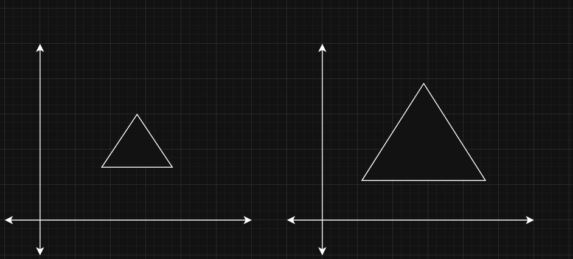
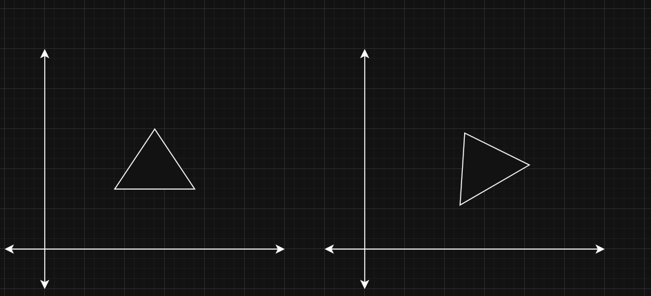
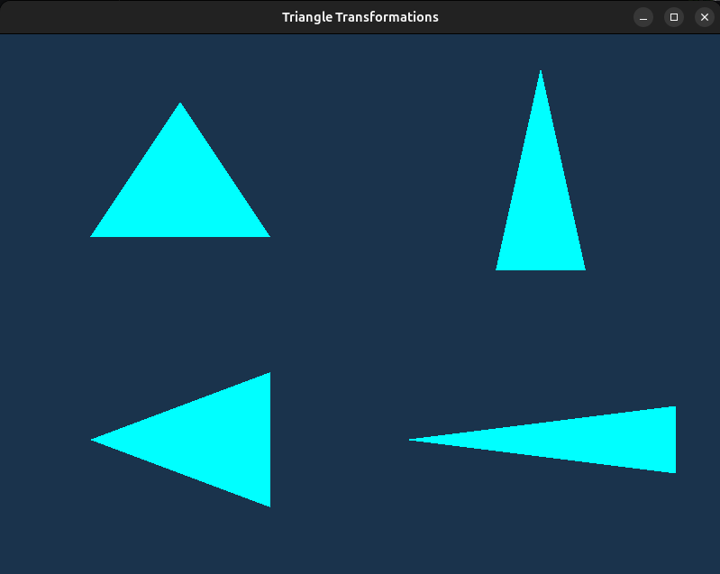

# Lesson 4 - Transformations

In this lesson we are going to learn transformations and, as a side topic, shader uniforms. Transformations, as a whole, are one of those building blocks that someone who is learning graphics should definitely master. But do not get too scared; unless you want to become a savant 3D graphics engineer, transformations, at least from what I have used, are not something that a simple person who does not understand math well cannot understand.

Since I am not the best at explaining math topics, before continuing any further, I highly suggest that you:

* Read [this article](https://learnopengl.com/Getting-started/Transformations)
* If you are more of a visual learning, I advise you to look [this playlist](https://www.youtube.com/watch?v=fNk_zzaMoSs&list=PLZHQObOWTQDPD3MizzM2xVFitgF8hE_ab) by [3Blue1Brown](https://www.youtube.com/@3blue1brown/playlists). This, in my opinion, is the best way to visually understand the concepts of linear algebra.

Again, do not get discouraged by the fact that N years ago, during math classes, you did not pay attention, because learning transformations is a process that each person, given time, can understand.

As for uniforms, they are also one of the building blocks you have to understand, but they are as simple as learning what a shader or vertex buffer is.

---

### Essence of Transformations in Rendering

I will try to give my own personal view on why transformations are one of the building blocks in rendering.

One important thing you have to understand about building a graphics engine is that not everything inside the graphics engine revolves around rendering. For example, let's say you want to render a triangle. From the previous lessons, we know that a triangle is comprised of 3 vertices. In order for OpenGL to see how you have defined those 3 vertices, you need to upload that vertex data array to the GPU using `glBufferData`. Now stop right here, before the `glBufferData` operation is called. Let's focus purely on the `triangle_vertices` array from the previous lesson.

If we isolated this `triangle_vertices` array from all the OpenGL operations, could we say that `triangle_vertices` is somehow related to rendering? Just look here:

```C++
int main()
{
    // Some code

    float triangle_vertices[] = {
        // positions    // colors
         0.0f,  0.5f,   0.0f, 1.0f, 1.0f, 1.0f, // top vertex 
        -0.5f, -0.5f,   0.0f, 1.0f, 1.0f, 1.0f, // bottom left
         0.5f, -0.5f,   0.0f, 1.0f, 1.0f, 1.0f  // bottom right
    };

    // Some code

    return 0;
}

```

Looking at this piece of code, does it give any information that we are going to render a triangle on the screen defined by triangle_vertices? No, it does not, and this is one of the major separations of concern you have to understand. The whole graphics project you are building can, and as a matter of fact should, be separated into 2 parts:

**Rendering** - everything regarding the graphics API for OpenGL, Vulkan, or any other graphics backend.
**Real World** - everything regarding the real-world logic, like geometrical object definitions, geometrical object construction, physics, lighting, orientations, scenes, etc.

You probably already know what rendering is, but this idea of a real world is a new concept that at first might be weird to understand, especially as to why we even need to separate it from rendering. To understand more easily what real world means, I suggest replacing the word "real" with "virtual", thus real world becomes virtual world. Does it make more sense now? Every object we create, every logic we apply to it, only lives inside computers, thus making it virtual. In order to render something, that something needs to be described and built from scratch. Going back to the triangle example, we have to provide OpenGL with some data that it has to render. This "data" is what I, and I hope a lot of other people, call the real world. This data for the triangle is quite simple, just 18 numbers in a sequential order. But in order to render something that would visually awe other people, a simple triangle is not enough. Just imagine how many different geometrical shapes are required to render this frame:


Just look at this frame; this scene has so many objects, like:

* 3 people + 1 lying dead
* Different clothing + different inventory (katanas, wakizashi, etc.)
* Environment, with trees, leaves, grass, rocks, mud, etc.
* Lighting and shadows (these 2 things are very big in terms of lines of code)

What this can and cannot show in a single frame is the "flow" of the scene. I mean, this is just a single scene, so no movement, either for characters or for environmental things, can be seen, but you can almost feel how this scene is playing out in your head. This movement is also a separate aspect of the real world.

The real world, most of the time, takes up way more lines of code than just calling some graphics backend API to render it. From my own personal experience, when creating my Andromeda graphics engine, I noticed that I spent 10x more time perfecting how the real world works (object creation, object movement, object transformations) than just implementing how to render images. I distinctly remember how I came to the realization that you need to separate what rendering is and what the real world is. It kind of scared me at the beginning, but now I am really glad that I have created my own small virtual reality which I can show to other people.

I am telling you this because the real world does not work if we remove transformation logic. No matter how you want to bypass transformations, it is impossible. Without transformations, there is no way to smoothly show how movement works, and it is impossible to implement illumination with realistic shadows. That is why I decided that lesson 4 is going to be about this topic.

Of course, this lesson is not going to be a full walkthrough on how to render scenes like the image I showed you before. I would have to write nonstop for like 2 weeks, with no breaks and just constant writing, to be able to tell you how to do stuff like that. I myself, at least at this point in time, would not be able to create games like this, because it is really hard and takes an enormous amount of time to make it happen. Just imagine, this game "Ghost of Tsushima" (the image I shared) was being created for 4-6 years by around 150 people (I cannot prove the exact numbers; it is just what I could find on the internet, so the numbers could be different). Imagine the total number of hours it takes to do this kind of stuff. And trust me when I say this, but it is impossible to create a game like this, or many other games, without transformations.

You have to realize that transformations are an integral part of the real world, and you cannot render anything without some data. For example, imagine that you want to render a basketball going into a basket from the 3-point line. You can create:

1. A sphere that represents a ball
2. A torus that represents a hoop
3. Mathematical equations that describe the motion of a ball, given the force, trajectory, and other necessary variables

Now input all the time data points into those equations, and now you have a trajectory of how the ball moves from the shooting spot to the hoop. What is missing is the ability to visualize the movement of the sphere (ball) from the shooting spot up to the basket. For this, we need translation transformation, which will help constantly "transform" the position of a sphere from the shooting spot up to the basket.

Without transformations, the only way to smoothly render this animation would be to create a new sphere for the basketball on every render iteration with different values for coordinates. That is as inefficient as it can get. Now imagine 100 basketballs going to the hoop at the same time; I think you get the gist of it. Another example would be zooming the view. We are not going to cover this now, but to do it you also need to use transformations.

You see? With transformations, instead of creating new objects, why not just change the way they appear on our screen? This is many times faster and "healthier" for computers to handle. Why? To answer this, just for a second, forget that there are transformations. Without them, if our rendered scene changes even the slightest bit, we would have to recreate all of our scene from scratch. That would mean that we have to:

1. Create data buffers
2. Reuse rules on how to read this data buffer
3. Delete previously used objects
4. Construct new objects
5. Etc.

This is extremely inefficient. Computers are fast, but that definitely hinders their speed a lot.

With transformations, instead of doing all those steps, why can't we just manipulate how the data is interpreted during rendering? Let's take our good old triangle data from previous lessons:

```C++
float triangle_vertices[] = {
    // positions    // colors
    0.0f,  0.5f,   0.0f, 1.0f, 1.0f, 1.0f, // top vertex 
    -0.5f, -0.5f,   0.0f, 1.0f, 1.0f, 1.0f, // bottom left
    0.5f, -0.5f,   0.0f, 1.0f, 1.0f, 1.0f  // bottom right
};
```

If we want to change the vertex position `(0.0, 0.5)`, without transformations, we would have to delete this buffer and create a new one. With transformations, we can directly apply changes to the objects in the vertex shader, i.e. change all of the vertices' coordinates according to a provided transformation.

To me, that is the essence of transformations in rendering. You just have some data in the buffer and you manipulate it according to your needs or the rules that you have defined.

---
### Transformation types

For basic 3D object transformation, in my opinion, you need to know 3 types of transformations:

1. __Scaling__ - resizing the object to make it bigger or smaller.

    

2. __Rotation__ - rotating the object around one of it's axis.

    

3. __Translation__ - moving an object in space from position A to position B.

    

This is probably 99% of the transformations you will need if you want to understand how object manipulation works. Again, I just want to stress that this topic of transformations is also an integral part of understanding how rendering works. I know that it may sound weird. I mean, "how does knowing how objects can be transformed help me understand how to render an image?" But without transformations, all of your scenes will just be static images where nothing happens.

Keep in mind that I just showed you how transformations happen in 2D. But do not get too afraid; in 3D, these transformations happen in the same way, just on more axes.

Also, an important thing to say is that these 3 transformations are only for object manipulation. These transformations only change the objects in world space, which we are going to talk about later in this lesson. Besides these 3 matrix transformations, there are others, like __view__ and __projection__ transformations. But these topics are going to be left for the following lessons, because they are a bit harder to explain.

---
### Transformations

Since you read (I hope you did) [this article](https://learnopengl.com/Getting-started/Transformations), I can move directly to explaining how I understand what transformations are, what they do, and how to use them. Our end goal is this window:



In this image you can see 4 different triangles placed in 4 different screen positions. First of all, what do these triangles symbolize?

1. ___Top Left Corner___ - a triangle that has only __translation__ applied (no rotation, no scaling).
2. ___Bottom Left Corner___ - a triangle that has __translation__ and __rotation__ transformation applied.
3. ___Top Right Corner___ - a triangle that has __translation__ and __scaling__ transformation applied.
4. ___Bottom Right Corner___ - a triangle that has __translation__, __rotation__ and __scaling__ transformations applied.

I hope you remember that there are many coordinate systems for objects; you can find these coordinate systems in the articles I have shared:

* Model space
* World space
* View space
* Projection space
* Clip space

In this lesson, we are only going to cover __model space__ and __world space__ (sometime in the future, I will for sure cover the remaining coordinates systems). We need to understand the first and second coordinate systems to understand how transformations happen.

Model space and world space transformations are what happen in the __real world__ (please remember that real world = virtual world).

#### Model Space

__Model space__ is a type of coordinate system that is relative to the object itself. That means that the object is defined relative to the origin. If it is 2D, then it is `[ 0, 0 ]`; if it is 3D, then `[ 0, 0, 0 ]`, etc. Why do we need this type of coordinate system? Well, it is great for describing a single object. As always, an example is worth more than a million words.

So imagine you want to create a triangle whose center is shifted 4 units to the left. There are 2 options for how you can achieve that:

1. Populate `triangle_vertices` like this:

    ```C++
    float triangle_vertices[] = {
        // positions    // colors
         0.0f - 4,  0.5f,   0.0f, 1.0f, 1.0f, 1.0f, // top vertex 
        -0.5f - 4, -0.5f,   0.0f, 1.0f, 1.0f, 1.0f, // bottom left
         0.5f - 4, -0.5f,   0.0f, 1.0f, 1.0f, 1.0f  // bottom right
    };
    ```
    Now every coordinate will be shifted 4 units to the left.
2. Imagine that you place the center of a triangle at the origin of a coordinate system, generate the positions of the vertices relative to the origin, and then, after its generation, apply translation transformation.

In a normal world, most developers go with the second route. This is where model space comes into play. Before creating an object, do not think about where it is placed in the real world. Instead, think about how the object you want to create is going to look, i.e. where its vertices are going to be relative to that object's center. Then, after the creation, just translate that object to the desired place. Model space is really great for this and allows the user to think about vertices in a local space, where the origin is the center of the object and the vertices are placed relative to the origin.


#### World Space

__World Space__ is the coordinate system shared by all objects in the real world. Imagine a simple coordinate system where the origin is some arbitrary point that you picked, from which you place all other objects. Simple as that. Imagine that a triangle, or rather the center of the object, is placed at the coordinates `[4, 5]`. Then there might be a square at coordinates `[-6, 7]`, a torus at `[11, 22]`, etc.

To illustrate you the difference between model space and world space, I created these 2 images:

* Model space

    

* World space

    

Do you see the difference? In the first image, you define only a single object, i.e. you create vertices relative to the origin. In the second image, you place the created objects in the shared world.

To sum it up, model space is for object creation, and world space is where all the created objects are placed.

---
### Matrices

We pack transformations into matrices because they allow for the transformation of the whole space simultaneously. What do I mean by this? Let's take 2 scenarios. The goal of this transformation is to scale a triangle to twice its size and rotate it by 90 degrees:

1. Applying transformation without a matrix
2. Applying transformation with a matrix

In the first case, what we could do is take every triangle vertex and apply a scaling operation and then a rotation operation. It would look like this:

```C++

struct Vec2
{
    float x;
    float y;
};

int main()
{
    std::array<Vec2, 3> triangle =
    {
        Vec2{ 0.0f,  0.5f },
        Vec2{ -0.5f, -0.5f },
        Vec2{ 0.5f, -0.5f }
    };

    float scale_factor = 2.0f;

    for (Vec2& vertex : triangle)
    {
        // --- Scaling ---
        vertex.x = vertex.x * scale_factor;
        vertex.y = vertex.y * scale_factor;

        // --- Rotation (90 degrees) ---
        float old_x = vertex.x;
        float old_y = vertex.y;

        vertex.x = -old_y;
        vertex.y = old_x;
    }
}
```

At first glance, it looks harmless, just 2 operations applied one after another. But the real issue here is the number of triangles. If we want to render a single triangle, then this is perfectly fine; the speed of our application is not going to be slow. But what if there are millions of triangles per frame? You see the issue? Every iteration of `for (Vec2& vertex : triangle)` is going to slow your application. It slows the program because in every iteration 2 operations have to be applied one by one. Imagine if there were a way where we could somehow combine these 2 transformations into a single entity and reuse it every time. This is where the magic of matrices lies.

Now take a look at what the second option would look like:

```C++
struct Vec2
{
    float x;
    float y;
};

struct Mat2
{
    float data[2][2];
};

Vec2 multiply(const Mat2& matrix, const Vec2& vector)
{
    Vec2 result;
    result.x = matrix.data[0][0] * vector.x + matrix.data[0][1] * vector.y;
    result.y = matrix.data[1][0] * vector.x + matrix.data[1][1] * vector.y;
    return result;
}

Mat2 multiply(const Mat2& a, const Mat2& b)
{
    Mat2 result = { 0.0f };

    for (int row = 0; row < 2; ++row)
    {
        for (int col = 0; col < 2; ++col)
        {
            result.data[row][col] = 0.0f;

            for (int k = 0; k < 2; ++k)
            {
                result.data[row][col] += a.data[row][k] * b.data[k][col];
            }
        }
    }

    return result;
}

int main()
{
    std::array<Vec2, 3> triangle =
    {
        Vec2{ 0.0f,  0.5f },
        Vec2{ -0.5f, -0.5f },
        Vec2{ 0.5f, -0.5f }
    };

    float scale_factor = 2.0f;

    Mat2 scale_matrix =
    {{
        { scale_factor, 0.0f },
        { 0.0f, scale_factor }
    }};

    Mat2 rotation_matrix =
    {{
        { 0.0f, -1.0f },
        { 1.0f,  0.0f }
    }};

    Mat2 transformation_matrix = multiply(rotation_matrix, scale_matrix);

    for (Vec2& vertex : triangle)
    {
        vertex = multiply(transformation_matrix, vertex);
    }

    return 0;
}
```

Can you guess why this is better? The main advantage here is that instead of applying scaling and then rotation operations one by one for every vertex, we first combine, or "encode", the 2 transformations into a single entity - a matrix - and then apply it to each vertex separately. This does not remove the need to process each vertex, but it allows us to define the transformation once and reuse it for all vertices. This becomes especially useful when many vertices share the same transformation, and it matches how transformations are applied in modern graphics pipelines.

The main advantages of transformations represented as matrices are:

* They combine multiple transformations into a single entity.
* They make transformations reusable (combine transformations into a single matrix and reuse it for every vertex).
* They scale conceptually. Going from 2D to 3D is straightforward.
* Matrix transformations are what all of rendering uses, so this matches how graphics pipelines work.


#### Homogeneous Coordinate Space

Notice that in the previous example, I only showed how to construct transformation matrices for scaling and rotation. In a 2D environment, a 2D transformation matrix works perfectly fine for scaling and rotation transformations, but an issue arises when we also want to include a translation transformation.

Why does a 2x2 matrix work for scaling and rotation but not for translation? Both scaling and rotation are linear operations, meaning that after applying these two operations:

* The origin stays at the origin
* Parallel lines stay parallel
* Straight lines stay straight

Just think about it: when you rotate something, the origin remains at the origin, the parallel lines stay parallel, and straight lines stay straight. Scaling works the same way. But translation breaks one rule of linear transformation. Even though parallel lines stay parallel and straight lines stay straight, the origin is moved. Try to visualize these 3 operations in your head. When you apply rotation, all the space around the origin is rotated. When you apply scaling, everything is scaled. But when you translate something, the origin is mapped to a new point in the direction of the translation. This becomes a problem if we want to combine all transformations - rotation, scale, and translation - into a single entity.

How does translation operation look like in 2D world? What we want from a translation transformation is this: if we have a vector `[x, y]`, the translation operation should do this --> `[x + tx, y + ty]`, or in simpler terms:

$ \begin{bmatrix} x' \\ y' \end{bmatrix}
= \begin{bmatrix} x + t_x \\ y + t_y \end{bmatrix} \quad \text{where } x', y' \text{ are the coordinates of the translated vector} $

This is how mathematically a translation looks like. In other words, we want to shift our vector by some amount in the x and y directions. Here lies the problem: we cannot express a translation transformation using a 2 × 2 matrix. Look at this simple 2 x 2 matrix and vector multiplication:

$ \begin{bmatrix} x' \\ y' \end{bmatrix}
= \begin{bmatrix} a & b \\ c & d \end{bmatrix}
\begin{bmatrix} x \\ y \end{bmatrix}
= \begin{bmatrix} ax + by \\ cx + dy \end{bmatrix} 
--> \begin{bmatrix} x' \\ y' \end{bmatrix} 
= \begin{bmatrix} ax + by \\ cx + dy \end{bmatrix} $

Now `x'` depends on x and y terms, the same goes for `y'`. Once again, remember that `x'` should only be equal to `x + tx`, same as `y'` which should be `y + ty`

To combine multiple transformations into a single matrix, we have to use this trick where we introduce an additional dimension to a transformation matrix. This additional dimension is the "hack" that allows us to to make the:

$ \begin{bmatrix} x' \\ y' \end{bmatrix}
= \begin{bmatrix} x + t_x \\ y + t_y \end{bmatrix}$

The homogeneous matrix will have a size of `(N + 1) x (N + 1)`, where `N` is the number of dimensions in your real world. Right now we work with 2D shapes, so our homogeneous matrix is `3 x 3`. "But wait, what is the point of that additional dimension? What purpose does it serve?" The additional dimension allows us to express a translation matrix as a linear transformation, which then allows us to combine rotation, scaling, and translation into a single transformation matrix.

To have a deeper understanding of why exactly the additional dimension helps with translation, first, let's see how a homogeneous matrix looks like:

$ 
    \begin{bmatrix} 
        1 & 0 & 0 \\ 
        0 & 1 & 0 \\ 
        0 & 0 & 1 
    \end{bmatrix}
$

Hold up, this looks like a simple identity matrix, isn't it? Yes, but now, with the additional dimension, we can represent the translation matrix like this:

$ 
    \begin{bmatrix} 
        1 & 0 & tx \\ 
        0 & 1 & ty \\ 
        0 & 0 & 1 
    \end{bmatrix}
$

Do you see how this helps? If not, let me explain. Our original vector, that we wanted to translate looked like this:

$ 
    \begin{bmatrix} 
        x \\ y 
    \end{bmatrix}
$

As you know, in order to be able to use matrix multiplication, the shape of a matrix has to be `m x n`, and the shape of a vector has to be `n x a` (i.e. the columns count of the matrix must be equal to the rows count of the vector). But our vector has the shape of `2 x 1`, when the matrix shape is `3 x 3`. 3 != 2, which prevents us from applying the translation matrix on to our vector. But what if we did this to our original vector:

$ 
    \begin{bmatrix} 
        x \\ y \\ 1 
    \end{bmatrix}
$

We essentially added an additional coordinate to our vector, so now it's shape is `3 x 1`. Now let's multiply the translation matrix with our vector:

$
    \begin{bmatrix} 
        1 & 0 & tx \\ 
        0 & 1 & ty \\ 
        0 & 0 & 1 
    \end{bmatrix}
    *
    \begin{bmatrix} 
        x \\ y \\ 1 
    \end{bmatrix}
    =
    \begin{bmatrix}
        1 \cdot x + 0 \cdot y + tx \cdot 1 \\
        0 \cdot x + 1 \cdot y + ty \cdot 1 \\
        0 \cdot x + 0 \cdot y + 1 \cdot 1
    \end{bmatrix}
    =
    \begin{bmatrix}
        x + tx \\
        y + ty \\
        1
    \end{bmatrix}
$

OMG, magic, just look at the final result for the x and y coordinates, they are:

$
    \begin{bmatrix} 
        x + t_x \\ 
        y + t_y 
    \end{bmatrix}
$

But what about the additional `1` we have in the vector? The cool part is that we can convert back to 2D coordinates by dividing by `w`. The removal operation is simple, but first, let's understand one thing about this final vector which is still in the homogeneous coordinates. Remember, we want to have this:

$
    \begin{bmatrix} 
        x \\ y 
    \end{bmatrix}
$

but we still have this:

$
    \begin{bmatrix} 
        x \\ y \\ 1
    \end{bmatrix}
$

The 3rd coordinate of our vector is called a `w` (__homogeneous coordinate__). The general form of a vector in homogeneous space (if our original vector is 2D) is this:

$
    \begin{bmatrix} 
        x \\ y \\ w
    \end{bmatrix}
$

In order to remove this `w` component we have to perform this operation:

$
    \begin{bmatrix} 
        x \\ y \\ w
    \end{bmatrix}
    ->
    \begin{bmatrix} 
        x / w \\ y / w
    \end{bmatrix}
$

With `1` as the homogeneos coordinate, the whole thing becomes even more simple:

$
    \begin{bmatrix} 
        x \\ y \\ 1
    \end{bmatrix}
    ->
    \begin{bmatrix} 
        x / 1 \\ y / 1
    \end{bmatrix}
    =
    \begin{bmatrix} 
        x \\ y
    \end{bmatrix}
$

I am not going to elaborate much on the `w` coordinate on this lesson, but remember that it is not always going to be equal to `1`. This coordinate is going to play a crucial role once we reach the __view__ and __projecton__ matrices.

Also, let's look how the rotation and scaling matrices look like in the homogeneous space. Rotation matrix:

$
    \begin{bmatrix}
        \cos\theta & -\sin\theta & 0 \\
        \sin\theta & \cos\theta  & 0 \\
        0          & 0           & 1
    \end{bmatrix}
    \begin{bmatrix}
        x \\ y \\ 1
    \end{bmatrix}
    =
    \begin{bmatrix}
        x \cos\theta - y \sin\theta \\
        x \sin\theta + y \cos\theta \\
        1
    \end{bmatrix}
    ->
    \begin{bmatrix}
        x \cos\theta - y \sin\theta \\
        x \sin\theta + y \cos\theta
    \end{bmatrix}
$

Scaling:

$
    \begin{bmatrix}
        s_x & 0   & 0 \\
        0   & s_y & 0 \\
        0   & 0   & 1
    \end{bmatrix}
    \begin{bmatrix}
        x \\ y \\ 1
    \end{bmatrix}
    =
    \begin{bmatrix}
        s_x \cdot x \\
        s_y \cdot y \\
        1
    \end{bmatrix}
    ->
    \begin{bmatrix}
        s_x x \\ s_y y
    \end{bmatrix}
$

To sum everything up, __homogeneous coordinates__ allow us to unify all affine transformations (translation, rotation, scaling) into a single matrix multiplication framework.

--- 
### Uniforms

First, let's start here, since it will be over in "half" a minute. A uniform is a way that lets developers directly pass variables to shaders. What is the point of allowing developers to directly pass values to shaders? The first thing that comes to my mind is the parallelism of the GPU. Remember the definition of a __shader__? Cough cough, a program that runs on the GPU. Also, remember that GPUs are great for program executions that are independent from one another. You can Google what SIMD is.

Ok, I will elaborate on this a little more. ___The following example is going to be run on the CPU, meaning a single CPU core is going to be used___. Imagine a simple array of numbers. Let's define it as `int array_of_numbers[] = {1, 2, 3, 4, 5, 6, 7, 8, 9};`. Imagine that there is a function that takes exactly 1 second to complete, which does:

```C++
int some_1_s_function(int original_value):
    ...
    return processed_output;
```

Also, imagine, that now, I want to apply this function to all of the numbers in the `array_of_numbers`. One way to do this is the following:

```C++
for (const number : array_of_numbers)
    int result = some_1_s_function(number);
```

On a CPU, this function would take 9 seconds to complete, since it would be called 9 times. To speed this up, we can use threads. So if our CPU had 9 or more cores, each core could take a single call of `some_1_s_function`, and voila, the time would be reduced from 9 seconds to just 1 second.

Ok, but what if our array has 10000 numbers? The CPU definitely does not have cores in the thousands. That's sad, but you know what does? Yes, the GPU. With some programming knowledge, you could run this operation on that 10000-number array, and since GPUs have thousands of mini-cores, this operation could be done in seconds.

Where do uniforms come into play? Well, remember that most of the time we have arrays of vertex data. This array can have thousands of vertices defined. Imagine that we wanted to multiply each vertex position by some matrix, which we talked about in the transformations section. Each of those transformations on each vertex will definitely take a toll on the speed of rendering. This is where __uniforms__ become handy. Let's take the vertex shader, for example. It can process many vertices at the same time because the VS is running on the GPU. Because of that, we can apply that matrix to each of the vertices many times faster than it could be done on the CPU. But how do we tell the GPU which matrix to apply? I mean, the GPU does not magically know about the matrix we want to use to transform vertices. To bypass that, you can add a changeable parameter to the shader program called a __uniform__.

Take a look:

```C++
#version 460 core
layout (location = 0) in vec2 a_pos;
layout (location = 1) in vec4 a_color;

uniform mat3 u_transform;

out vec4 our_color;

void main()
{
    vec3 transformed = u_transform * vec3(a_pos, 1.0);
    gl_Position = vec4(transformed.xy, 0.0, 1.0);
    our_color = a_color;
}
```

`uniform mat3 u_transform;` is the newly added line. Now the GPU knows that there is an additional parameter that is going to be controlled by the user. We have direct access from the program side to set a `3x3` matrix for this shader.

Just remember one thing: uniforms allow developers to directly set values in shader programs.

---
### Code Part

Before I show you the code for this lesson, I want to inform you that the code from the previous lesson has changed here. The things I have changed are:

1. I have moved the shader code into separate files. I did that because this is the convention for how to handle shaders, at least in our situation. For this and many following lessons, we are not going to generate shaders throughout the lifetime of a program. That is something we may do far, far in the future.
2. I added my own library from [my own graphics engine](https://github.com/ArturasDruteika/Andromeda). For the lessons, I will be naming it __orion__. So everything that you can find in the __orion__ folder, is what I use when I am creating __Andromeda__ graphics engine.
3. Added __glm__ 3rd party. This is a great library for math. It has all the needed transformations and etc. when working with OpenGL.

Also, as a side note, from this point onward, we will be refactoring a lot of our code to make it follow best practices. I am not saying that all of our code will be the best it can possibly be, absolutely not, because then it will be hard to explain everything. But we will stop flooding our `main.cpp` file with all the code for a single lesson. Instead, we will separate what can be separated into classes, files, etc., so do not be scared.

Without any further pointless talk, let's dive deep into the code part, where I will show you how to code transformations and how to use uniforms in OpenGL.

#### Transformations

To easily use transfomations, we are going to use [glm](https://github.com/g-truc/glm) library. It is a great tool to apply and use all sorts of transformations. 

Take a look at the transformations we are going to use:

```C++
glm::mat3 create_translation_2d(const glm::vec2& translation)
{
    glm::mat3 result(1.0f);
    result[2] = glm::vec3(translation, 1.0f);
    return result;
}

glm::mat3 create_rotation_2d(float angle_in_radians)
{
    const float cosine = std::cos(angle_in_radians);
    const float sine = std::sin(angle_in_radians);

    glm::mat3 result(1.0f);
    result[0] = glm::vec3(cosine, sine, 0.0f);
    result[1] = glm::vec3(-sine, cosine, 0.0f);
    return result;
}

glm::mat3 create_scale_2d(const glm::vec2& scale)
{
    glm::mat3 result(1.0f);
    result[0] = glm::vec3(scale.x, 0.0f, 0.0f);
    result[1] = glm::vec3(0.0f, scale.y, 0.0f);
    return result;
}

...


    const float rotation_angle = glm::radians(90.0f);
    const glm::vec2 non_uniform_scale{ 0.5f, 1.5f };
    const glm::vec2 top_left_position{ -0.5f, 0.5f };
    const glm::vec2 bottom_left_position{ -0.5f, -0.5f };
    const glm::vec2 top_right_position{ 0.5f, 0.5f };
    const glm::vec2 bottom_right_position{ 0.5f, -0.5f };

    const glm::mat3 translate_top_left = create_translation_2d(top_left_position);
    const glm::mat3 translate_bottom_left = create_translation_2d(bottom_left_position);
    const glm::mat3 translate_top_right = create_translation_2d(top_right_position);
    const glm::mat3 translate_bottom_right = create_translation_2d(bottom_right_position);

    const glm::mat3 rotate_2d = create_rotation_2d(rotation_angle);
    const glm::mat3 scale_2d = create_scale_2d(non_uniform_scale);

    const glm::mat3 top_left = translate_top_left;
    const glm::mat3 bottom_left = translate_bottom_left * rotate_2d;
    const glm::mat3 top_right = translate_top_right * scale_2d;
    const glm::mat3 bottom_right = translate_bottom_right * rotate_2d * scale_2d;
```

Let's go line by line and I will try to explain what is going on in here:

```C++
const float rotation_angle = glm::radians(90.0f);
const glm::vec2 non_uniform_scale{ 0.5f, 1.5f };
const glm::vec2 top_left_position{ -0.5f, 0.5f };
const glm::vec2 bottom_left_position{ -0.5f, -0.5f };
const glm::vec2 top_right_position{ 0.5f, 0.5f };
const glm::vec2 bottom_right_position{ 0.5f, -0.5f };
```
Here, basically, we define what we want to transform in the simplest terms. You can say that these lines only define what transformations are going to be used later. At this point, these are just simple values that we are going to use later. Also, we have not yet defined which objects we are going to apply these transformations to.

`const float rotation_angle = glm::radians(90.0f);` is pretty self-explanatory: a single value, in radians, that tells us how much to rotate something. But the next 5 lines are vectors, which have 2 numbers in them. Since we are rendering triangles in a 2D world, and in the future we are going to transition to 3D, scaling and translation need to be 2D vectors. Why? Because each of those 2 numbers defines transformation on a single axis. Let's take this line: `const glm::vec2 non_uniform_scale{ 0.5f, 1.5f };`. This is a scaling vector which tells us how much to scale the X and Y axes separately, i.e. `0.5` scales the X axis, and `1.5` scales the Y axis. Keep in mind that X and Y axes are set arbitrarily, meaning that you can use `1.5` for X and `0.5` for Y. But the convention is this: the first number in a transformation vector is for X, the second for Y, and the third for Z. Translation works the same way. In `const glm::vec2 top_left_position{ -0.5f, 0.5f };`, `-0.5` tells us where to move on the X axis, and `0.5` tells us where to move on the Y axis.

Now let's discuss these lines:

```C++
glm::mat3 create_translation_2d(const glm::vec2& translation)
{
    glm::mat3 result(1.0f);
    result[2] = glm::vec3(translation, 1.0f);
    return result;
}

glm::mat3 create_rotation_2d(float angle_in_radians)
{
    const float cosine = std::cos(angle_in_radians);
    const float sine = std::sin(angle_in_radians);

    glm::mat3 result(1.0f);
    result[0] = glm::vec3(cosine, sine, 0.0f);
    result[1] = glm::vec3(-sine, cosine, 0.0f);
    return result;
}

glm::mat3 create_scale_2d(const glm::vec2& scale)
{
    glm::mat3 result(1.0f);
    result[0] = glm::vec3(scale.x, 0.0f, 0.0f);
    result[1] = glm::vec3(0.0f, scale.y, 0.0f);
    return result;
}

...

    const glm::mat3 translate_top_left = create_translation_2d(top_left_position);
    const glm::mat3 translate_bottom_left = create_translation_2d(bottom_left_position);
    const glm::mat3 translate_top_right = create_translation_2d(top_right_position);
    const glm::mat3 translate_bottom_right = create_translation_2d(bottom_right_position);

    const glm::mat3 rotate_2d = create_rotation_2d(rotation_angle);
    const glm::mat3 scale_2d = create_scale_2d(non_uniform_scale);
```

This is where the matrices come into play. As I said before, matrices are great for reusability, for adding transformations into a single entity, and also, matrices are a standard way in which transformations should be used. Let's discuss this part:

```C++
glm::mat3 create_translation_2d(const glm::vec2& translation)
{
    glm::mat3 result(1.0f);
    result[2] = glm::vec3(translation, 1.0f);
    return result;
}

...

const glm::mat3 translate_top_left = create_translation_2d(top_left_position);
const glm::mat3 translate_bottom_left = create_translation_2d(bottom_left_position);
const glm::mat3 translate_top_right = create_translation_2d(top_right_position);
const glm::mat3 translate_bottom_right = create_translation_2d(bottom_right_position);
```

These lines help us create a translation transformation matrix. Since we know how matrices work, and again, I hope you read the articles I provided, I will tell you what the translation matrix looks like. `create_translation_2d(const glm::vec2& translation)` constructs a matrix that looks like this:

```
[  1  0  tx  ]
[  0  1  ty  ]
[  0  0  1   ]
​
```

"What are `tx` and `ty`? Wait, before answering this, can you tell me why the translation matrix is `3x3` when we are still working in a 2D world?" To answer this, first get really familiar with the "Homogeneous Coordinate Space" paragraph in the "Transformations" section. As I said, a transformation matrix always has 1 more dimension than the real world you are working in. So because we have a 2D world, our transformation matrix is `3x3`.

The `tx` and `ty` variables are the offset, or the position, you want to translate the object to. Please know that offset and position are 2 different approaches to how we can translate our object, so do not confuse them as one and the same. These are not the same because there are 2 main possibilities for how an object can be translated, or moved:

1. Give only a position where you want to see your object moved to. An example is when you have an object at the initial position of `(4, 7)` and you want that object to be moved to a position of `(10, -6)`. With this approach, you supply your function with the final position where you want to see your object moved.
2. Give an offset, meaning how much and in which directions the object should be moved. An example is when you have an object at the initial position of `(4, 7)` and you want that object to be shifted by `10` units on the X axis and `-6` units on the Y axis. That would put our object at the final position of `(4 + 10, 7 + (-6)) = (14, -2)`.

Do you see the difference now? These are just 2 options for how you can move your object. Both are equally valid. It is up to the programmer how he or she implements the translation operation. For this lesson, our translation is going to be the first case, meaning we pass the final value where we want to see our object placed. In the future, we are definitely going to implement offset-based translation.

Going back to the code part, notice that there are 4 different translation matrices. For this lesson, we need 4 translations because our goal is to render 4 triangles placed at different positions on the screen, as seen in the first image in the Transformations section. This means that each of those triangles has a translation transformation applied to it so that its position can be changed on the screen. Remember how, in model space and world space, I talked about the differences between these 2 coordinate systems? This is where understanding these concepts helps us realize the need for transformations better.

If you look at `triangle_vertices`, you can see that the positions are defined in model space, meaning that all vertex positions are relative to the origin. If you rendered the triangle with the positions from `triangle_vertices`, without the translation transformation applied, you would see exactly the same triangle as in lesson 2.

Before showing how to apply transformations to objects, let's first look at these lines, just so that we can finish with the transformation definitions:

```C++
glm::mat3 create_rotation_2d(float angle_in_radians)
{
    const float cosine = std::cos(angle_in_radians);
    const float sine = std::sin(angle_in_radians);

    glm::mat3 result(1.0f);
    result[0] = glm::vec3(cosine, sine, 0.0f);
    result[1] = glm::vec3(-sine, cosine, 0.0f);
    return result;
}

glm::mat3 create_scale_2d(const glm::vec2& scale)
{
    glm::mat3 result(1.0f);
    result[0] = glm::vec3(scale.x, 0.0f, 0.0f);
    result[1] = glm::vec3(0.0f, scale.y, 0.0f);
    return result;
}

...

    const glm::mat3 rotate_2d = create_rotation_2d(rotation_angle);
    const glm::mat3 scale_2d = create_scale_2d(non_uniform_scale);
```

Analogous to the translation matrices, here we are constructing matrices for rotation and scaling. The created matrices are exactly the same shape as the translation matrix.

To better understand why the rotation matrix looks the way it does, I highly suggest that you watch these videos:

* [Rotation Matrices by Dr. Trefor Bazett](https://www.youtube.com/watch?v=rUKsjo1nReE)
* [Rotation Matrix by Dr Peyam](https://www.youtube.com/watch?v=Ta8cKqltPfU&t=380s)

These videos, at least for me, helped me understand how rotation transformations work using matrices.

Scaling is probably the easiest of all the transformations in terms of matrices. The only thing you need to change is the diagonal values for each axis in the matrix. This way, that dimension of the object is going to be scaled according to the value.

Keep in mind 2 things about all 3 transformations:

1. To construct a transformation, first create an identity matrix, sometimes called an eye matrix, of shape `(N + 1, N + 1)`. An identity matrix is the type of matrix where each element is `0` except for diagonal values, which are set to `1`. To create an identity matrix, use `glm::mat3 result(1.0f)`. The identity matrix is unique because it does not transform the term you are multiplying. If you multiply `A x y`, where `A` is an identity matrix and `y` is a vector, the result is going to be `y` `(A x y = y)`. The same rule applies to matrix-by-matrix multiplication. If you multiply `A x B`, where A is an identity transformation and `B` is some other matrix, the answer is going to be `B (A x B = B)`. With matrix multiplication, remember that it is not commutative, meaning that `M x N != N x M`, but with identity matrices, `A x B == B x A`.
2. Pay attention to which matrix values are changed in each transformation matrix. For translation, only the 3rd axis's X and Y values are changed. For rotation, the 1st and 2nd axes' X and Y values are changed. For scaling, only the diagonal values are changed, except for the last dimension.

#### Model Matrix

I think this is the last topic we are going to cover about matrix transformations in this lesson. This is the finale.

A __model matrix__ is the transformation matrix that combines all other transformations into a single entity.

Imagine that you have an object that you want to scale by some amount, then rotate by some degrees, and then translate to some position. Instead of doing this:

``` Python
# T - translation matrix
# R - rotation matrix
# S - scaling matrix

for vertex_position_local_space in vertex_positions_local_space:
    vertex_position_world_space = T x R x S x vertex_position_local_space
```

why can't we do this:

``` Python
# T - translation matrix
# R - rotation matrix
# S - scaling matrix
# M - model matrix

M = T x R x S

for vertex_position_local_space in vertex_positions_local_space:
    vertex_position_world_space = M x vertex_position_local_space
```

Can you see the benefits? Instead of recalculating the same value every time a new vertex position comes in, why can't we just calculate it once and reuse it? It becomes even more efficient if the same transformations are going to be applied to multiple objects.

In graphics, a __model matrix__ can be defined as a transformation that moves an object from model space to world space. This is because if you remove rotation and scale transformations, the model matrix is constructed as a translation matrix. Thus, by using the model matrix, an object is translated to a specified point in space.

One very important thing to mention is the multiplication order used for constructing the model matrix. Did you notice why I use this sequence here: `M = T x R x S`? This is the convention, at least in the graphics world, for how to construct a model matrix. If you want to know where in the real world your vertex position is going to land, follow these steps:

```
p_m - vertex position in model (local) space
p_w
S - scaling matrix
R - rotation matrix
T - translation matrix
M - model matrix, where M is initialized as an identity matrix

1.  M = S
2.  M = R x M
3.  M = T x M
4.  p_w = M x p_m
```

Also, please remember that every object that you want to place in the real world has its own unique model matrix. If 2 or more objects share the same model matrix, that means that these 2 objects are exactly the same in terms of all of their vertex positions.

Why does every object have its own model matrix? Well, just think about it. You might want to create one object that is rotated 40 degrees on the X axis and scaled to look twice as big. The other object might be moved in the opposite direction from the first object and rotated 90 degrees on the Y axis. The third object might lie directly in between these 2 objects, but be twice as small as the second object. If even a single scaling component, rotation angle, or position differs, that means that a new model matrix must be constructed.

So with this knowledge, we can go to this part:

```C++
const glm::mat3 top_left = translate_top_left;
const glm::mat3 bottom_left = translate_bottom_left * rotate_2d;
const glm::mat3 top_right = translate_top_right * scale_2d;
const glm::mat3 bottom_right = translate_bottom_right * rotate_2d * scale_2d;
```

Since we have 4 triangles, we have 4 unique model matrices. Take a look again at this image:


1. `top_left` - model matrix for the triangle at the top-left corner
2. `bottom_left` - model matrix for the triangle at the bottom-left corner
3. `top_right` - model matrix for the triangle at the top-right corner
4. `bottom_right` - model matrix for the triangle at the bottom-right corner

Each of these model matrices transforms the original triangle in a unique way. Again, notice that we retain the multiplication order for model matrices that follows this rule: `M = T x R x S`.

You might ask, "Why do some of the model matrices not have all the transformations in them, like where `top_left` is only a translation matrix?" There are 2 ways you can think about them:

1. Think that the model matrix does not need to have all transformations embedded in it.
2. Always think that the model matrix needs to have all the transformations embedded in it, but if it is missing one or another, implicitly substitute that transformation matrix with an identity matrix. It works because the identity matrix does not change the outer product.

Both of these ideas work fine; it is just the way you want to think about the model matrix.


#### Main Loop

Finally, we have arrived at the end of this lesson: the long-awaited main rendering loop. There are basically 2 new lines that need discussion, since all others have been talked about in the previous lessons. Let's go line by line:

1. `int transform_location = glGetUniformLocation(shader_program, "u_transform");` This line allows us to get the ID of a location in the shader program. Using this ID, we will be able to directly set `u_transform`, which is a variable representing a model matrix. Notice that the ID is of type `int` and not `unsigned int`. It is like this because `glGetUniformLocation` can return `-1` if the specified uniform does not exist in the shader program. Right now, if you open the VS shader for this lesson, you will notice that it has `u_transform` defined as a uniform. Names have to match, so if you tried to do this, `int transform_location = glGetUniformLocation(shader_program, "u_transformmm");`, then `transform_location` would have a value of `-1`. The arguments are also pretty self-explanatory: `shader_program` tells us for which shader program the location is needed, and `"u_transform"` specifies which uniform is needed from the shader program.
2. `glUniformMatrix3fv(transform_location, 1, GL_FALSE, glm::value_ptr(top_left));` In short, this line is where we actually set our transformation matrix's values in the shader. Its arguments are as follows:

1. `GLint location` - specifies the location in the shader. Notice that you do not need to specify the shader program itself, only the ID of a location. This is one of those "OpenGL is a state machine where every little tiny thing has its own ID" situations.
2. `GLsizei count` - the count of how many matrices we are sending to the shader. Shaders can have uniforms as arrays too. We will talk about this in the future.
3. `GLboolean transpose` - almost always this is going to be false, since we do not need to transpose our matrix.
4. `const GLfloat * value` - a pointer to the value you want to set in the shader.

One important thing I want to say about `glUniformMatrix3fv` is that there are many variations of this function. It changes based on what uniform variable type you want to set. For example:

1. `glUniform1i` - sets a variable of type `int`
2. `glUniform1f` - sets a variable of type `float`
3. `glUniformMatrix4iv` - sets a matrix variable of size `4 x 4` where each entry is of type `int`


---
### Conclusion

That is it, we did it. We now have the basic knowledge about transformations and how to use them to change the way objects appear on our screen. As I said, transformations are one of the building blocks in rendering, so knowing them allows you to build all kinds of shapes and manipulate them. And did you notice another thing? Once you realize what transformations are, math, especially linear algebra, does not seem so distant and unknown.