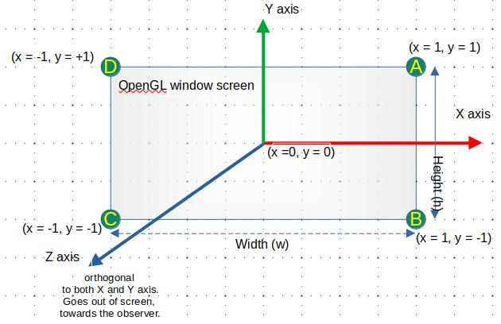
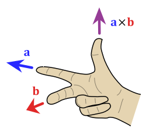
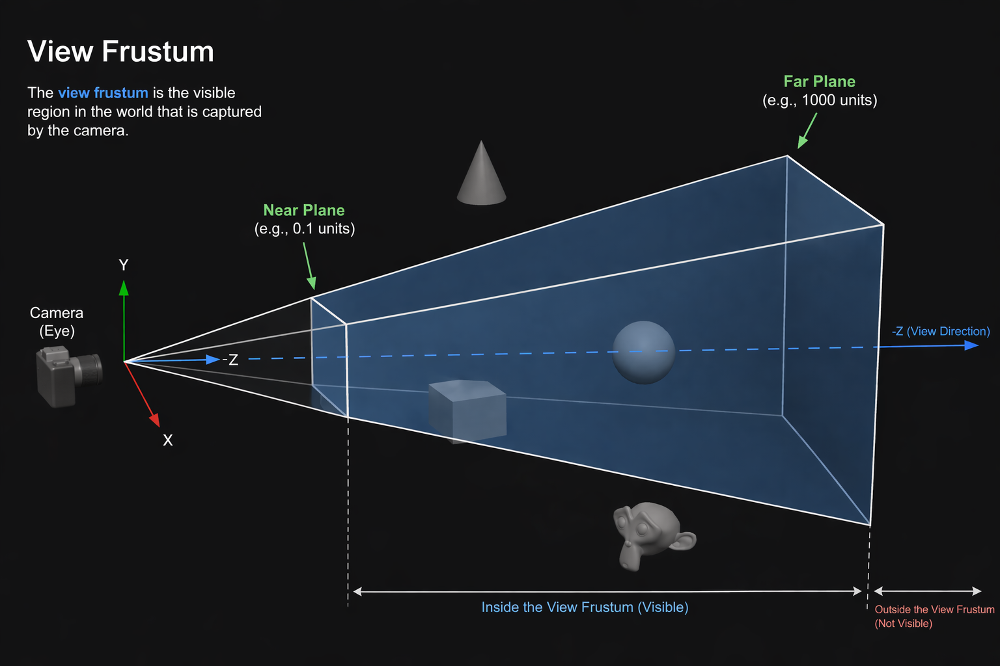
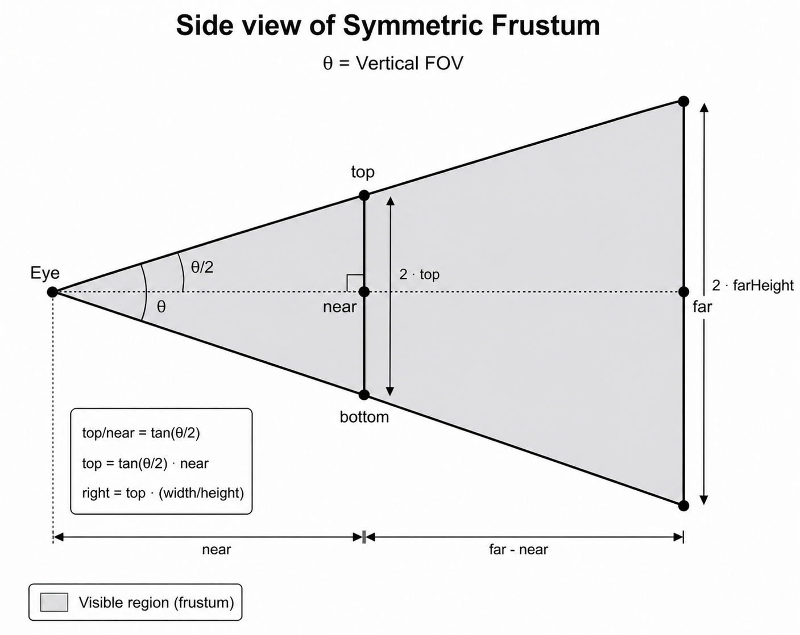
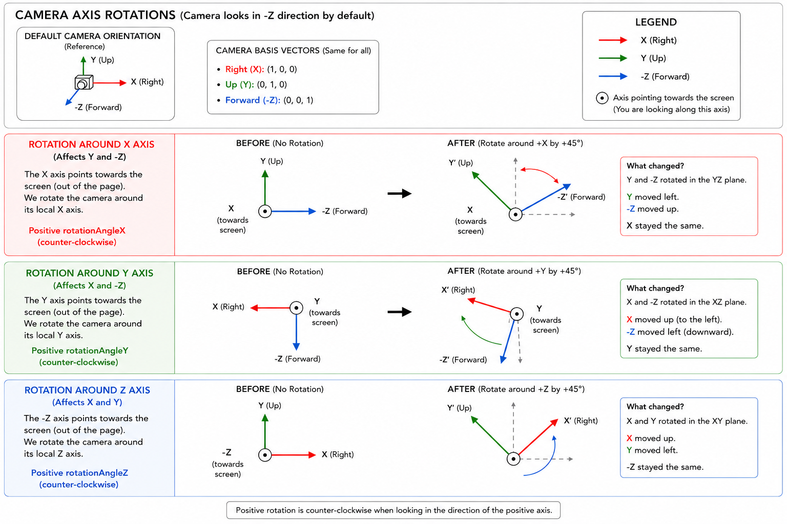
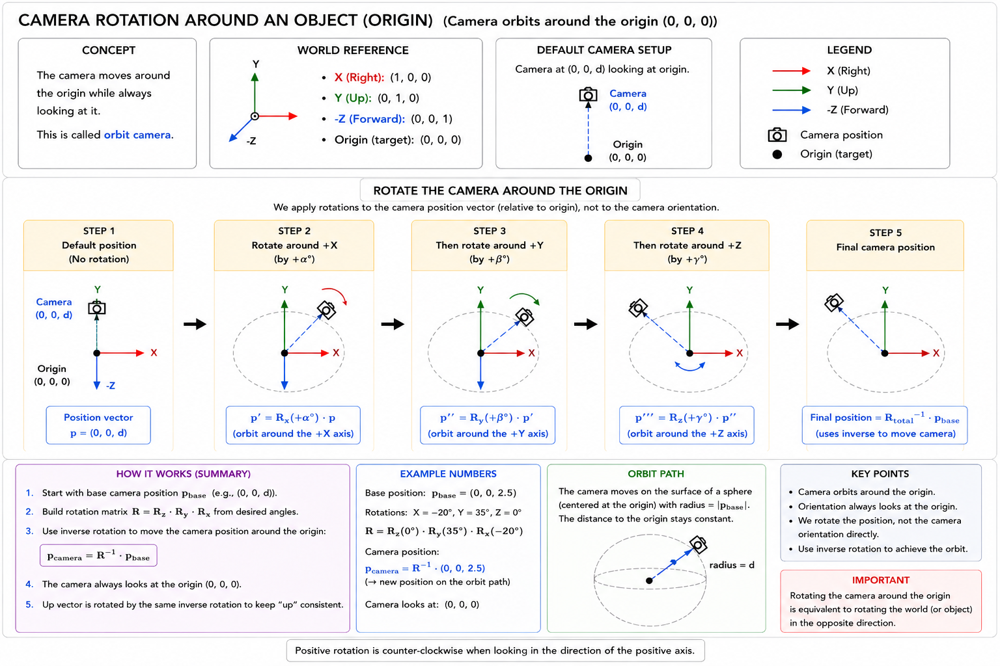

# Lesson 5 — Going to 3D

In the previous lessons, we built the foundations of our OpenGL renderer:

- vertex and index buffers
- vertex array objects
- shaders
- uniforms
- 2D transformations
- model matrices

We are now ready to make the transition from **2D rendering to 3D rendering**.

By the end of this lesson, we will be able to render a 3D pyramid:


More importantly, we are going to introduce several concepts that form the foundation of almost every 3D renderer:

- 3D coordinates
- camera position and orientation
- view space
- field of view
- aspect ratio
- near and far clipping planes
- perspective projection
- clip space
- normalized device coordinates
- perspective division
- depth testing
- the Model-View-Projection transformation

This lesson contains more mathematics than our earlier OpenGL lessons, but the goal is not to memorize every matrix.

The goal is to understand the **flow of a vertex through a 3D renderer**.

By the end, you should understand this pipeline:

    Model Space
        ↓
    Model Matrix
        ↓
    World Space
        ↓
    View Matrix
        ↓
    View / Camera Space
        ↓
    Projection Matrix
        ↓
    Clip Space
        ↓
    Perspective Divide
        ↓
    Normalized Device Coordinates
        ↓
    Viewport Transform
        ↓
    Window / Screen Space

---

# Contents

1. [Transitioning from 2D to 3D](#1-transitioning-from-2d-to-3d)
   - [1.1 Adding the Z Axis](#11-adding-the-z-axis)
   - [1.2 OpenGL Coordinate Conventions](#12-opengl-coordinate-conventions)
2. [Introducing the Camera](#2-introducing-the-camera)
   - [2.1 Camera Position](#21-camera-position)
   - [2.2 Forward, Right, and Up](#22-forward-right-and-up)
   - [2.3 The Cross Product](#23-the-cross-product)
3. [The Camera Frustum](#3-the-camera-frustum)
   - [3.1 Near and Far Planes](#31-near-and-far-planes)
   - [3.2 Field of View](#32-field-of-view)
   - [3.3 Aspect Ratio](#33-aspect-ratio)
4. [The 3D Coordinate-Space Pipeline](#4-the-3d-coordinate-space-pipeline)
5. [The View Transformation](#5-the-view-transformation)
   - [5.1 View Space](#51-view-space)
   - [5.2 Constructing the Camera Basis](#52-constructing-the-camera-basis)
   - [5.3 Why the View Matrix Is an Inverse](#53-why-the-view-matrix-is-an-inverse)
   - [5.4 View Translation](#54-view-translation)
   - [5.5 Complete View Matrix](#55-complete-view-matrix)
6. [Projection](#6-projection)
   - [6.1 Why We Need Projection](#61-why-we-need-projection)
   - [6.2 Clip Space](#62-clip-space)
   - [6.3 Normalized Device Coordinates](#63-normalized-device-coordinates)
   - [6.4 Perspective Divide](#64-perspective-divide)
7. [The Perspective Projection Matrix](#7-the-perspective-projection-matrix)
   - [7.1 Vertical FOV Scaling](#71-vertical-fov-scaling)
   - [7.2 Aspect-Ratio Correction](#72-aspect-ratio-correction)
   - [7.3 Creating W Clip](#73-creating-w-clip)
   - [7.4 Mapping Depth](#74-mapping-depth)
8. [The Model-View-Projection Matrix](#8-the-model-view-projection-matrix)
9. [Constructing a 3D Pyramid](#9-constructing-a-3d-pyramid)
   - [9.1 The Vertex Structure](#91-the-vertex-structure)
   - [9.2 Geometric Vertices vs Vertex Records](#92-geometric-vertices-vs-vertex-records)
   - [9.3 VBO and VAO Configuration](#93-vbo-and-vao-configuration)
10. [3D Rotation](#10-3d-rotation)
    - [10.1 Rotation Around X](#101-rotation-around-x)
    - [10.2 Rotation Around Y](#102-rotation-around-y)
    - [10.3 Rotation Around Z](#103-rotation-around-z)
    - [10.4 Rotation Order](#104-rotation-order)
11. [Camera Rotation](#11-camera-rotation)
    - [11.1 Rotating the Camera in Place](#111-rotating-the-camera-in-place)
    - [11.2 Orbiting Around a Point](#112-orbiting-around-a-point)
12. [Projection with GLM](#12-projection-with-glm)
13. [Using the MVP Matrix in the Shader](#13-using-the-mvp-matrix-in-the-shader)
14. [Depth Testing](#14-depth-testing)
15. [Complete Rendering Flow](#15-complete-rendering-flow)
16. [Common 3D Rendering Mistakes](#16-common-3d-rendering-mistakes)
17. [Conclusion](#17-conclusion)

---

# 1. Transitioning from 2D to 3D

At the vertex-data level, the first step from 2D to 3D is surprisingly small.

In 2D, a position contains two components:

    x
    y

For example:

```cpp
glm::vec2 position{
    0.5f,
    0.25f
};
```

In 3D, we introduce another component:

    z

so a position becomes:

```cpp
glm::vec3 position{
    0.5f,
    0.25f,
    -1.0f
};
```

Conceptually:

    2D position:

    (x, y)

        ↓

    3D position:

    (x, y, z)


The third coordinate introduces **depth**.

We can now describe positions:

- to the left or right
- above or below
- in front of or behind other positions

This is the geometric foundation of 3D rendering.

However, adding a `z` component is only the beginning.

A useful 3D renderer also needs to answer:

> From where are we looking at the scene?

That is the job of the **camera**.

---

# 1.1 Adding the Z Axis

In a conventional Cartesian coordinate system:

    X → horizontal direction
    Y → vertical direction
    Z → depth direction

For the OpenGL conventions used throughout this lesson, we will think about the axes as:

    +X → right
    -X → left

    +Y → up
    -Y → down

and, in the default OpenGL-style camera orientation:

    -Z → forward, into the scene
    +Z → behind the camera / toward the viewer



This is especially important once we begin working in **view space**.

A camera located at the origin with its default orientation looks along:

    (0, 0, -1)

---

# 1.2 OpenGL Coordinate Conventions

You will frequently hear the terms:

- right-handed coordinate system
- left-handed coordinate system

For the conventions used in this lesson, we use a **right-handed system** before projection.

A useful basis is:

    Right   = ( 1, 0,  0)
    Up      = ( 0, 1,  0)
    Forward = ( 0, 0, -1)

The right-hand rule also determines the positive direction of rotation.

For a positive rotation around an axis:

1. Point your right thumb along the positive direction of the axis.
2. The direction in which your fingers curl is the positive rotation direction.

> **Do not mix coordinate-system conventions inside one renderer unless you deliberately account for the differences.**

Libraries, graphics APIs, engines, and textbooks sometimes use different conventions.

What matters most is that your renderer remains internally consistent.

---

# 2. Introducing the Camera

The easiest way to imagine a virtual camera is to compare it to a real camera operator.

Imagine a scene containing:

- a table
- several chairs
- a person
- a lamp

The objects themselves can remain exactly where they are.

However, changing where the camera stands changes the image that we see.

The operator could move:

- left
- right
- forward
- backward
- upward
- downward

The operator could also rotate the camera.

A virtual camera works according to the same idea.


At a basic level, a perspective camera needs information such as:

- position
- orientation
- field of view
- aspect ratio
- near plane
- far plane

From these values, we can construct the transformations that determine how the 3D world is observed.

---

# 2.1 Camera Position

The camera position tells us where the camera exists in world space.

For example:

```cpp
glm::vec3 camera_position{
    0.0f,
    0.0f,
    2.5f
};
```

means that the camera is located at:

    x = 0.0
    y = 0.0
    z = 2.5

If an object is centered around the world origin:

    (0, 0, 0)

then a camera at:

    (0, 0, 2.5)

looking approximately toward `-Z` can see that object in front of it.

---

# 2.2 Forward, Right, and Up

A camera orientation can be described using three perpendicular direction vectors:

    Forward
    Right
    Up

Conceptually:

                 Up
                 ↑
                 |
                 |
    Camera ------+------→ Right
                /
               /
              ↓
           Forward

For our default camera orientation:

    Right   = (1, 0, 0)
    Up      = (0, 1, 0)
    Forward = (0, 0, -1)

These vectors form the camera's local coordinate basis.

If we know a camera position and a target point, we can calculate its forward direction.

Let:

    c = camera position
    t = target position

Then:

$$
\mathbf{f}
=
\frac{\mathbf{t}-\mathbf{c}}
{\|\mathbf{t}-\mathbf{c}\|}
$$

or:

$$
\mathbf{f}
=
\operatorname{normalize}
(\mathbf{t}-\mathbf{c})
$$

Given a world-up direction such as:

$$
\mathbf{u}_{world} =
\begin{bmatrix}
0\\
1\\
0
\end{bmatrix}
$$

we can calculate the camera's right vector:

$$
\mathbf{r}
=
\operatorname{normalize}
(
\mathbf{f}
\times
\mathbf{u}_{world}
)
$$

Then the corrected camera-up vector is:

$$
\mathbf{u}
=
\mathbf{r}
\times
\mathbf{f}
$$

We now have an orthogonal camera basis:

    r → right
    u → up
    f → forward

---

# 2.3 The Cross Product

The cross product takes two 3D vectors and produces another vector perpendicular to both.

For:

$$
\mathbf{a}
=
\begin{bmatrix}
a_x\\
a_y\\
a_z
\end{bmatrix}
$$

and:

$$
\mathbf{b}
=
\begin{bmatrix}
b_x\\
b_y\\
b_z
\end{bmatrix}
$$

their cross product is:

$$
\mathbf{a}
\times
\mathbf{b}
=
\begin{bmatrix}
a_yb_z-a_zb_y\\
a_zb_x-a_xb_z\\
a_xb_y-a_yb_x
\end{bmatrix}
$$


One extremely important property is:

$$
\mathbf{a}\times\mathbf{b}
\neq
\mathbf{b}\times\mathbf{a}
$$

In fact:

$$
\mathbf{a}\times\mathbf{b}
=
-
(\mathbf{b}\times\mathbf{a})
$$

Swapping the operands reverses the resulting direction.

The direction is determined by the **right-hand rule**.



This is why the order used to construct a camera basis matters.

---

# 3. The Camera Frustum

A perspective camera does not see the entire 3D world.

Instead, its visible region is commonly represented as a **view frustum**.



A frustum resembles a pyramid with its tip removed.

It is bounded by six planes:

- left
- right
- top
- bottom
- near
- far

Geometry completely outside this region will not contribute to the final view.

---

# 3.1 Near and Far Planes

The **near plane** determines the closest view-space depth that belongs to the perspective viewing volume.

The **far plane** determines the farthest.

For example:

```cpp
constexpr float NEAR_PLANE = 0.1f;
constexpr float FAR_PLANE  = 100.0f;
```

Conceptually:

    Camera
      |
      |  near
      ↓
     /---\
    /     \
   /       \
  /         \
 /-----------\
      far

Objects or portions of primitives outside the clipping volume may be clipped.

There is an important distinction here:

> A near plane is not literally your monitor, nor does the rendered image physically exist on the near plane.

It is a mathematical boundary used by the perspective projection.

The actual framebuffer is produced much later, after projection, clipping, perspective division, rasterization, and viewport mapping.

---

## Why Must Near Be Greater Than Zero?

For the standard perspective matrix used in this lesson:

```cpp
near > 0
```

is required.

Perspective projection depends on depth, and the camera position itself is not a valid finite perspective plane.

A near value such as:

```cpp
0.1f
```

is common for small scenes.

---

## Choosing the Far Plane

A far plane such as:

```cpp
100.0f
```

means geometry beyond that depth lies outside the conventional finite perspective frustum.

However, the far plane should not be described merely as a mechanism that prevents the GPU from processing infinitely many distant objects.

OpenGL does not automatically discover and submit every object in the world based on the far-plane value.

Your application still controls what draw calls are submitted.

Near and far values primarily affect:

- the projection mapping
- clipping
- depth precision

There are also projection techniques that use an effectively infinite far plane.

For this lesson, however, we will use a conventional finite near/far range.

---

## Near Plane and Depth Precision

A very important practical rule is:

> **Do not make the near plane unnecessarily small.**

For example:

    near = 0.00001
    far  = 100000

can produce poor depth-buffer precision.

This may cause artifacts such as **z-fighting**, where surfaces at similar depths appear to flicker.

Choosing sensible near and far values is therefore important for more than visibility.

---

# 3.2 Field of View

The **Field of View (FOV)** describes the angular extent of the scene visible through the perspective camera.


A wide field of view shows more of the scene.

A narrow field of view shows less.


In perspective rendering, increasing the FOV generally makes objects appear smaller because more of the scene must fit inside the same viewport.

Decreasing the FOV makes objects appear larger and creates a zoomed-in effect.

---

## Physical-Camera Relationship

For a physical camera, FOV can be related to sensor size and focal length:

$$
FOV =
2\arctan
\left(
\frac{sensor\_size}
{2\cdot focal\_length}
\right)
$$

For horizontal FOV:

$$
FOV_h =
2\arctan
\left(
\frac{sensor\_width}
{2\cdot focal\_length}
\right)
$$

For vertical FOV:

$$
FOV_v =
2\arctan
\left(
\frac{sensor\_height}
{2\cdot focal\_length}
\right)
$$

In real-time graphics, however, we commonly choose the field of view directly.

For example:

```cpp
constexpr float FOV_DEGREES_Y_AXIS = 45.0f;
```

Functions such as:

```cpp
glm::perspective(...)
```

normally expect a **vertical FOV**.

---

# 3.3 Aspect Ratio

The **aspect ratio** describes the width of the viewport relative to its height:

$$
aspect =
\frac{width}{height}
$$

For example:

    width  = 1920
    height = 1080

gives:

$$
aspect =
\frac{1920}{1080}
\approx 1.7778
$$

or approximately:

    16 : 9


The aspect ratio is important because our viewport is usually rectangular.

Without aspect-ratio correction, projected geometry can appear stretched.

For example:

    circle → ellipse
    square → rectangle

A perspective matrix therefore adjusts horizontal scaling based on the viewport's width-to-height ratio.

---

# 4. The 3D Coordinate-Space Pipeline

In the previous lesson, we introduced model and world space.

In 3D rendering, a vertex travels through several coordinate systems.

The complete simplified pipeline is:

    Model Space
        ↓
        M
        ↓
    World Space
        ↓
        V
        ↓
    View Space
        ↓
        P
        ↓
    Clip Space
        ↓
    Perspective Divide
        ↓
    NDC
        ↓
    Viewport Transform
        ↓
    Window Coordinates

where:

    M = model matrix
    V = view matrix
    P = projection matrix

Mathematically:

$$
\mathbf{p}_{clip}
=
PVM\mathbf{p}_{model}
$$

This expression is one of the most important equations in introductory 3D graphics.

---

# 5. The View Transformation

The **view matrix** transforms coordinates from **world space into camera space**.

Conceptually:

    World Space
        ↓
    View Matrix
        ↓
    Camera / View Space

In world space, the camera may be located at:

    (3, 2, 5)

with some orientation.

After the view transformation, we describe everything relative to the camera.

In view space, the camera is conceptually:

    position = (0, 0, 0)

with the standard orientation:

    Right   → +X
    Up      → +Y
    Forward → -Z

That is the purpose of the view transformation.

---

# 5.1 View Space

Suppose a cube has a world-space position:

$$
\mathbf{p}_{world}
$$

After the view transformation:

$$
\mathbf{p}_{view}
=
V\mathbf{p}_{world}
$$

the resulting coordinates answer:

> Where is this point relative to the camera?

This is why view space is often called **camera space**.

A helpful mental model is:

> Instead of mathematically moving the camera through an unchanged world, transform the world by the inverse of the camera's transformation.

The final result is equivalent.

---

# 5.2 Constructing the Camera Basis

Assume we know:

    camera position = c
    target          = t
    world up        = u_world

The forward direction is:

$$
\mathbf{f}
=
\operatorname{normalize}
(
\mathbf{t}-\mathbf{c}
)
$$

The right vector is:

$$
\mathbf{r}
=
\operatorname{normalize}
(
\mathbf{f}\times\mathbf{u}_{world}
)
$$

The camera-up vector becomes:

$$
\mathbf{u}
=
\mathbf{r}\times\mathbf{f}
$$

For the conventional OpenGL view-space orientation, the basis used by the view matrix is:

    +X → right
    +Y → up
    -Z → forward

That is why the view matrix uses:

$$
-\mathbf{f}
$$

for its Z basis.

---

# 5.3 Why the View Matrix Is an Inverse

Imagine that a camera's transform moves it from its local space into world space.

Call this camera transform:

$$
C
$$

Then:

$$
\mathbf{p}_{world}
=
C\mathbf{p}_{camera}
$$

But for rendering, we need the opposite conversion:

$$
\mathbf{p}_{camera}
=
C^{-1}\mathbf{p}_{world}
$$

Therefore:

$$
V = C^{-1}
$$

The **view matrix is the inverse camera transform**.

This explains why camera motion often appears reversed when expressed as a view transformation.

If the camera moves:

    +5 along X

the world appears to move:

    -5 along X

relative to the camera.

Likewise, if the camera rotates right, the world is transformed in the opposite direction into camera space.

---

## Inverse Rotation

A pure rotation matrix is **orthogonal**.

For an orthogonal matrix:

$$
R^{-1}=R^T
$$

because:

$$
R^TR=I
$$

Therefore, if the camera orientation is represented by an orthonormal rotation matrix, its inverse can be found by transposing it.

This is why view-matrix construction often contains an inverse or transpose of the camera rotation.

---

# 5.4 View Translation

Suppose the camera world position is:

$$
\mathbf{c}
=
\begin{bmatrix}
c_x\\
c_y\\
c_z
\end{bmatrix}
$$

If there were no rotation, moving the camera to the origin would require translating the world by:

$$
-\mathbf{c}
$$

The corresponding homogeneous translation matrix would be:

$$
T^{-1}
=
\begin{bmatrix}
1 & 0 & 0 & -c_x\\
0 & 1 & 0 & -c_y\\
0 & 0 & 1 & -c_z\\
0 & 0 & 0 & 1
\end{bmatrix}
$$

When camera rotation is also involved, the translation component must be expressed in the rotated view basis.

Therefore:

$$
\mathbf{t}_{view}
=
-R^{-1}\mathbf{c}
$$

or equivalently:

$$
\mathbf{t}_{view}
=
R^{-1}(-\mathbf{c})
$$

In code:

```cpp
const glm::vec3 view_translation =
    -view_rotation * camera_position;
```

---

# 5.5 Complete View Matrix

Using:

    r = camera right
    u = camera up
    f = camera forward
    c = camera position

a conventional right-handed OpenGL view matrix can be written as:

$$
V =
\begin{bmatrix}
r_x & r_y & r_z & -\mathbf{r}\cdot\mathbf{c}\\
u_x & u_y & u_z & -\mathbf{u}\cdot\mathbf{c}\\
-f_x & -f_y & -f_z & \mathbf{f}\cdot\mathbf{c}\\
0 & 0 & 0 & 1
\end{bmatrix}
$$

This matrix performs the world-to-view transformation.

One way to think about its structure is:

    View Matrix
    │
    ├── inverse camera orientation
    │
    └── inverse camera translation

The important idea is not to memorize every matrix entry.

Remember:

> **The view matrix transforms the world into a coordinate system where the camera is at the origin and has the standard view-space orientation.**

---

# 6. Projection

We now have our geometry in camera space.

The next problem is perspective.

In real life:

- nearby objects appear larger
- distant objects appear smaller

A perspective renderer needs to reproduce this behavior.

That is the job of the **perspective projection transformation**.

---

# 6.1 Why We Need Projection

Suppose a point exists in view space:

$$
(x,y,z)
$$

For the OpenGL convention used here, visible points in front of the camera normally have:

$$
z<0
$$

A simple perspective relationship is approximately:

$$
x' \propto \frac{x}{-z}
$$

$$
y' \propto \frac{y}{-z}
$$

As the magnitude of the depth increases:

$$
|-z|\uparrow
$$

the projected coordinate becomes smaller.

That gives us the familiar perspective effect.

However, the OpenGL projection matrix does **not** directly produce final 2D pixel coordinates.

Instead:

    View Space
        ↓
    Projection Matrix
        ↓
    Clip Space
        ↓
    Perspective Divide
        ↓
    NDC
        ↓
    Viewport Transform
        ↓
    Window Coordinates

That distinction is extremely important.

---

# 6.2 Clip Space

The vertex shader ultimately writes:

```glsl
gl_Position
```

in **homogeneous clip coordinates**.

The position has four components:

    x_clip
    y_clip
    z_clip
    w_clip

A point lies inside the canonical OpenGL clip volume when:

$$
-w_{clip}
\le
x_{clip}
\le
w_{clip}
$$

$$
-w_{clip}
\le
y_{clip}
\le
w_{clip}
$$

$$
-w_{clip}
\le
z_{clip}
\le
w_{clip}
$$

An important correction is needed here.

It is too simplistic to say:

> If one vertex lies outside these inequalities, the entire triangle disappears.

OpenGL clips **primitives** against the clip volume.

For example, a triangle may have one vertex outside the frustum while part of the triangle still intersects the visible region.

OpenGL can clip that triangle against the relevant clipping planes and keep the visible portion.

Conceptually:

    Original Triangle
        ↓
    intersects frustum boundary
        ↓
    clipping
        ↓
    visible portion remains

---

# 6.3 Normalized Device Coordinates

After clipping and perspective division, coordinates enter **Normalized Device Coordinates (NDC)**.

For standard OpenGL conventions, NDC coordinates are in:

$$
-1\le x_{ndc}\le1
$$

$$
-1\le y_{ndc}\le1
$$

$$
-1\le z_{ndc}\le1
$$

NDC is independent of the framebuffer's pixel dimensions.

For example, the center is:

    (0, 0)

regardless of whether the viewport is:

    400 × 800

or:

    1920 × 1080


Later, the **viewport transform** maps NDC into actual window coordinates.

---

# 6.4 Perspective Divide

Clip coordinates are converted into NDC through the **perspective divide**:

$$
x_{ndc}
=
\frac{x_{clip}}{w_{clip}}
$$

$$
y_{ndc}
=
\frac{y_{clip}}{w_{clip}}
$$

$$
z_{ndc}
=
\frac{z_{clip}}{w_{clip}}
$$

The perspective divide is not itself a linear transformation.

The projection matrix prepares the clip coordinates so that dividing by `w` produces the desired perspective behavior.

For the conventional perspective matrix used here:

$$
w_{clip}=-z_{view}
$$

Therefore:

$$
x_{ndc}
=
\frac{x_{clip}}{-z_{view}}
$$

and:

$$
y_{ndc}
=
\frac{y_{clip}}{-z_{view}}
$$

The farther an object is in front of the camera, the larger:

$$
-z_{view}
$$

becomes.

That causes projected X and Y coordinates to shrink toward the center.

This is the mathematical source of perspective foreshortening.

---

# 7. The Perspective Projection Matrix

For a conventional right-handed OpenGL perspective projection using vertical FOV, the matrix is:

$$
P =
\begin{bmatrix}
\frac{1}
{aspect\tan\left(\frac{fov_y}{2}\right)}
&
0
&
0
&
0
\\
0
&
\frac{1}
{\tan\left(\frac{fov_y}{2}\right)}
&
0
&
0
\\
0
&
0
&
\frac{f+n}{n-f}
&
\frac{2fn}{n-f}
\\
0
&
0
&
-1
&
0
\end{bmatrix}
$$

where:

    fov_y  = vertical field of view
    aspect = width / height
    n      = near distance
    f      = far distance

The matrix may look intimidating, but each part solves a specific problem.

---

# 7.1 Vertical FOV Scaling

Define:

$$
s =
\frac{1}
{\tan\left(\frac{fov_y}{2}\right)}
$$

This is the vertical projection scale.

Why?

Consider half of the camera frustum.



If the near plane is at distance `n` and its half-height is `t`:

$$
\tan
\left(
\frac{fov_y}{2}
\right)
=
\frac{t}{n}
$$

Therefore:

$$
t
=
n\tan
\left(
\frac{fov_y}{2}
\right)
$$

At a reference distance of `1`:

$$
t
=
\tan
\left(
\frac{fov_y}{2}
\right)
$$

To normalize this visible range, the projection uses its reciprocal:

$$
s
=
\frac{1}
{\tan\left(\frac{fov_y}{2}\right)}
$$

So:

- smaller FOV → larger scale → zoomed-in appearance
- larger FOV → smaller scale → wider view

For example:

$$
fov_y=15^\circ
$$

gives:

$$
s
=
\frac{1}{\tan(7.5^\circ)}
\approx7.60
$$

while:

$$
fov_y=120^\circ
$$

gives:

$$
s
=
\frac{1}{\tan(60^\circ)}
\approx0.577
$$

The smaller FOV magnifies projected coordinates much more strongly.

---

# 7.2 Aspect-Ratio Correction

The vertical projection scale is:

$$
s_y
=
\frac{1}
{\tan\left(\frac{fov_y}{2}\right)}
$$

The horizontal scale is:

$$
s_x
=
\frac{s_y}{aspect}
$$

Therefore:

$$
s_x
=
\frac{1}
{aspect\tan\left(\frac{fov_y}{2}\right)}
$$

Why divide by the aspect ratio?

Suppose:

$$
aspect>1
$$

The viewport is wider than it is tall.

We therefore want more horizontal world space to fit inside the visible region.

That means X coordinates need less magnification.

Dividing by the aspect ratio provides exactly that correction.

Without it, geometry would appear distorted whenever the viewport is not square.

---

# 7.3 Creating W Clip

The final row of the perspective matrix is:

$$
\begin{bmatrix}
0 & 0 & -1 & 0
\end{bmatrix}
$$

Multiplying this row by:

$$
\begin{bmatrix}
x_{view}\\
y_{view}\\
z_{view}\\
1
\end{bmatrix}
$$

produces:

$$
w_{clip}
=
-z_{view}
$$

This is one of the most important parts of the perspective matrix.

Afterward:

$$
x_{ndc}
=
\frac{x_{clip}}
{-z_{view}}
$$

and:

$$
y_{ndc}
=
\frac{y_{clip}}
{-z_{view}}
$$

This is what creates perspective foreshortening.

> **The projection matrix does not itself perform the perspective divide. It constructs clip coordinates whose `w` component allows the later perspective divide to create the perspective effect.**

---

# 7.4 Mapping Depth

We still need to determine:

$$
z_{clip}
$$

For the conventional OpenGL matrix:

$$
z_{clip}
=
A z_{view}+B
$$

where:

$$
A=
\frac{f+n}{n-f}
$$

and:

$$
B=
\frac{2fn}{n-f}
$$

After the perspective divide:

$$
z_{ndc}
=
\frac{z_{clip}}
{w_{clip}}
$$

and since:

$$
w_{clip}
=
-z_{view}
$$

we get:

$$
z_{ndc}
=
\frac
{Az_{view}+B}
{-z_{view}}
$$

or:

$$
z_{ndc}
=
-A-\frac{B}{z_{view}}
$$

The constants are chosen so that:

$$
z_{view}=-n
\Rightarrow
z_{ndc}=-1
$$

and:

$$
z_{view}=-f
\Rightarrow
z_{ndc}=+1
$$

This maps the view-space near/far interval into the OpenGL NDC depth interval.

An important consequence is that perspective depth is **nonlinear** after division.

Depth precision is concentrated more heavily near the camera.

This is another reason why choosing a sensible near plane is important.

---

# 8. The Model-View-Projection Matrix

We now have all three major transformations:

    Model
    View
    Projection

The **Model-View-Projection matrix**, commonly abbreviated **MVP**, combines them.

For column vectors:

$$
\mathbf{p}_{clip}
=
PVM\mathbf{p}_{model}
$$

Therefore:

```cpp
const glm::mat4 mvp =
    projection *
    view *
    model;
```

The matrices act on the vertex from right to left:

    model-space position
        ↓
       Model
        ↓
    world-space position
        ↓
       View
        ↓
    view-space position
        ↓
     Projection
        ↓
    clip-space position

This order is essential.

Do not write:

```cpp
model * view * projection
```

when using the GLM/GLSL column-vector convention shown here.

That would represent a different transformation.

---

# 9. Constructing a 3D Pyramid

Our goal is to render:


A square-based pyramid has five unique geometric corner positions:

    1 top point
    4 base corners

For example:

```cpp
const glm::vec3 top{
    0.0f,
    0.35f,
    0.0f
};

const glm::vec3 front_left{
    -0.25f,
    -0.25f,
     0.25f
};

const glm::vec3 front_right{
     0.25f,
    -0.25f,
     0.25f
};

const glm::vec3 back_left{
    -0.25f,
    -0.25f,
    -0.25f
};

const glm::vec3 back_right{
     0.25f,
    -0.25f,
    -0.25f
};
```

These positions are defined in **model space**.

---

# 9.1 The Vertex Structure

Instead of storing raw floats manually, we can define a vertex structure:

```cpp
struct Vertex
{
    glm::vec3 position;
    glm::vec4 color;
};
```

Our complete vertex now contains:

    position
        ├── x
        ├── y
        └── z

    color
        ├── r
        ├── g
        ├── b
        └── a

This becomes easier to manage as our renderer grows.

Later, a vertex might also contain:

```cpp
glm::vec3 normal;
glm::vec2 texture_coordinates;
glm::vec3 tangent;
```

Using a `Vertex` type gives those attributes a clear structure.

---

# 9.2 Geometric Vertices vs Vertex Records

There is an important distinction in our pyramid.

Geometrically, the pyramid has:

    5 unique corner positions

However, our renderer may need more than five **complete vertex records**.

Why?

Because neighboring faces can share the same position while requiring different attributes.

For this lesson, different faces use different colors.

For example, the top point may appear on several faces:

    same position
        +
    different face color
        =
    different complete vertex record

Therefore, we might store:

```cpp
const std::vector<Vertex> vertices =
{
    // Front face
    { top,         neon_blue_1 },
    { front_left,  neon_blue_2 },
    { front_right, neon_blue_2 },

    // Right face
    { top,         neon_green },
    { front_right, neon_green },
    { back_right,  neon_green },

    // Back face
    { top,        neon_purple },
    { back_right, neon_purple },
    { back_left,  neon_purple },

    // Left face
    { top,        neon_blue_2 },
    { back_left,  neon_blue_1 },
    { front_left, neon_blue_1 },

    // Base
    { front_left,  base_blue },
    { back_left,   base_blue },
    { back_right,  base_purple },
    { front_right, base_purple }
};
```

This contains more than five records even though there are only five geometric positions.

That is not a mistake.

Remember the rule from the EBO lesson:

> **Indices reuse complete vertex records, not positions by themselves.**

Later, this becomes even more important when different faces require different:

- normals
- texture coordinates
- tangents

---

# 9.3 VBO and VAO Configuration

Our VBO now contains `Vertex` structures.

Upload the data:

```cpp
glBindBuffer(
    GL_ARRAY_BUFFER,
    vbo
);

glBufferData(
    GL_ARRAY_BUFFER,
    static_cast<GLsizeiptr>(
        vertices.size() * sizeof(Vertex)
    ),
    vertices.data(),
    GL_STATIC_DRAW
);
```

If an EBO is used:

```cpp
glBindBuffer(
    GL_ELEMENT_ARRAY_BUFFER,
    ebo
);

glBufferData(
    GL_ELEMENT_ARRAY_BUFFER,
    static_cast<GLsizeiptr>(
        indices.size() *
        sizeof(unsigned int)
    ),
    indices.data(),
    GL_STATIC_DRAW
);
```

The position attribute now contains **three** components:

```cpp
glVertexAttribPointer(
    0,
    3,
    GL_FLOAT,
    GL_FALSE,
    sizeof(Vertex),
    reinterpret_cast<void*>(
        offsetof(Vertex, position)
    )
);

glEnableVertexAttribArray(0);
```

Color still contains four:

```cpp
glVertexAttribPointer(
    1,
    4,
    GL_FLOAT,
    GL_FALSE,
    sizeof(Vertex),
    reinterpret_cast<void*>(
        offsetof(Vertex, color)
    )
);

glEnableVertexAttribArray(1);
```

Using:

```cpp
sizeof(Vertex)
```

for the stride is cleaner than manually counting all components.

Likewise:

```cpp
offsetof(Vertex, position)
```

and:

```cpp
offsetof(Vertex, color)
```

make the attribute offsets explicit.

---

# 10. 3D Rotation

In 2D, we only needed one rotation axis.

In 3D, we can rotate around:

    X
    Y
    Z

Each rotation leaves one axis unchanged while rotating the other two.

---

# 10.1 Rotation Around X

Rotation around X leaves X unchanged and rotates the YZ plane:

$$
R_x(\theta)
=
\begin{bmatrix}
1&0&0&0\\
0&\cos\theta&-\sin\theta&0\\
0&\sin\theta&\cos\theta&0\\
0&0&0&1
\end{bmatrix}
$$

Conceptually:

    X axis → unchanged
    Y axis → changes
    Z axis → changes

---

# 10.2 Rotation Around Y

Rotation around Y leaves Y unchanged:

$$
R_y(\theta)
=
\begin{bmatrix}
\cos\theta&0&\sin\theta&0\\
0&1&0&0\\
-\sin\theta&0&\cos\theta&0\\
0&0&0&1
\end{bmatrix}
$$

Conceptually:

    X axis → changes
    Y axis → unchanged
    Z axis → changes

---

# 10.3 Rotation Around Z

Rotation around Z leaves Z unchanged:

$$
R_z(\theta)
=
\begin{bmatrix}
\cos\theta&-\sin\theta&0&0\\
\sin\theta&\cos\theta&0&0\\
0&0&1&0\\
0&0&0&1
\end{bmatrix}
$$

Conceptually:

    X axis → changes
    Y axis → changes
    Z axis → unchanged



---

# 10.4 Rotation Order

Rotation order matters because matrix multiplication is not commutative.

In general:

$$
R_xR_y
\neq
R_yR_x
$$

Suppose we decide that an object's rotations occur:

    X first
    Y second
    Z third

Using column vectors, that can be represented as:

```cpp
const glm::mat4 rotation =
    rotate_z *
    rotate_y *
    rotate_x;
```

because the rightmost matrix acts first.

Therefore:

```cpp
rotate_z * rotate_y * rotate_x
```

means:

    1. X rotation
    2. Y rotation
    3. Z rotation

There is no universal requirement that every renderer must always use XYZ Euler order.

Different engines may use different conventions.

What matters is:

> **Choose a convention, understand it, and use it consistently.**

---

# 11. Camera Rotation

There are two useful camera behaviors to distinguish:

1. rotating the camera at its current position
2. orbiting the camera around another point

These are not the same transformation.

---

# 11.1 Rotating the Camera in Place

Imagine standing still and turning your head.

Your position does not change.

Only your orientation changes.

For example:

```cpp
const float camera_rotation_angle_x =
    glm::radians(15.0f);

const float camera_rotation_angle_y =
    glm::radians(15.0f);

const float camera_rotation_angle_z =
    glm::radians(45.0f);
```

Construct each rotation:

```cpp
const glm::mat4 camera_rotate_x =
    create_rotation_x3d(
        camera_rotation_angle_x
    );

const glm::mat4 camera_rotate_y =
    create_rotation_y3d(
        camera_rotation_angle_y
    );

const glm::mat4 camera_rotate_z =
    create_rotation_z3d(
        camera_rotation_angle_z
    );
```

Combine them:

```cpp
const glm::mat4 camera_rotation =
    camera_rotate_z *
    camera_rotate_y *
    camera_rotate_x;
```

The camera's world orientation changes.

Its position does not.

To construct the view transformation, we need the inverse camera orientation.

Because this is an orthonormal rotation:

```cpp
const glm::mat3 view_rotation =
    glm::transpose(
        glm::mat3(camera_rotation)
    );
```

could be used.

A more general conceptual expression is:

```cpp
view = inverse(camera_world_transform);
```

---

## Rotation Examples

A camera with zero rotation might produce:


Example results:

| X | Y | Z | Result |
|:---:|:---:|:---:|:---:|
| `30°` | `0°` | `0°` |  |
| `-30°` | `0°` | `0°` |  |
| `0°` | `30°` | `0°` |  |
| `0°` | `-30°` | `0°` |  |
| `0°` | `0°` | `90°` |  |
| `0°` | `0°` | `-90°` |  |

---

# 11.2 Orbiting Around a Point

Orbiting is different.

Instead of standing in one place and turning your head, imagine walking around an object while continuing to observe it.



An orbital transformation changes the camera's **position** around a pivot.

Suppose:

```cpp
const glm::vec3 base_camera_position{
    0.0f,
    0.0f,
    2.5f
};
```

We construct an orbit rotation:

```cpp
const glm::mat4 orbit_rotation =
    orbit_rotate_z *
    orbit_rotate_y *
    orbit_rotate_x;
```

Then the orbit can transform the camera position:

```cpp
const glm::vec3 new_camera_position =
    glm::vec3(
        orbit_rotation *
        glm::vec4(
            base_camera_position,
            1.0f
        )
    );
```

Because `w = 1`, the vector represents a position.

The camera's location now moves around the orbit pivot.

---

## Orbit Examples

Using:

    camera position = (0, 0, 2.5)

we may obtain:

| Orbit X | Orbit Y | Orbit Z | Approximate Position |
|:---:|:---:|:---:|:---:|
| `30°` | `0°` | `0°` | `(0.0, -1.25, 2.17)` |
| `-30°` | `0°` | `0°` | `(0.0, 1.25, 2.17)` |
| `0°` | `30°` | `0°` | `(1.25, 0.0, 2.17)` |
| `0°` | `-30°` | `0°` | `(-1.25, 0.0, 2.17)` |

Example images:

| X | Y | Z | Orbit |
|:---:|:---:|:---:|:---:|
| `30°` | `0°` | `0°` |  |
| `-30°` | `0°` | `0°` |  |
| `0°` | `30°` | `0°` |  |
| `0°` | `-30°` | `0°` |  |
| `0°` | `0°` | `90°` |  |
| `0°` | `0°` | `-90°` |  |

The important distinction is:

    Camera rotation in place
        → orientation changes
        → position remains fixed

    Camera orbit
        → camera position changes around a pivot
        → orientation may also change depending on implementation

---

## A Cleaner Camera Construction

For introductory camera code, manually constructing the inverse transform is useful because it teaches how the view matrix works.

For production code, GLM already provides convenient helpers.

For a camera that looks at a target:

```cpp
const glm::mat4 view =
    glm::lookAt(
        camera_position,
        target_position,
        world_up
    );
```

For example:

```cpp
const glm::vec3 camera_position{
    0.0f,
    0.0f,
    2.5f
};

const glm::vec3 target{
    0.0f,
    0.0f,
    0.0f
};

const glm::vec3 world_up{
    0.0f,
    1.0f,
    0.0f
};

const glm::mat4 view =
    glm::lookAt(
        camera_position,
        target,
        world_up
    );
```

This produces the same conceptual world-to-view transformation without requiring us to manually assemble every matrix element.

Understanding the mathematics is still valuable because later camera systems will build on the same ideas.

---

# 12. Projection with GLM

The perspective matrix depends on:

- vertical FOV
- aspect ratio
- near plane
- far plane

Define:

```cpp
constexpr float FOV_DEGREES_Y_AXIS =
    45.0f;

constexpr float NEAR_PLANE =
    0.1f;

constexpr float FAR_PLANE =
    100.0f;
```

Our framebuffer dimensions may change:

```cpp
int g_framebuffer_width =
    WINDOW_WIDTH;

int g_framebuffer_height =
    WINDOW_HEIGHT;
```

Calculate the aspect ratio:

```cpp
const float aspect_ratio =
    static_cast<float>(
        g_framebuffer_width
    ) /
    static_cast<float>(
        g_framebuffer_height > 0
            ? g_framebuffer_height
            : 1
    );
```

Then construct the perspective matrix:

```cpp
const glm::mat4 projection =
    glm::perspective(
        glm::radians(
            FOV_DEGREES_Y_AXIS
        ),
        aspect_ratio,
        NEAR_PLANE,
        FAR_PLANE
    );
```

GLM handles the matrix construction for us.

---

## Recalculate Projection When Necessary

The aspect ratio changes when the framebuffer size changes.

Therefore, the projection matrix must be updated when necessary.

One option is to calculate it every frame:

```cpp
const float aspect_ratio =
    static_cast<float>(
        g_framebuffer_width
    ) /
    static_cast<float>(
        g_framebuffer_height > 0
            ? g_framebuffer_height
            : 1
    );

const glm::mat4 projection =
    glm::perspective(
        glm::radians(
            FOV_DEGREES_Y_AXIS
        ),
        aspect_ratio,
        NEAR_PLANE,
        FAR_PLANE
    );
```

This is perfectly acceptable for a simple tutorial.

A more structured renderer might instead mark the projection matrix dirty and recalculate it only when:

- viewport dimensions change
- FOV changes
- near plane changes
- far plane changes

---

# 13. Using the MVP Matrix in the Shader

We can construct the final matrix:

```cpp
const glm::mat4 mvp =
    projection *
    view *
    model;
```

Then send it to the vertex shader.

Retrieve the location once after linking:

```cpp
const GLint mvp_location =
    glGetUniformLocation(
        shader_program,
        "u_mvp"
    );
```

Inside the rendering logic:

```cpp
glUseProgram(shader_program);

glUniformMatrix4fv(
    mvp_location,
    1,
    GL_FALSE,
    glm::value_ptr(mvp)
);
```

Our vertex shader can then be:

```glsl
#version 460 core

layout (location = 0) in vec3 a_position;
layout (location = 1) in vec4 a_color;

uniform mat4 u_mvp;

out vec4 v_color;

void main()
{
    gl_Position =
        u_mvp *
        vec4(a_position, 1.0);

    v_color = a_color;
}
```

The vertex transformation is now:

    Model-space position
        ↓
    vec4(position, 1)
        ↓
    MVP
        ↓
    Clip-space gl_Position

OpenGL performs the later clipping and perspective-division stages as part of the graphics pipeline.

---

## Should We Always Multiply MVP on the CPU?

Not necessarily.

The original lesson compared:

```glsl
uniform mat4 u_mvp;
```

against:

```glsl
uniform mat4 u_model;
uniform mat4 u_view;
uniform mat4 u_projection;
```

and suggested that calculating:

```glsl
u_projection *
u_view *
u_model
```

inside the vertex shader would necessarily create a major performance problem.

That conclusion is too broad.

Both approaches are valid.

For example:

```glsl
gl_Position =
    u_projection *
    u_view *
    u_model *
    vec4(a_position, 1.0);
```

is a common shader pattern.

However, there is still an important optimization principle:

> **Avoid repeating calculations per vertex when the result is constant for the entire draw and does not need to be computed there.**

If:

```cpp
projection * view * model
```

is constant for an entire draw call, calculating the combined matrix once on the CPU can avoid repeating matrix-matrix multiplication for each vertex shader invocation.

So:

```cpp
const glm::mat4 mvp =
    projection *
    view *
    model;
```

can be a sensible optimization.

However, keeping `model`, `view`, and `projection` separate can also be useful because shaders may need them independently for other calculations.

Later, for lighting, we may need values such as:

- model matrix
- view matrix
- normal matrix
- world-space positions

Therefore, there is no universal rule that shaders should contain only a precomputed MVP.

The correct design depends on what the shader needs.

---

# 14. Depth Testing

One of the most important additions when moving to 3D is the **depth buffer**.

Imagine two triangles overlapping on screen.

Without depth testing, whichever triangle is drawn later may appear on top, even if it is actually farther from the camera.

Depth testing solves this problem.

---

## Enable Depth Testing

During initialization:

```cpp
glEnable(GL_DEPTH_TEST);
```

This tells OpenGL to compare fragment depth values against the depth buffer.

With the default depth function:

```cpp
GL_LESS
```

a fragment generally passes when its depth is closer than the depth value currently stored.

---

## Clear the Depth Buffer

At the beginning of each frame:

```cpp
glClear(
    GL_COLOR_BUFFER_BIT |
    GL_DEPTH_BUFFER_BIT
);
```

The color buffer contains the previous frame's colors.

The depth buffer contains the previous frame's depth values.

Both must be cleared before rendering the next frame unless you intentionally need another behavior.

So our basic rendering loop now contains:

```cpp
while (!glfwWindowShouldClose(p_window))
{
    glClear(
        GL_COLOR_BUFFER_BIT |
        GL_DEPTH_BUFFER_BIT
    );

    // Render...

    glfwSwapBuffers(p_window);
    glfwPollEvents();
}
```

> **Clearing `GL_DEPTH_BUFFER_BIT` is not enough by itself. `GL_DEPTH_TEST` must also be enabled for normal depth testing to occur.**

---

# 15. Complete Rendering Flow

At this point, our renderer has evolved considerably.

Let's follow one pyramid vertex through the entire pipeline.

Suppose our vertex begins as:

```cpp
Vertex vertex;
```

with:

```cpp
vertex.position
```

in model space.

Conceptually:

    MODEL SPACE

    p_model
        ↓

    MODEL MATRIX

    p_world = M × p_model
        ↓

    WORLD SPACE

    p_world
        ↓

    VIEW MATRIX

    p_view = V × p_world
        ↓

    VIEW SPACE

    p_view
        ↓

    PROJECTION MATRIX

    p_clip = P × p_view
        ↓

    CLIP SPACE

    (x_clip, y_clip, z_clip, w_clip)
        ↓

    CLIPPING
        ↓

    PERSPECTIVE DIVIDE

    x_ndc = x_clip / w_clip
    y_ndc = y_clip / w_clip
    z_ndc = z_clip / w_clip
        ↓

    NDC

    [-1, 1]
        ↓

    VIEWPORT TRANSFORM
        ↓

    WINDOW COORDINATES
        ↓

    RASTERIZATION
        ↓

    FRAGMENTS
        ↓

    DEPTH TEST
        ↓

    FRAMEBUFFER

This is the fundamental path behind conventional rasterized 3D rendering.

---

## C++ Side

A simplified frame might look like:

```cpp
const glm::mat4 model =
    create_scale_3d(
        glm::vec3{
            1.4f,
            1.4f,
            1.4f
        }
    );

const glm::mat4 view =
    glm::lookAt(
        camera_position,
        target_position,
        glm::vec3{
            0.0f,
            1.0f,
            0.0f
        }
    );

const float aspect_ratio =
    static_cast<float>(
        g_framebuffer_width
    ) /
    static_cast<float>(
        g_framebuffer_height > 0
            ? g_framebuffer_height
            : 1
    );

const glm::mat4 projection =
    glm::perspective(
        glm::radians(
            FOV_DEGREES_Y_AXIS
        ),
        aspect_ratio,
        NEAR_PLANE,
        FAR_PLANE
    );

const glm::mat4 mvp =
    projection *
    view *
    model;
```

Then:

```cpp
glUseProgram(shader_program);

glUniformMatrix4fv(
    mvp_location,
    1,
    GL_FALSE,
    glm::value_ptr(mvp)
);

glBindVertexArray(vao);

glDrawElements(
    GL_TRIANGLES,
    index_count,
    GL_UNSIGNED_INT,
    nullptr
);
```

---

# 16. Common 3D Rendering Mistakes

There are several concepts in this lesson that are extremely easy to mix up.

---

## Mistake 1: Thinking 3D Rendering Is Just Adding Z

Adding:

```cpp
z
```

to vertex positions gives us 3D geometry, but a practical perspective renderer also requires concepts such as:

- view transformation
- projection
- depth testing
- clipping
- perspective division

So:

    vec2 → vec3

is only the first step.

---

## Mistake 2: Thinking Positive Z Is the Camera's Forward Direction

Using the conventional OpenGL view-space orientation:

    Camera Forward = -Z

not:

    Camera Forward = +Z

Therefore, a point directly in front of the default camera may have:

```text
z_view = -5
```

rather than:

```text
z_view = +5
```

---

## Mistake 3: Using the Left-Hand Rule for Positive OpenGL-Style Rotations

With the right-handed coordinate conventions used in this lesson, positive rotations follow the **right-hand rule**.

Point your right thumb along the positive axis.

Your curled fingers indicate positive rotation.

---

## Mistake 4: Calling the Near Plane the Screen

The near clipping plane is part of the camera's mathematical viewing volume.

It is not literally the framebuffer or physical monitor.

The actual conversion to window coordinates happens much later.

---

## Mistake 5: Assuming the Far Plane Automatically Improves Scene Performance

Changing:

```cpp
FAR_PLANE
```

does not automatically prevent your CPU from submitting distant objects.

Frustum culling and scene visibility systems are separate topics.

The far plane primarily affects:

- clipping
- projection
- depth precision

---

## Mistake 6: Thinking a Vertex Outside the Frustum Makes the Entire Triangle Vanish

OpenGL clips **primitives**.

A triangle can intersect the view volume even when one or more of its original vertices lie outside it.

The visible portion may still be rasterized.

---

## Mistake 7: Thinking Clip Space Is `[-1, 1]`

It is not.

Before perspective division, the canonical clipping inequalities are:

$$
-w\le x\le w
$$

$$
-w\le y\le w
$$

$$
-w\le z\le w
$$

The familiar:

$$
[-1,1]
$$

range belongs to NDC after division by `w`.

---

## Mistake 8: Thinking Projection Directly Produces Pixels

The projection matrix produces **clip-space coordinates**.

The path is:

    View
        ↓
    Projection
        ↓
    Clip
        ↓
    Perspective Divide
        ↓
    NDC
        ↓
    Viewport
        ↓
    Window Coordinates

---

## Mistake 9: Thinking the Projection Matrix Performs the Perspective Divide

The matrix itself performs a homogeneous linear transformation.

It constructs:

```text
x_clip
y_clip
z_clip
w_clip
```

The graphics pipeline later performs:

```text
x_clip / w_clip
y_clip / w_clip
z_clip / w_clip
```

That separate operation is the perspective divide.

---

## Mistake 10: Forgetting That Visible View-Space Z Is Negative

For the conventions used here:

    Camera forward = -Z

Therefore:

    near plane → z_view = -near
    far plane  → z_view = -far

The conventional OpenGL perspective matrix maps:

$$
-near\rightarrow-1
$$

and:

$$
-far\rightarrow+1
$$

in NDC depth.

---

## Mistake 11: Using an Extremely Small Near Plane Without Reason

Values such as:

```cpp
near = 0.000001f;
far  = 100000.0f;
```

can severely reduce useful depth precision.

Prefer the largest near distance and smallest far distance that make sense for the scene.

---

## Mistake 12: Forgetting the Depth Test

Clearing:

```cpp
GL_DEPTH_BUFFER_BIT
```

does not enable depth testing.

You also need:

```cpp
glEnable(GL_DEPTH_TEST);
```

---

## Mistake 13: Assuming the Pyramid Has Only Five Vertex Records

The pyramid has five unique **geometric positions**.

However, if faces need different colors, normals, or texture coordinates, the same geometric position may require several different complete vertex records.

For example:

    same top position
        +
    blue color
        =
    vertex A

    same top position
        +
    green color
        =
    vertex B

Those are different vertices from the renderer's perspective.

---

## Mistake 14: Thinking XYZ Is the Only Correct Rotation Order

There is no universal Euler rotation order.

This lesson uses a chosen order such as:

    X
    Y
    Z

represented by:

```cpp
Rz * Ry * Rx
```

for column vectors.

Other systems may choose another order.

Consistency is more important than pretending one order is universally correct.

---

## Mistake 15: Confusing Camera Rotation with Orbiting

Rotating the camera:

    changes orientation
    keeps position fixed

Orbiting:

    changes camera position around a pivot

They may sometimes produce visually similar frames, but mathematically they are different operations.

---

# 17. Conclusion

We have now crossed one of the biggest conceptual boundaries in this OpenGL course.

Our renderer is no longer limited to flat geometry positioned directly in clip-space-like coordinates.

We now understand the basic structure of a **3D rendering pipeline**.

---

## From 2D to 3D

Our positions changed from:

    (x, y)

to:

    (x, y, z)

This gives geometry depth.

But depth alone is not enough.

We also need a camera and projection system.

---

## The Camera

A camera can be described using:

- position
- orientation
- field of view
- aspect ratio
- near plane
- far plane

Its local basis contains:

    Right
    Up
    Forward

With the conventional orientation used here:

    Right   = +X
    Up      = +Y
    Forward = -Z

---

## The View Matrix

The view matrix converts:

    World Space
        ↓
    View Space

It can be understood as the **inverse of the camera's world transformation**.

After the transformation, the camera is conceptually located at:

    (0, 0, 0)

with the standard camera-space orientation.

---

## The Projection Matrix

The projection matrix converts:

    View Space
        ↓
    Clip Space

It uses:

- FOV
- aspect ratio
- near plane
- far plane

and prepares coordinates for clipping and perspective division.

---

## Perspective Divide

After projection:

$$
x_{ndc}
=
\frac{x_{clip}}
{w_{clip}}
$$

$$
y_{ndc}
=
\frac{y_{clip}}
{w_{clip}}
$$

$$
z_{ndc}
=
\frac{z_{clip}}
{w_{clip}}
$$

For our perspective matrix:

$$
w_{clip}=-z_{view}
$$

This causes distant objects to appear smaller.

---

## MVP

Our three transformations combine into:

$$
MVP=PVM
$$

and each model-space vertex becomes:

$$
\mathbf{p}_{clip}
=
PVM\mathbf{p}_{model}
$$

In C++:

```cpp
const glm::mat4 mvp =
    projection *
    view *
    model;
```

In GLSL:

```glsl
gl_Position =
    u_mvp *
    vec4(a_position, 1.0);
```

---

## Depth

Finally, 3D rendering requires us to reason about which surfaces are closer.

Enable:

```cpp
glEnable(GL_DEPTH_TEST);
```

and clear both buffers each frame:

```cpp
glClear(
    GL_COLOR_BUFFER_BIT |
    GL_DEPTH_BUFFER_BIT
);
```

---

## Final Pipeline

The most important diagram from this entire lesson is:

    Model-Space Vertex
            ↓
          Model
            ↓
        World Space
            ↓
           View
            ↓
         View Space
            ↓
        Projection
            ↓
        Clip Space
            ↓
         Clipping
            ↓
    Perspective Divide
            ↓
           NDC
            ↓
    Viewport Transform
            ↓
     Window Coordinates
            ↓
       Rasterization
            ↓
        Fragments
            ↓
       Depth Testing
            ↓
       Final Image

If you understand why each stage exists, you already understand a large part of the foundation on which conventional real-time 3D rendering is built.

The important ideas to remember are:

> **A 3D position adds depth through the Z coordinate.**

> **The model matrix places an object into the world.**

> **The view matrix expresses the world relative to the camera.**

> **The projection matrix converts view-space geometry into homogeneous clip coordinates.**

> **Perspective division converts clip coordinates into normalized device coordinates.**

> **The viewport transform maps normalized coordinates into window coordinates.**

> **The depth buffer determines which fragments are visible when surfaces overlap.**

And most importantly:

> **For the column-vector convention used with GLM and GLSL, a model-space vertex reaches clip space through `P × V × M × position`.**

With these concepts in place, we now have the foundation of a genuine 3D renderer.

From here, we can begin adding the systems that make 3D scenes feel alive: interactive cameras, textures, normals, lighting, materials, and eventually more advanced rendering techniques.